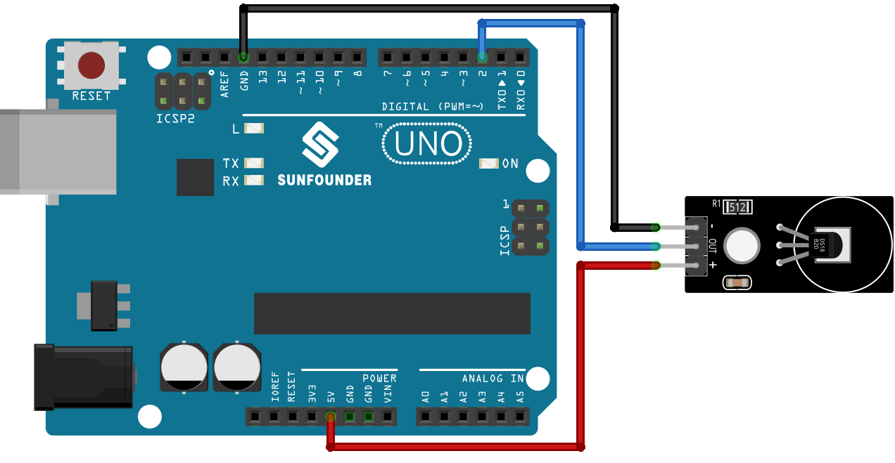

 .. note::

    Hallo und willkommen in der SunFounder Raspberry Pi & Arduino & ESP32 Enthusiasten-Gemeinschaft auf Facebook! Tauchen Sie tiefer ein in die Welt von Raspberry Pi, Arduino und ESP32 mit anderen Enthusiasten.

    **Warum beitreten?**

    - **Expertenunterstützung**: Lösen Sie Nachverkaufsprobleme und technische Herausforderungen mit Hilfe unserer Gemeinschaft und unseres Teams.
    - **Lernen & Teilen**: Tauschen Sie Tipps und Anleitungen aus, um Ihre Fähigkeiten zu verbessern.
    - **Exklusive Vorschauen**: Erhalten Sie frühzeitigen Zugang zu neuen Produktankündigungen und exklusiven Einblicken.
    - **Spezialrabatte**: Genießen Sie exklusive Rabatte auf unsere neuesten Produkte.
    - **Festliche Aktionen und Gewinnspiele**: Nehmen Sie an Gewinnspielen und Feiertagsaktionen teil.

    👉 Sind Sie bereit, mit uns zu erkunden und zu erschaffen? Klicken Sie auf [|link_sf_facebook|] und treten Sie heute bei!

.. _uno_lesson18_ds18b20:

Lektion 18: Temperatursensormodul (DS18B20)
==============================================

In dieser Lektion lernen Sie, wie Sie Temperaturdaten von einem DS18B20-Sensor mit einem Arduino auslesen. Wir werden die Verwendung der DallasTemperature-Bibliothek zur Kommunikation mit dem Sensor und zur Anzeige der Messwerte in Celsius und Fahrenheit im seriellen Monitor behandeln. Dieses Projekt ist ideal für Arduino-Anfänger und bietet praktische Erfahrungen im Umgang mit Temperatursensoren und der Datenverarbeitung.

Benötigte Komponenten
--------------------------

Für dieses Projekt benötigen wir die folgenden Komponenten.

Es ist definitiv praktisch, ein komplettes Kit zu kaufen. Hier ist der Link:

.. list-table::
    :widths: 20 20 20
    :header-rows: 1

    *   - Name
        - ITEMS IN THIS KIT
        - LINK
    *   - Universal Maker Sensor Kit
        - 94
        - |link_umsk|

Sie können sie auch separat über die folgenden Links kaufen.

.. list-table::
    :widths: 30 20
    :header-rows: 1

    *   - Component Introduction
        - Purchase Link

    *   - Arduino UNO R3 or R4
        - |link_Uno_R3_buy|
    *   - :ref:`cpn_ds18b20`
        - \-

Verkabelung
-----------------

Code
---------------------------

.. raw:: html

    <iframe src=https://create.arduino.cc/editor/sunfounder01/7619d902-81b3-4faa-bdf4-29b4429ccd54/preview?embed style="height:510px;width:100%;margin:10px 0" frameborder=0></iframe>

Code Analyse
---------------------------

#. Einbindung der Bibliotheken

   Die Einbindung der OneWire- und DallasTemperature-Bibliotheken ermöglicht die Kommunikation mit dem DS18B20-Sensor.

   .. code-block:: arduino

      #include <OneWire.h>
      #include <DallasTemperature.h>

#. Definition des Sensordaten-Pins

   Der DS18B20 ist mit dem digitalen Pin 2 des Arduinos verbunden.

   .. code-block:: arduino

      #define ONE_WIRE_BUS 2

#. Initialisierung des Sensors

   Die OneWire-Instanz und das DallasTemperature-Objekt werden erstellt und initialisiert.

   .. code-block:: arduino

      OneWire oneWire(ONE_WIRE_BUS);	
      DallasTemperature sensors(&oneWire);

#. Setup-Funktion

   Die ``setup()``-Funktion initialisiert den Sensor und richtet die serielle Kommunikation ein.

   .. code-block:: arduino

      void setup(void)
      {
         sensors.begin();	// Start up the library
         Serial.begin(9600);
      }

#. Hauptschleife

   In der ``loop()``-Funktion fordert das Programm Temperaturmessungen an und gibt diese sowohl in Celsius als auch in Fahrenheit aus.

   .. code-block:: arduino

      void loop(void)
      { 
         sensors.requestTemperatures();
         Serial.print("Temperature: ");
         Serial.print(sensors.getTempCByIndex(0));
         Serial.print("℃ | ");
         Serial.print((sensors.getTempCByIndex(0) * 9.0) / 5.0 + 32.0);
         Serial.println("℉");
         delay(500);
      }