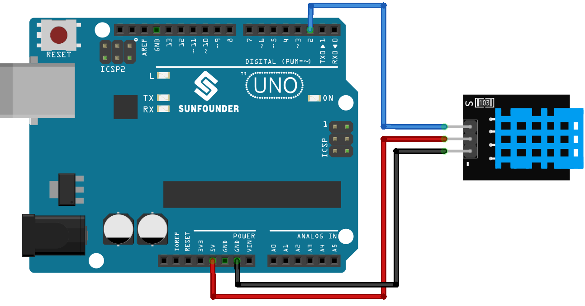

.. note::

    こんにちは、SunFounder Raspberry Pi & Arduino & ESP32 Enthusiasts Communityへようこそ！Facebook上で、仲間と一緒にRaspberry Pi、Arduino、ESP32をさらに深く探求しましょう。

    **なぜ参加するのか？**

    - **専門的なサポート**：購入後の問題や技術的な課題をコミュニティやチームの助けを借りて解決。
    - **学びと共有**：スキルを向上させるためのヒントやチュートリアルを交換。
    - **限定プレビュー**：新製品発表や予告編に早期アクセス。
    - **特別割引**：最新製品の特別割引を楽しむ。
    - **フェスティブプロモーションとプレゼント**：プレゼントやホリデープロモーションに参加。

    👉 私たちと一緒に探索と創造を始める準備はできましたか？[|link_sf_facebook|]をクリックして、今すぐ参加しましょう！
.. _uno_lesson19_dht11:

レッスン19: 温度・湿度センサーモジュール (DHT11)
====================================================================

このレッスンでは、Arduino Unoを使用してDHT11センサーで温度と湿度を測定し、熱指数を計算する方法を学びます。DHT11センサーからのデータを読み取り解釈し、これらの値を摂氏および華氏でシリアルモニターに表示する方法を説明します。このプロジェクトは、センサーとデータ処理に関する実践的な経験を提供するため、Arduino初心者に最適です。

必要なコンポーネント
--------------------------

このプロジェクトでは、以下のコンポーネントが必要です。

一式をまとめて購入すると便利です。リンクはこちら：

.. list-table::
    :widths: 20 20 20
    :header-rows: 1

    *   - Name	
        - ITEMS IN THIS KIT
        - LINK
    *   - Universal Maker Sensor Kit
        - 94
        - |link_umsk|

以下のリンクから個別に購入することもできます。

.. list-table::
    :widths: 30 10
    :header-rows: 1

    *   - Component Introduction
        - Purchase Link

    *   - Arduino UNO R3 or R4
        - |link_Uno_R3_buy|
    *   - :ref:`cpn_dht11`
        - |link_dht11_humiture_buy|

配線
---------------------------

コード
---------------------------

.. note:: 
   ライブラリをインストールするには、Arduino Library Managerを使用して **"DHT sensor library"** を検索し、インストールしてください。

.. raw:: html

    <iframe src=https://create.arduino.cc/editor/sunfounder01/ca143284-4649-4f76-a6f0-d6b8f3cb4c73/preview?embed style="height:510px;width:100%;margin:10px 0" frameborder=0></iframe>

コード解析
---------------------------

#. 必要なライブラリのインクルードと定数の定義。
   この部分のコードでは、DHTセンサーライブラリをインクルードし、使用するピン番号とセンサータイプを定義します。

   .. note:: 
      ライブラリをインストールするには、Arduino Library Managerを使用して **"DHT sensor library"** を検索し、インストールしてください。

   .. code-block:: arduino
    
      #include <DHT.h>
      #define DHTPIN 2       // Define the pin used to connect the sensor
      #define DHTTYPE DHT11  // Define the sensor type

#. DHTオブジェクトの作成。
   ここでは、定義されたピン番号とセンサータイプを使用してDHTオブジェクトを作成します。

   .. code-block:: arduino

      DHT dht(DHTPIN, DHTTYPE);  // Create a DHT object

#. Arduinoが起動すると一度だけ実行される関数。
   この関数では、シリアル通信とDHTセンサーを初期化します。

   .. code-block:: arduino

      void setup() {
        Serial.begin(9600);
        Serial.println(F("DHT11 test!"));
        dht.begin();  // Initialize the DHT sensor
      }

#. メインループ。
   ``loop()``関数は、setup関数の後に継続的に実行されます。ここでは、湿度と温度の値を読み取り、熱指数を計算し、これらの値をシリアルモニターに表示します。センサーの読み取りが失敗した場合（NaNを返す）、エラーメッセージを表示します。

   .. note::
    
      |link_heat_index|は、気温と湿度を組み合わせて外の暑さを測定する方法です。「体感気温」や「見かけの温度」とも呼ばれます。

   .. code-block:: arduino

      void loop() {
        delay(2000);
        float h = dht.readHumidity();
        float t = dht.readTemperature();
        float f = dht.readTemperature(true);
        if (isnan(h) || isnan(t) || isnan(f)) {
          Serial.println(F("Failed to read from DHT sensor!"));
          return;
        }
        float hif = dht.computeHeatIndex(f, h);
        float hic = dht.computeHeatIndex(t, h, false);
        Serial.print(F("Humidity: "));
        Serial.print(h);
        Serial.print(F("%  Temperature: "));
        Serial.print(t);
        Serial.print(F("°C "));
        Serial.print(f);
        Serial.print(F("°F  Heat index: "));
        Serial.print(hic);
        Serial.print(F("°C "));
        Serial.print(hif);
        Serial.println(F("°F"));
      }