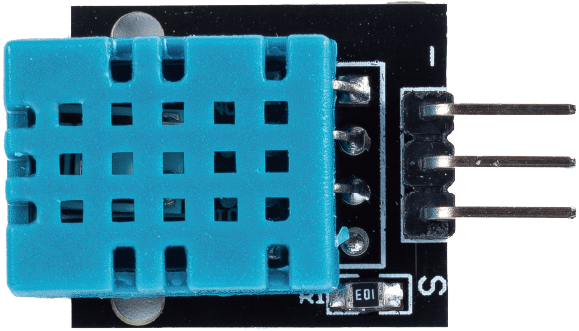
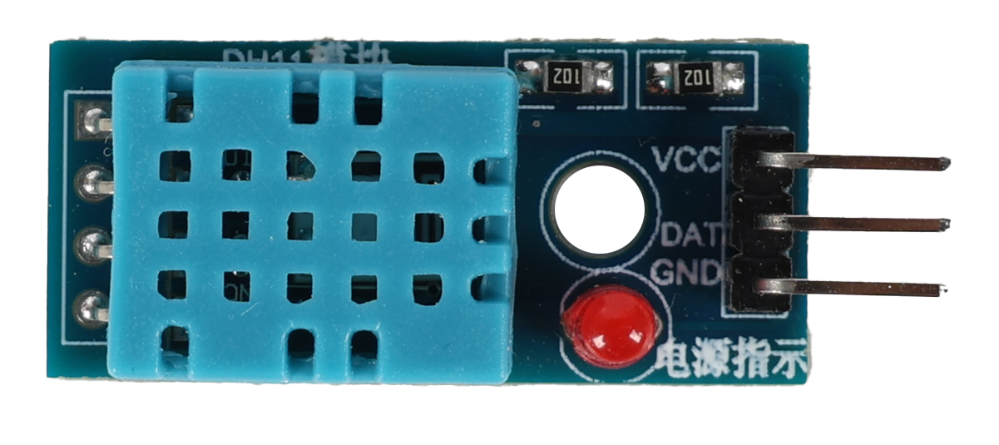
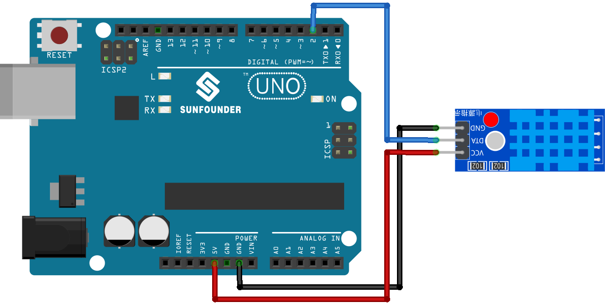

.. note::

   Hallo und willkommen in der SunFounder Raspberry Pi & Arduino & ESP32 Enthusiasten-Gemeinschaft auf Facebook! Tauchen Sie tiefer ein in die Welt von Raspberry Pi, Arduino und ESP32 mit anderen Enthusiasten.

   **Warum beitreten?**

   - **Expertenunterstützung**: Lösen Sie Nachverkaufsprobleme und technische Herausforderungen mit Hilfe unserer Gemeinschaft und unseres Teams.
   - **Lernen & Teilen**: Tauschen Sie Tipps und Anleitungen aus, um Ihre Fähigkeiten zu verbessern.
   - **Exklusive Vorschauen**: Erhalten Sie frühzeitigen Zugang zu neuen Produktankündigungen und exklusiven Einblicken.
   - **Spezialrabatte**: Genießen Sie exklusive Rabatte auf unsere neuesten Produkte.
   - **Festliche Aktionen und Gewinnspiele**: Nehmen Sie an Gewinnspielen und Feiertagsaktionen teil.

   👉 Sind Sie bereit, mit uns zu erkunden und zu erschaffen? Klicken Sie auf [|link_sf_facebook|] und treten Sie heute bei!

.. _uno_lesson19_dht11:

Lektion 19: Temperatur- und Feuchtigkeitssensor-Modul (DHT11)
====================================================================

In dieser Lektion lernen Sie, wie Sie mit einem DHT11-Sensor und einem Arduino Uno die Temperatur und Luftfeuchtigkeit messen sowie den Hitzeindex berechnen können. Wir werden das Lesen und Interpretieren der Daten vom DHT11-Sensor behandeln und diese Werte zusammen mit dem Hitzeindex sowohl in Celsius als auch in Fahrenheit auf dem seriellen Monitor anzeigen. Dieses Projekt ist perfekt für Arduino-Anfänger geeignet und bietet praktische Erfahrungen mit Sensoren und Datenverarbeitung auf eine einfache und dennoch fesselnde Weise.

Benötigte Komponenten
--------------------------

Für dieses Projekt benötigen wir die folgenden Komponenten. 

Es ist definitiv praktisch, ein komplettes Kit zu kaufen. Hier ist der Link:

.. list-table::
    :widths: 20 20 20
    :header-rows: 1

    *   - Name	
        - ITEMS IN THIS KIT
        - LINK
    *   - Universal Maker Sensor Kit
        - 94
        - |link_umsk|

Sie können sie auch separat über die unten stehenden Links kaufen.

.. list-table::
    :widths: 30 10
    :header-rows: 1

    *   - Component Introduction
        - Purchase Link

    *   - Arduino UNO R3 or R4
        - |link_Uno_R3_buy|
    *   - :ref:`cpn_dht11`
        - |link_dht11_humiture_buy|

Verkabelung
---------------------------

.. note:: 
   Das Kit kann unterschiedliche Versionen des DHT11-Moduls enthalten. Bitte überprüfen Sie die Verdrahtungsmethode entsprechend dem Modul, das Sie haben.

.. csv-table:: 
   :widths: 25, 75

   |dht11_module|, |dht11_module_circuit|
   |dht11_module_withLED|, |dht11_module_withLED_circuit|

.. |dht11_module_circuit| image:: img/Lesson_19_dht11_module_circuit_uno_bb.png
   :width: 500px

Code
---------------------------

.. note:: 
   Um die Bibliothek zu installieren, verwenden Sie den Arduino Library Manager und suchen nach **"DHT sensor library"** und installieren diese.

.. raw:: html

    <iframe src=https://create.arduino.cc/editor/sunfounder01/ca143284-4649-4f76-a6f0-d6b8f3cb4c73/preview?embed style="height:510px;width:100%;margin:10px 0" frameborder=0></iframe>

Code-Analyse
---------------------------

#. Einbindung der notwendigen Bibliotheken und Definition von Konstanten.
   Dieser Teil des Codes bindet die DHT-Sensorbibliothek ein und definiert die Pin-Nummer und den Sensortyp, der in diesem Projekt verwendet wird.

   .. note:: 
      Um die Bibliothek zu installieren, verwenden Sie den Arduino Library Manager und suchen nach **"DHT sensor library"** und installieren diese.

   .. code-block:: arduino
    
      #include <DHT.h>
      #define DHTPIN 2       // Define the pin used to connect the sensor
      #define DHTTYPE DHT11  // Define the sensor type

#. Creation of DHT object.
   Here we create a DHT object using the defined pin number and sensor type.

   .. code-block:: arduino

      DHT dht(DHTPIN, DHTTYPE);  // Create a DHT object

#. Diese Funktion wird einmal ausgeführt, wenn der Arduino startet. In dieser Funktion initialisieren wir die serielle Kommunikation und den DHT-Sensor.

   .. code-block:: arduino

      void setup() {
        Serial.begin(9600);
        Serial.println(F("DHT11 test!"));
        dht.begin();  // Initialize the DHT sensor
      }

#. Hauptschleife.
   Die ``loop()``-Funktion läuft kontinuierlich nach der setup-Funktion. Hier lesen wir die Feuchtigkeits- und Temperaturwerte aus, berechnen den Hitzeindex und geben diese Werte auf dem seriellen Monitor aus. Wenn das Auslesen des Sensors fehlschlägt (gibt NaN zurück), wird eine Fehlermeldung ausgegeben.

   .. note::
    
      Der |link_heat_index| ist eine Methode, um zu messen, wie heiß es sich draußen anfühlt, indem die Lufttemperatur und die Luftfeuchtigkeit kombiniert werden. Er wird auch als "gefühlte Lufttemperatur" oder "scheinbare Temperatur" bezeichnet.

   .. code-block:: arduino

      void loop() {
        delay(2000);
        float h = dht.readHumidity();
        float t = dht.readTemperature();
        float f = dht.readTemperature(true);
        if (isnan(h) || isnan(t) || isnan(f)) {
          Serial.println(F("Failed to read from DHT sensor!"));
          return;
        }
        float hif = dht.computeHeatIndex(f, h);
        float hic = dht.computeHeatIndex(t, h, false);
        Serial.print(F("Humidity: "));
        Serial.print(h);
        Serial.print(F("%  Temperature: "));
        Serial.print(t);
        Serial.print(F("°C "));
        Serial.print(f);
        Serial.print(F("°F  Heat index: "));
        Serial.print(hic);
        Serial.print(F("°C "));
        Serial.print(hif);
        Serial.println(F("°F"));
      }