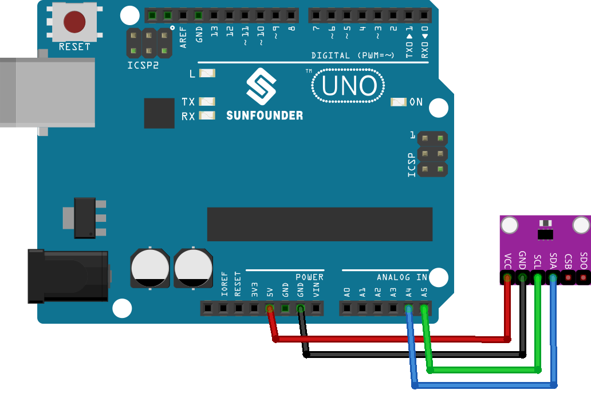

.. note::

    こんにちは、SunFounder Raspberry Pi & Arduino & ESP32 Enthusiasts Communityへようこそ！Facebook上で、仲間と一緒にRaspberry Pi、Arduino、ESP32をさらに深く探求しましょう。

    **なぜ参加するのか？**

    - **専門的なサポート**：購入後の問題や技術的な課題をコミュニティやチームの助けを借りて解決。
    - **学びと共有**：スキルを向上させるためのヒントやチュートリアルを交換。
    - **限定プレビュー**：新製品発表や予告編に早期アクセス。
    - **特別割引**：最新製品の特別割引を楽しむ。
    - **フェスティブプロモーションとプレゼント**：プレゼントやホリデープロモーションに参加。

    👉 私たちと一緒に探索と創造を始める準備はできましたか？[|link_sf_facebook|]をクリックして、今すぐ参加しましょう！
    
.. _uno_lesson20_bmp280:

レッスン20: 温度、湿度、気圧センサー（BMP280）
====================================================================

このレッスンでは、BMP280センサーをArduino Unoと組み合わせて使用し、気圧、温度、およびおおよその高度を読み取る方法を学びます。Adafruit BMP280ライブラリを使用してセンサーをArduinoと統合し、シリアルモニターに読み取り結果を表示する方法を説明します。このセッションは、電子工学とプログラミングの初心者が、Arduinoプラットフォームでのセンサーインターフェースとデータ取得を理解するのに最適です。

必要なコンポーネント
--------------------------

このプロジェクトでは、以下のコンポーネントが必要です。

キット全体を購入するのが便利です、以下のリンクをご覧ください：

.. list-table::
    :widths: 20 20 20
    :header-rows: 1

    *   - Name	
        - ITEMS IN THIS KIT
        - LINK
    *   - Universal Maker Sensor Kit
        - 94
        - |link_umsk|

以下のリンクから個別に購入することもできます。

.. list-table::
    :widths: 30 20
    :header-rows: 1

    *   - Component Introduction
        - Purchase Link

    *   - Arduino UNO R3 or R4
        - |link_Uno_R3_buy|
    *   - :ref:`cpn_bmp280`
        - |link_bmp280_module_buy|

配線
---------------------------

コード
---------------------------

.. raw:: html

    <iframe src=https://create.arduino.cc/editor/sunfounder01/96357754-fa67-4a69-82dc-156650454e41/preview?embed style="height:510px;width:100%;margin:10px 0" frameborder=0></iframe>

コード解析
---------------------------

1. ライブラリのインクルードと初期化。必要なライブラリをインクルードし、I2Cインターフェースを使用してBMP280センサーを初期化します。

   .. note:: 
      ライブラリをインストールするには、Arduino Library Managerを使用して **"Adafruit BMP280"** を検索し、インストールしてください。

   - Adafruit BMP280ライブラリ: このライブラリは、BMP280センサー用の使いやすいインターフェースを提供し、温度、気圧、高度を読み取ることができます。
   - Wire.h: I2C通信に使用されます。

   .. raw:: html
    
     

   .. code-block:: arduino
    
      #include <Wire.h>
      #include <Adafruit_BMP280.h>
      #define BMP280_ADDRESS 0x76
      Adafruit_BMP280 bmp;  // use I2C interface

2. ``setup()``関数では、シリアル通信を初期化し、BMP280センサーをチェックし、センサーをデフォルト設定でセットアップします。

   .. code-block:: arduino

      void setup() {
        Serial.begin(9600);
        while (!Serial) delay(100);
        Serial.println(F("BMP280 test"));
        unsigned status;
        status = bmp.begin(BMP280_ADDRESS);
        // ... (rest of the setup code)

3. ``loop()``関数では、BMP280センサーから温度、気圧、高度のデータを読み取ります。このデータはシリアルモニターに表示されます。

   .. code-block:: arduino

      void loop() {
        // ... (read and print temperature, pressure, and altitude data)
        delay(2000);  // 2-second delay between readings.
      }
