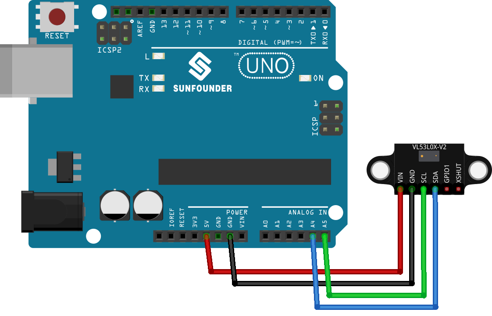

.. note::

    こんにちは、SunFounder Raspberry Pi & Arduino & ESP32 Enthusiasts Communityへようこそ！Facebook上で、仲間と一緒にRaspberry Pi、Arduino、ESP32をさらに深く探求しましょう。

    **なぜ参加するのか？**

    - **専門的なサポート**：購入後の問題や技術的な課題をコミュニティやチームの助けを借りて解決。
    - **学びと共有**：スキルを向上させるためのヒントやチュートリアルを交換。
    - **限定プレビュー**：新製品発表や予告編に早期アクセス。
    - **特別割引**：最新製品の特別割引を楽しむ。
    - **フェスティブプロモーションとプレゼント**：プレゼントやホリデープロモーションに参加。

    👉 私たちと一緒に探索と創造を始める準備はできましたか？[|link_sf_facebook|]をクリックして、今すぐ参加しましょう！
    
.. _uno_lesson21_vl53l0x:

レッスン21: 飛行時間マイクロLIDAR距離センサー（VL53L0X）
====================================================================

このレッスンでは、VL53L0X飛行時間距離センサーをArduino Unoと共に使用する方法を学びます。センサーを接続し、ミリメートル単位で距離を測定し、シリアルモニターに読み取り結果を表示する基本を説明します。このプロジェクトは、高度なセンサーの実際の応用に関する実践的な経験を提供し、Arduinoのスキルを向上させます。

必要なコンポーネント
--------------------------

このプロジェクトでは、以下のコンポーネントが必要です。

キット全体を購入するのが便利です。リンクはこちら：

.. list-table::
    :widths: 20 20 20
    :header-rows: 1

    *   - Name	
        - ITEMS IN THIS KIT
        - LINK
    *   - Universal Maker Sensor Kit
        - 94
        - |link_umsk|

以下のリンクから個別に購入することもできます。

.. list-table::
    :widths: 30 10
    :header-rows: 1

    *   - Component Introduction
        - Purchase Link

    *   - Arduino UNO R3 or R4
        - |link_Uno_R3_buy|
    *   - :ref:`cpn_VL53L0X`
        - |link_vl53l0x_module_buy|

配線
---------------------------

コード
---------------------------

.. note:: 
   ライブラリをインストールするには、Arduino Library Managerを使用して **"Adafruit_VL53L0X"** を検索し、インストールしてください。

.. raw:: html

    <iframe src=https://create.arduino.cc/editor/sunfounder01/72c81822-13e0-4a33-8da0-acf3c966bf57/preview?embed style="height:510px;width:100%;margin:10px 0" frameborder=0></iframe>

コード解析
---------------------------

#. 必要なライブラリのインクルードとセンサーオブジェクトの初期化。まず、VL53L0Xセンサー用のライブラリをインクルードし、Adafruit_VL53L0Xクラスのインスタンスを作成します。

   .. note:: 
      ライブラリをインストールするには、Arduino Library Managerを使用して **"Adafruit_VL53L0X"** を検索し、インストールしてください。

   .. code-block:: arduino

      #include <Adafruit_VL53L0X.h>
      Adafruit_VL53L0X lox = Adafruit_VL53L0X();

#. ``setup()``関数での初期化。ここでは、シリアル通信を設定し、距離センサーを初期化します。センサーが初期化できない場合、プログラムは停止します。

   .. code-block:: arduino

      void setup() {
        Serial.begin(115200);
        while (!Serial) {
          delay(1);
        }
        Serial.println("Adafruit VL53L0X test");
        if (!lox.begin()) {
          Serial.println(F("Failed to boot VL53L0X"));
          while (1)
            ;
        }
        Serial.println(F("VL53L0X API Simple Ranging example\n\n"));
      }

#. ``loop()``関数での測定値のキャプチャと表示。Arduinoは ``rangingTest()`` メソッドを使用して距離を継続的に測定します。測定が有効であれば、シリアルモニターに表示されます。

   .. code-block:: arduino
       
      void loop() {
        VL53L0X_RangingMeasurementData_t measure;
        Serial.print("Reading a measurement... ");
        lox.rangingTest(&measure, false);
        if (measure.RangeStatus != 4) {
          Serial.print("Distance (mm): ");
          Serial.println(measure.RangeMilliMeter);
        } else {
          Serial.println(" out of range ");
        }
        delay(100);
      }