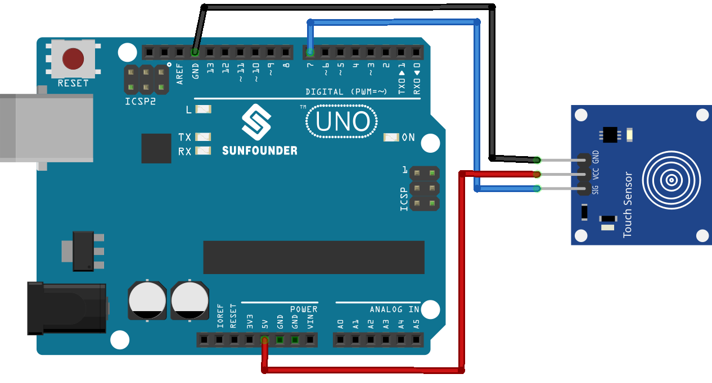

.. note::

    こんにちは、SunFounder Raspberry Pi & Arduino & ESP32 Enthusiasts Communityへようこそ！Facebook上で、仲間と一緒にRaspberry Pi、Arduino、ESP32をさらに深く探求しましょう。

    **なぜ参加するのか？**

    - **専門的なサポート**：購入後の問題や技術的な課題をコミュニティやチームの助けを借りて解決。
    - **学びと共有**：スキルを向上させるためのヒントやチュートリアルを交換。
    - **限定プレビュー**：新製品発表や予告編に早期アクセス。
    - **特別割引**：最新製品の特別割引を楽しむ。
    - **フェスティブプロモーションとプレゼント**：プレゼントやホリデープロモーションに参加。

    👉 私たちと一緒に探索と創造を始める準備はできましたか？[|link_sf_facebook|]をクリックして、今すぐ参加しましょう！
.. _uno_lesson22_touch_sensor:

レッスン22: タッチセンサーモジュール
==================================

このレッスンでは、タッチセンサーをArduino Unoに接続する方法を学びます。Arduinoに接続されたタッチセンサーからの入力を読み取り、これらの入力がプログラムの流れにどのように影響するかに焦点を当てます。条件文を使用してタッチイベントを検出し、適切なアクションとメッセージで応答する方法を学びます。このプロジェクトは初心者に最適で、デジタル入力の処理と基本的なArduinoプログラミングの概念を明確に理解するのに役立ちます。

必要なコンポーネント
--------------------------

このプロジェクトでは、以下のコンポーネントが必要です。

キット全体を購入するのが便利です。リンクはこちら：

.. list-table::
    :widths: 20 20 20
    :header-rows: 1

    *   - Name	
        - ITEMS IN THIS KIT
        - LINK
    *   - Universal Maker Sensor Kit
        - 94
        - |link_umsk|

以下のリンクから個別に購入することもできます。

.. list-table::
    :widths: 30 20
    :header-rows: 1

    *   - Component Introduction
        - Purchase Link

    *   - Arduino UNO R3 or R4
        - |link_Uno_R3_buy|
    *   - :ref:`cpn_touch`
        - |link_touch_buy|

配線
---------------------------

コード
---------------------------

.. raw:: html

    <iframe src=https://create.arduino.cc/editor/sunfounder01/a0d962e5-5d21-4f26-88db-c38f8e9fb90c/preview?embed style="height:510px;width:100%;margin:10px 0" frameborder=0></iframe>

コード解析
---------------------------

#. 必要な変数の設定。タッチセンサーが接続されているピン番号を定義します。

   .. code-block:: arduino

      const int sensorPin = 7;

#. ``setup()``関数での初期化。ここでは、センサーピンを入力用、内蔵LEDを出力用に指定し、シリアル通信を開始してメッセージをシリアルモニターに送信できるようにします。

   .. code-block:: arduino

      void setup() {
        pinMode(sensorPin, INPUT);
        pinMode(LED_BUILTIN, OUTPUT);
        Serial.begin(9600);
      }

#. Arduinoはタッチセンサーが作動しているかどうかを継続的にチェックします。触れられるとLEDが点灯し、「Touch detected!」というメッセージが送信されます。触れられていない場合は、LEDが消灯し、"No touch detected..." というメッセージが送信されます。センサーが読み取られすぎるのを防ぐために遅延が導入されています。

   .. code-block:: arduino

      void loop() {
        if (digitalRead(sensorPin) == 1) {
          digitalWrite(LED_BUILTIN, HIGH);
          Serial.println("Touch detected!");
        } else {
          digitalWrite(LED_BUILTIN, LOW);
          Serial.println("No touch detected...");
        }
        delay(100);
      }