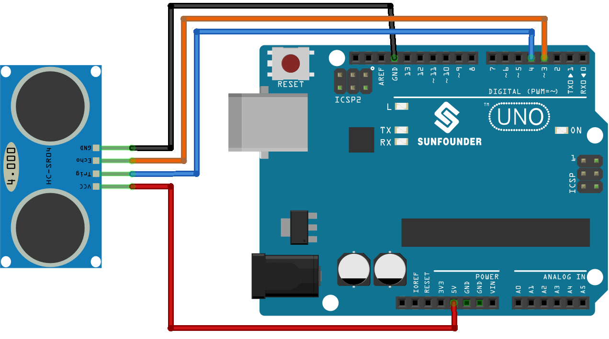

.. note::

    こんにちは、SunFounder Raspberry Pi & Arduino & ESP32 Enthusiasts Communityへようこそ！Facebook上で、仲間と一緒にRaspberry Pi、Arduino、ESP32をさらに深く探求しましょう。

    **なぜ参加するのか？**

    - **専門的なサポート**：購入後の問題や技術的な課題をコミュニティやチームの助けを借りて解決。
    - **学びと共有**：スキルを向上させるためのヒントやチュートリアルを交換。
    - **限定プレビュー**：新製品発表や予告編に早期アクセス。
    - **特別割引**：最新製品の特別割引を楽しむ。
    - **フェスティブプロモーションとプレゼント**：プレゼントやホリデープロモーションに参加。

    👉 私たちと一緒に探索と創造を始める準備はできましたか？[|link_sf_facebook|]をクリックして、今すぐ参加しましょう！
    
.. _uno_lesson23_ultrasonic:

レッスン23: 超音波センサーモジュール (HC-SR04)
================================================

このレッスンでは、Arduinoを使用して超音波センサーで距離を測定する方法を学びます。HC-SR04センサーをArduino Uno R4ボードに接続し、センチメートル単位で距離を計算して表示する方法を説明します。このプロジェクトは初心者に最適で、Arduinoのシリアル通信とセンサーデータの処理について実践的な経験を提供します。デジタル信号の取り扱いと超音波センサー技術の基本を理解するための貴重な洞察を得ることができます。

必要なコンポーネント
--------------------------

このプロジェクトでは、以下のコンポーネントが必要です。

キット全体を購入するのが便利です。リンクはこちら：

.. list-table::
    :widths: 20 20 20
    :header-rows: 1

    *   - Name	
        - ITEMS IN THIS KIT
        - LINK
    *   - Universal Maker Sensor Kit
        - 94
        - |link_umsk|

以下のリンクから個別に購入することもできます。

.. list-table::
    :widths: 30 20
    :header-rows: 1

    *   - Component Introduction
        - Purchase Link

    *   - Arduino UNO R3 or R4
        - |link_Uno_R3_buy|
    *   - :ref:`cpn_ultrasonic`
        - |link_ultrasonic_buy|

配線
---------------------------

コード
---------------------------

.. raw:: html

    <iframe src=https://create.arduino.cc/editor/sunfounder01/633ae8f5-4b15-4888-b4cb-b1eb24f3e2ef/preview?embed style="height:510px;width:100%;margin:10px 0" frameborder=0></iframe>

コード解析
---------------------------

1. ピンの宣言:

   最初に超音波センサーのピンを定義します。 ``echoPin`` と ``trigPin`` を整数として宣言し、その値をArduinoボードの物理的な接続に合わせます。

   .. code-block:: arduino

      const int echoPin = 3;
      const int trigPin = 4;

2. ``setup()`` 関数:

   ``setup()`` 関数はシリアル通信を初期化し、ピンモードを設定し、超音波センサーが準備完了であることを示すメッセージを表示します。
 
   .. code-block:: arduino
 
      void setup() {
        Serial.begin(9600);
        pinMode(echoPin, INPUT);
        pinMode(trigPin, OUTPUT);
        Serial.println("Ultrasonic sensor:");
      }

3. ``loop()`` 関数:

   ``loop()`` 関数はセンサーから距離を読み取り、それをシリアルモニターに表示し、400ミリ秒遅延してから繰り返します。

   .. code-block:: arduino

      void loop() {
        float distance = readDistance();
        Serial.print(distance);
        Serial.println(" cm");
        delay(400);
      }

4. ``readDistance()`` 関数:

   ``readDistance()`` 関数は超音波センサーをトリガーし、信号が戻ってくるまでの時間に基づいて距離を計算します。

   超音波センサーモジュールの動作原理については、詳細については :ref:`principle <cpn_ultrasonic_principle>` を参照してください。

   .. code-block:: arduino

      float readDistance() {
        digitalWrite(trigPin, LOW);   // Set trig pin to low to ensure a clean pulse
        delayMicroseconds(2);         // Delay for 2 microseconds
        digitalWrite(trigPin, HIGH);  // Send a 10 microsecond pulse by setting trig pin to high
        delayMicroseconds(10);
        digitalWrite(trigPin, LOW);  // Set trig pin back to low
        float distance = pulseIn(echoPin, HIGH) / 58.00;  // Formula: (340m/s * 1us) / 2
        return distance;
      }
