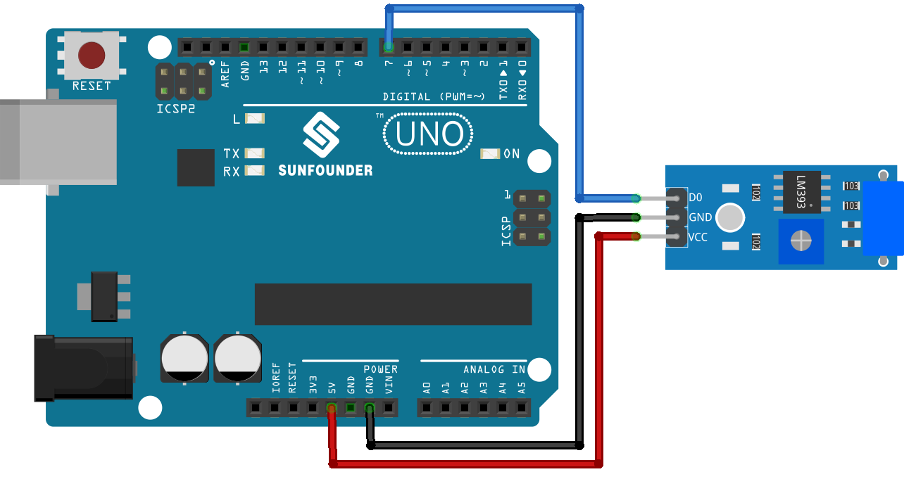

 .. note::

    Hallo und willkommen in der SunFounder Raspberry Pi & Arduino & ESP32 Enthusiasten-Gemeinschaft auf Facebook! Tauchen Sie tiefer ein in die Welt von Raspberry Pi, Arduino und ESP32 mit anderen Enthusiasten.

    **Warum beitreten?**

    - **Expertenunterstützung**: Lösen Sie Nachverkaufsprobleme und technische Herausforderungen mit Hilfe unserer Gemeinschaft und unseres Teams.
    - **Lernen & Teilen**: Tauschen Sie Tipps und Anleitungen aus, um Ihre Fähigkeiten zu verbessern.
    - **Exklusive Vorschauen**: Erhalten Sie frühzeitigen Zugang zu neuen Produktankündigungen und exklusiven Einblicken.
    - **Spezialrabatte**: Genießen Sie exklusive Rabatte auf unsere neuesten Produkte.
    - **Festliche Aktionen und Gewinnspiele**: Nehmen Sie an Gewinnspielen und Feiertagsaktionen teil.

    👉 Sind Sie bereit, mit uns zu erkunden und zu erschaffen? Klicken Sie auf [|link_sf_facebook|] und treten Sie heute bei!

.. _uno_lesson24_vibration_sensor:

Lektion 24: Vibrationssensormodul (SW-420)
=============================================

In dieser Lektion lernen Sie, wie man mit einem Vibrationssensor und einem Arduino Uno Vibrationen erkennt. Wir werden untersuchen, wie der Sensor dem Arduino das Vorhandensein von Vibrationen signalisiert und es auslöst, eine Nachricht anzuzeigen. Dieses Projekt ist ideal für Anfänger, um die Verarbeitung digitaler Eingaben und die serielle Kommunikation mit Arduino zu verstehen. Sie erhalten praktische Erfahrungen im Lesen von Sensordaten und der Implementierung bedingter Logik in Ihren Sketchen.

Benötigte Komponenten
--------------------------

Für dieses Projekt benötigen wir die folgenden Komponenten.

Es ist definitiv praktisch, ein komplettes Kit zu kaufen, hier ist der Link:

.. list-table::
    :widths: 20 20 20
    :header-rows: 1

    *   - Name	
        - ITEMS IN THIS KIT
        - LINK
    *   - Universal Maker Sensor Kit
        - 94
        - |link_umsk|

Sie können sie auch einzeln über die untenstehenden Links kaufen.

.. list-table::
    :widths: 30 20
    :header-rows: 1

    *   - Component Introduction
        - Purchase Link

    *   - Arduino UNO R3 or R4
        - |link_Uno_R3_buy|
    *   - :ref:`cpn_vibration`
        - |link_sw420_vibration_module_buy|

Verdrahtung
---------------------------

Code
---------------------------

.. raw:: html

    <iframe src=https://create.arduino.cc/editor/sunfounder01/a04cb423-f55b-465a-bef3-100260eef067/preview?embed style="height:510px;width:100%;margin:10px 0" frameborder=0></iframe>

Code-Analyse
---------------------------

1. Die erste Zeile des Codes ist eine Konstante Integer-Deklaration für den Vibrationssensor-Pin. Wir verwenden den digitalen Pin 7, um die Ausgabe des Vibrationssensors zu lesen.

   .. code-block:: arduino
   
      const int sensorPin = 7;

2. In der ``setup()``-Funktion initialisieren wir die serielle Kommunikation mit einer Baudrate von 9600, um die Messwerte des Vibrationssensors auf den seriellen Monitor zu drucken. Wir setzen auch den Vibrationssensor-Pin als Eingang.

   .. code-block:: arduino
   
      void setup() {
        Serial.begin(9600);         // Start serial communication at 9600 baud rate
        pinMode(sensorPin, INPUT);  // Set the sensorPin as an input pin
      }

3. Die ``loop()``-Funktion überprüft kontinuierlich, ob der Sensor Vibrationen erkennt. Wenn der Sensor Vibrationen erkennt, druckt er "Detected vibration..." auf den seriellen Monitor. Wenn keine Vibration erkannt wird, druckt er "...". Die Schleife wiederholt sich alle 100 Millisekunden.

   .. code-block:: arduino
   
      void loop() {
        if (digitalRead(sensorPin)) {               // Check if there is any vibration detected by the sensor
          Serial.println("Detected vibration...");  // Print "Detected vibration..." if vibration detected
        } 
        else {
          Serial.println("...");  // Print "..." otherwise
        }
        // Add a delay to avoid flooding the serial monitor
        delay(100);
      }