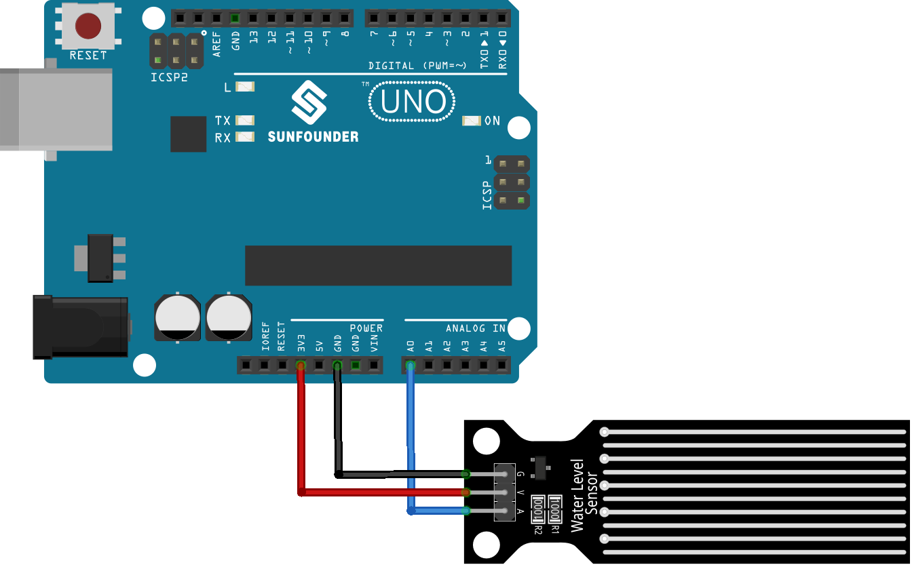

.. note::

    Hello, welcome to the SunFounder Raspberry Pi & Arduino & ESP32 Enthusiasts Community on Facebook! Dive deeper into Raspberry Pi, Arduino, and ESP32 with fellow enthusiasts.

    **Why Join?**

    - **Expert Support**: Solve post-sale issues and technical challenges with help from our community and team.
    - **Learn & Share**: Exchange tips and tutorials to enhance your skills.
    - **Exclusive Previews**: Get early access to new product announcements and sneak peeks.
    - **Special Discounts**: Enjoy exclusive discounts on our newest products.
    - **Festive Promotions and Giveaways**: Take part in giveaways and holiday promotions.

    👉 Ready to explore and create with us? Click [|link_sf_facebook|] and join today!

.. _uno_lesson25_water_level:

Lesson 25: Water Level Sensor Module
=========================================

In this lesson, you will learn how to measure water levels using Arduino. We'll look at how a water level sensor can produce different voltage levels based on the water height and how the Arduino reads these voltage levels. This project is ideal for beginners as it provides practical experience with analog sensors and introduces basic concepts of processing sensor data on the Arduino platform.

Required Components
--------------------------

In this project, we need the following components. 

It's definitely convenient to buy a whole kit, here's the link: 

.. list-table::
    :widths: 20 20 20
    :header-rows: 1

    *   - Name	
        - ITEMS IN THIS KIT
        - LINK
    *   - Universal Maker Sensor Kit
        - 94
        - |link_umsk|

You can also buy them separately from the links below.

.. list-table::
    :widths: 30 20
    :header-rows: 1

    *   - Component Introduction
        - Purchase Link

    *   - Arduino UNO R3 or R4
        - |link_Uno_R3_buy|
    *   - :ref:`cpn_water_level`
        - \-

Wiring
---------------------------

Code
---------------------------

.. raw:: html

    <iframe src=https://create.arduino.cc/editor/sunfounder01/268011b0-8c0c-42b0-8d21-253a37de0dc8/preview?embed style="height:510px;width:100%;margin:10px 0" frameborder=0></iframe>

Code Analysis
---------------------------

#. **Initializing the Sensor Pin**:

   Before using the water level sensor, it's pin number is defined using a constant variable. This makes the code more readable and easier to modify.

   .. code-block:: arduino

      const int sensorPin = A0;

#. **Setting Up Serial Communication**:

   In the ``setup()`` function, the baud rate for serial communication is set. This is crucial for the Arduino to communicate with the computer's serial monitor.

   .. code-block:: arduino

      void setup() {
        Serial.begin(9600);  // Start serial communication at 9600 baud rate
      }

#. **Reading Sensor Data and Outputting to Serial Monitor**:

   The ``loop()`` function continuously reads the sensor's analog value using ``analogRead()`` and outputs it to the serial monitor using ``Serial.println()``. The ``delay(100)`` function makes the Arduino wait for 100 milliseconds before repeating the loop, controlling the rate of data reading and transmission.

   .. code-block:: arduino
    
      void loop() {
        Serial.println(analogRead(sensorPin));  // Read the analog value of the sensor and print it to the serial monitor
        delay(100);                             // Wait for 100 milliseconds
      }