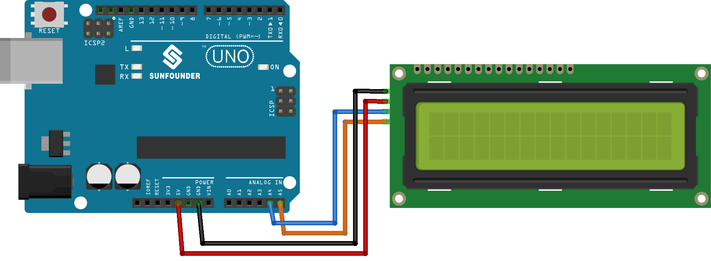

.. note::

    こんにちは、SunFounder Raspberry Pi & Arduino & ESP32 Enthusiasts Communityへようこそ！Facebook上で、仲間と一緒にRaspberry Pi、Arduino、ESP32をさらに深く探求しましょう。

    **なぜ参加するのか？**

    - **専門的なサポート**：購入後の問題や技術的な課題をコミュニティやチームの助けを借りて解決。
    - **学びと共有**：スキルを向上させるためのヒントやチュートリアルを交換。
    - **限定プレビュー**：新製品発表や予告編に早期アクセス。
    - **特別割引**：最新製品の特別割引を楽しむ。
    - **フェスティブプロモーションとプレゼント**：プレゼントやホリデープロモーションに参加。

    👉 私たちと一緒に探索と創造を始める準備はできましたか？[|link_sf_facebook|]をクリックして、今すぐ参加しましょう！

.. _uno_lesson26_lcd:

レッスン26: I2C LCD 1602
==================================

このレッスンでは、Arduinoを使用してI2Cインターフェースを持つ16x2液晶ディスプレイ（LCD）を設定し、メッセージを表示する方法を学びます。LiquidCrystal I2Cライブラリを使用してLCDを初期化し、テキストを表示し、バックライトを制御する基本的な操作を説明します。「Hello world!」や「LCD Tutorial」をディスプレイに表示する方法を紹介し、ArduinoとLCDのインターフェースを実践的に学びます。このチュートリアルは、電子ディスプレイの制御を実践的に学ぶための初心者に最適な内容です。

必要なコンポーネント
--------------------------

このプロジェクトでは、以下のコンポーネントが必要です。

キット全体を購入するのが便利です。リンクはこちら：

.. list-table::
    :widths: 20 20 20
    :header-rows: 1

    *   - Name	
        - ITEMS IN THIS KIT
        - LINK
    *   - Universal Maker Sensor Kit
        - 94
        - |link_umsk|

以下のリンクから個別に購入することもできます。

.. list-table::
    :widths: 30 20
    :header-rows: 1

    *   - Component Introduction
        - Purchase Link

    *   - Arduino UNO R3 or R4
        - |link_Uno_R3_buy|
    *   - :ref:`cpn_i2c_lcd1602`
        - |link_i2clcd1602_buy|

配線
---------------------------

コード
---------------------------

.. note:: 
   ライブラリをインストールするには、Arduinoライブラリマネージャーを使用し、 **"LiquidCrystal I2C"** を検索してインストールしてください。  

.. raw:: html

    <iframe src=https://create.arduino.cc/editor/sunfounder01/48a64786-bcfc-4497-a12d-495c283e09ce/preview?embed style="height:510px;width:100%;margin:10px 0" frameborder=0></iframe>

コード解析
---------------------------

#. **ライブラリのインクルードとLCDの初期化**:
   LiquidCrystal I2Cライブラリをインクルードし、LCDインターフェース用の関数とメソッドを提供します。その後、LiquidCrystal_I2Cクラスを使用してLCDオブジェクトを作成し、I2Cアドレス、列数、および行数を指定します。

   .. note:: 
      ライブラリをインストールするには、Arduinoライブラリマネージャーを使用し、 **"LiquidCrystal I2C"** を検索してインストールしてください。  

   .. code-block:: arduino

      #include <LiquidCrystal_I2C.h>
      LiquidCrystal_I2C lcd(0x27, 16, 2);

#. **セットアップ関数**:
   ``setup()`` 関数は、Arduinoが起動すると一度実行されます。この関数では、LCDを初期化し、クリアし、バックライトをオンにします。次に、LCDに2つのメッセージを表示します。

   .. code-block:: arduino

      void setup() {
        lcd.init();       // initialize the LCD
        lcd.clear();      // clear the LCD display
        lcd.backlight();  // Make sure backlight is on
      
        // Print a message on both lines of the LCD.
        lcd.setCursor(2, 0);  //Set cursor to character 2 on line 0
        lcd.print("Hello world!");
      
        lcd.setCursor(2, 1);  //Move cursor to character 2 on line 1
        lcd.print("LCD Tutorial");
      }