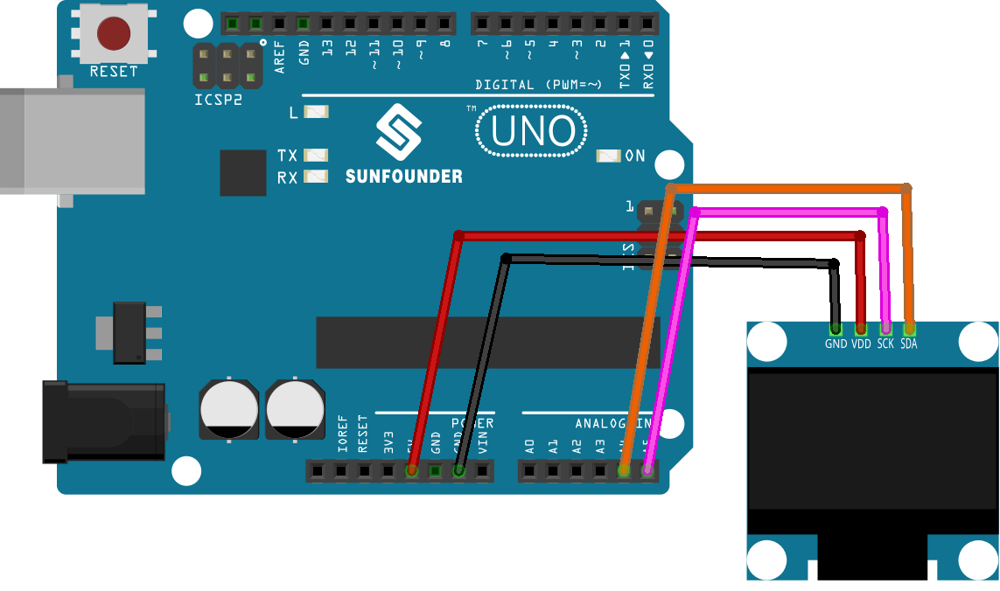

.. note::

    こんにちは、SunFounder Raspberry Pi & Arduino & ESP32 Enthusiasts Communityへようこそ！Facebook上で、仲間と一緒にRaspberry Pi、Arduino、ESP32をさらに深く探求しましょう。

    **なぜ参加するのか？**

    - **専門的なサポート**：購入後の問題や技術的な課題をコミュニティやチームの助けを借りて解決。
    - **学びと共有**：スキルを向上させるためのヒントやチュートリアルを交換。
    - **限定プレビュー**：新製品発表や予告編に早期アクセス。
    - **特別割引**：最新製品の特別割引を楽しむ。
    - **フェスティブプロモーションとプレゼント**：プレゼントやホリデープロモーションに参加。

    👉 私たちと一緒に探索と創造を始める準備はできましたか？[|link_sf_facebook|]をクリックして、今すぐ参加しましょう！

.. _uno_lesson27_oled:

Lesson 27: OLED Display Module (SSD1306)
============================================

In this lesson, you will learn how to program an Arduino Uno board to control an OLED display (SSD1306). We’ll cover using the Adafruit SSD1306 and GFX libraries to display text, numbers, and create scroll animations on the screen. This project is ideal for those seeking to enhance their knowledge of displaying graphics and text on small screens using the Arduino environment.

Required Components
--------------------------

In this project, we need the following components. 

It's definitely convenient to buy a whole kit, here's the link: 

.. list-table::
    :widths: 20 20 20
    :header-rows: 1

    *   - Name	
        - ITEMS IN THIS KIT
        - LINK
    *   - Universal Maker Sensor Kit
        - 94
        - |link_umsk|

You can also buy them separately from the links below.

.. list-table::
    :widths: 30 20
    :header-rows: 1

    *   - Component Introduction
        - Purchase Link

    *   - Arduino UNO R3 or R4
        - |link_Uno_R3_buy|
    *   - :ref:`cpn_oled`
        - \-

Wiring
---------------------------

Code
---------------------------

.. raw:: html

    <iframe src=https://create.arduino.cc/editor/sunfounder01/b2617291-5326-4d12-812b-78c45ced7516/preview?embed style="height:510px;width:100%;margin:10px 0" frameborder=0></iframe>

Code Analysis
---------------------------

1. **Library Inclusion and Initial Definitions**:
   The necessary libraries for interfacing with the OLED are included. Following that, definitions regarding the OLED's dimensions and I2C address are provided.

   - **Adafruit SSD1306**: This library is designed to help with the interfacing of the SSD1306 OLED display. It provides methods to initialize the display, control its settings, and display content.
   - **Adafruit GFX Library**: This is a core graphics library for displaying text, producing colors, drawing shapes, etc., on various screens including OLEDs.

   .. note:: 
      To install the library, use the Arduino Library Manager and search for **"Adafruit SSD1306"** and **"Adafruit GFX"** and install it. 

   .. code-block:: arduino
    
      #include <SPI.h>
      #include <Wire.h>
      #include <Adafruit_GFX.h>
      #include <Adafruit_SSD1306.h>

      #define SCREEN_WIDTH 128  // OLED display width, in pixels
      #define SCREEN_HEIGHT 64  // OLED display height, in pixels

      #define OLED_RESET -1
      #define SCREEN_ADDRESS 0x3C

2. **Bitmap Data**:
   Bitmap data for displaying a custom icon on the OLED screen. This data represents an image in a format that the OLED can interpret.

   You can use this online tool called |link_image2cpp| that can turn your image into an array. 

   The ``PROGMEM`` keyword denotes that the array is stored in the program memory of the Arduino microcontroller. Storing data in program memory(PROGMEM) instead of RAM can be helpful for large amounts of data, which would otherwise take up too much space in RAM.

   .. code-block:: arduino

      static const unsigned char PROGMEM sunfounderIcon[] = {...};

3. **Setup Function (Initialization and Display)**:
   The ``setup()`` function initializes the OLED and displays a series of patterns, texts, and animations.

   .. code-block:: arduino

      void setup() {
         ...  // Serial initialization and OLED object initialization
         ...  // Displaying various text, numbers, and animations
      }