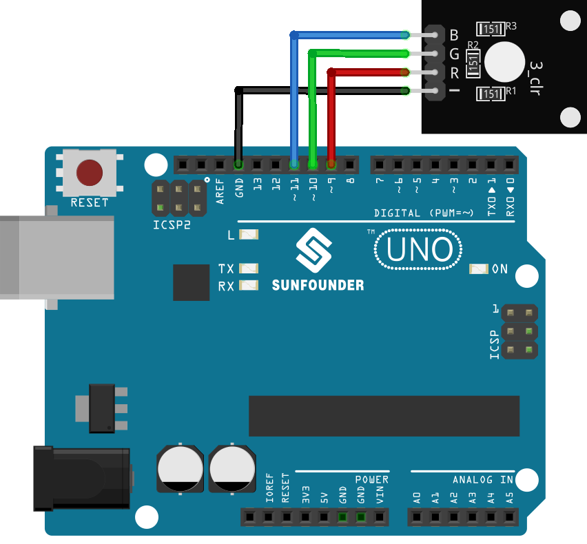

 .. note::

    Hallo und willkommen in der SunFounder Raspberry Pi & Arduino & ESP32 Enthusiasten-Gemeinschaft auf Facebook! Tauchen Sie tiefer ein in die Welt von Raspberry Pi, Arduino und ESP32 mit anderen Enthusiasten.

    **Warum beitreten?**

    - **Expertenunterstützung**: Lösen Sie Nachverkaufsprobleme und technische Herausforderungen mit Hilfe unserer Gemeinschaft und unseres Teams.
    - **Lernen & Teilen**: Tauschen Sie Tipps und Anleitungen aus, um Ihre Fähigkeiten zu verbessern.
    - **Exklusive Vorschauen**: Erhalten Sie frühzeitigen Zugang zu neuen Produktankündigungen und exklusiven Einblicken.
    - **Spezialrabatte**: Genießen Sie exklusive Rabatte auf unsere neuesten Produkte.
    - **Festliche Aktionen und Gewinnspiele**: Nehmen Sie an Gewinnspielen und Feiertagsaktionen teil.

    👉 Sind Sie bereit, mit uns zu erkunden und zu erschaffen? Klicken Sie auf [|link_sf_facebook|] und treten Sie heute bei!

.. _uno_lesson28_rgb_module:

Lektion 28: RGB-LED-Modul
==================================

In dieser Lektion lernen Sie, wie Sie eine RGB-LED mit Arduino steuern. Wir werden die Einrichtung der LED behandeln und dann primäre Farben anzeigen und ein lebendiges Regenbogenspektrum erstellen. Dieses praktische Projekt ist ideal für Anfänger und bietet praktische Erfahrung mit Ausgabeoperationen und Farbmischung in der Arduino-Umgebung.

Benötigte Komponenten
--------------------------

Für dieses Projekt benötigen wir die folgenden Komponenten. 

Es ist definitiv praktisch, ein komplettes Kit zu kaufen, hier ist der Link:

.. list-table::
    :widths: 20 20 20
    :header-rows: 1

    *   - Name	
        - ITEMS IN THIS KIT
        - LINK
    *   - Universal Maker Sensor Kit
        - 94
        - |link_umsk|

Sie können sie auch einzeln über die folgenden Links kaufen.

.. list-table::
    :widths: 30 20
    :header-rows: 1

    *   - Component Introduction
        - Purchase Link

    *   - Arduino UNO R3 or R4
        - |link_Uno_R3_buy|
    *   - :ref:`cpn_rgb`
        - \-

Verdrahtung
---------------------------

Code
---------------------------

.. raw:: html

    <iframe src=https://create.arduino.cc/editor/sunfounder01/69d51b96-ad16-4c16-aa97-6dab559929d3/preview?embed style="height:510px;width:100%;margin:10px 0" frameborder=0></iframe>

Code-Analyse
---------------------------

1. Im ersten Abschnitt des Codes werden die Pins deklariert und initialisiert, an die jeder Farbkanal des RGB-LED-Moduls angeschlossen ist.

   .. code-block:: arduino
       
      const int rledPin = 9;  // pin connected to the red color channel
      const int gledPin = 10;   // pin connected to the green color channel
      const int bledPin = 11;  // pin connected to the blue color channel

2. Die Funktion ``setup()`` initialisiert diese Pins als OUTPUT. Das bedeutet, dass wir Signale von diesen Pins zum RGB-LED-Modul senden.

   .. code-block:: arduino
   
      void setup() {
        pinMode(rledPin, OUTPUT);
        pinMode(gledPin, OUTPUT);
        pinMode(bledPin, OUTPUT);
      }

3. In der Funktion ``loop()`` wird die Funktion ``setColor()`` mit verschiedenen Parametern aufgerufen, um unterschiedliche Farben anzuzeigen. Die Funktion ``delay()`` wird nach jeder Farbänderung verwendet, um für 1000 Millisekunden (oder 1 Sekunde) zu pausieren, bevor die nächste Farbe eingestellt wird.

   .. code-block:: arduino
   
      void loop() {
        setColor(255, 0, 0);  // Set RGB LED color to red
        delay(1000);
        setColor(0, 255, 0);  // Set RGB LED color to green
        delay(1000);
        // The rest of the color sequence...
      }

4. Die Funktion ``setColor()`` verwendet die Funktion ``analogWrite()``, um die Helligkeit jedes Farbkanals des RGB-LED-Moduls anzupassen. Die Funktion ``analogWrite()`` nutzt Pulsweitenmodulation (PWM), um verschiedene Spannungspegel zu simulieren. Durch die Steuerung des PWM-Duty-Cycles (der Prozentsatz der Zeit, in der ein Signal innerhalb einer festen Periode HIGH ist) kann die Helligkeit jedes Farbkanals gesteuert werden, was die Mischung verschiedener Farben ermöglicht.

   .. code-block:: arduino

      void setColor(int R, int G, int B) {
        analogWrite(rledPin, R);  // Use PWM to control the brightness of the red color channel
        analogWrite(gledPin, G);  // Use PWM to control the brightness of the green color channel
        analogWrite(bledPin, B);  // Use PWM to control the brightness of the blue color channel
      }