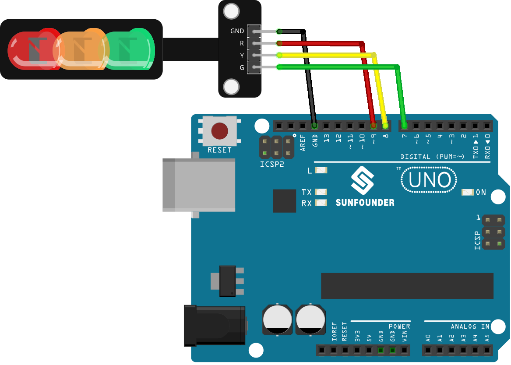

.. note::

   Hallo und willkommen in der SunFounder Raspberry Pi & Arduino & ESP32 Enthusiasten-Gemeinschaft auf Facebook! Tauchen Sie tiefer ein in die Welt von Raspberry Pi, Arduino und ESP32 mit anderen Enthusiasten.

   **Warum beitreten?**

   - **Expertenunterstützung**: Lösen Sie Nachverkaufsprobleme und technische Herausforderungen mit Hilfe unserer Gemeinschaft und unseres Teams.
   - **Lernen & Teilen**: Tauschen Sie Tipps und Anleitungen aus, um Ihre Fähigkeiten zu verbessern.
   - **Exklusive Vorschauen**: Erhalten Sie frühzeitigen Zugang zu neuen Produktankündigungen und exklusiven Einblicken.
   - **Spezialrabatte**: Genießen Sie exklusive Rabatte auf unsere neuesten Produkte.
   - **Festliche Aktionen und Gewinnspiele**: Nehmen Sie an Gewinnspielen und Feiertagsaktionen teil.

   👉 Sind Sie bereit, mit uns zu erkunden und zu erschaffen? Klicken Sie auf [|link_sf_facebook|] und treten Sie heute bei!

.. _uno_lesson29_traffic_light_module:

Lektion 29: Ampelmodul
==================================

In dieser Lektion lernen Sie, wie Sie mit Arduino eine Mini-LED-Ampel steuern können. Wir werden die Programmierung des Arduino Uno durchlaufen, um die Ampel auf Grün, Gelb und Rot zu schalten und damit eine echte Ampel zu simulieren. Dieses Projekt ist ideal für Anfänger, da es praktische Erfahrungen im Programmieren von Lichtsequenzen und Timing-Steuerungen auf der Arduino-Plattform bietet.

Benötigte Komponenten
--------------------------

In diesem Projekt benötigen wir die folgenden Komponenten. 

Es ist auf jeden Fall praktisch, ein komplettes Kit zu kaufen. Hier ist der Link: 

.. list-table::
    :widths: 20 20 20
    :header-rows: 1

    *   - Name	
        - ITEMS IN THIS KIT
        - LINK
    *   - Universal Maker Sensor Kit
        - 94
        - |link_umsk|

Sie können die Teile auch einzeln über die folgenden Links kaufen.

.. list-table::
    :widths: 30 20
    :header-rows: 1

    *   - Component Introduction
        - Purchase Link

    *   - Arduino UNO R3 or R4
        - |link_Uno_R3_buy|
    *   - :ref:`cpn_traffic`
        - |link_traffic_light_module_buy|

* Arduino UNO R3 or R4
* :ref:`cpn_traffic`

Verkabelung
---------------------------

Code
---------------------------

.. raw:: html

    <iframe src=https://create.arduino.cc/editor/sunfounder01/48f3abf4-1a9c-405f-9247-7dbd61e64f75/preview?embed style="height:510px;width:100%;margin:10px 0" frameborder=0></iframe>

Code-Analyse
---------------------------

1. Bevor wir mit den Operationen beginnen, definieren wir Konstanten für die Pins, an denen die LEDs angeschlossen sind. Dies macht unseren Code leichter lesbar und einfacher zu ändern.

  .. code-block:: arduino

     const int rledPin = 9;  //red
     const int yledPin = 8;  //yellow
     const int gledPin = 7;  //green

2. Hier legen wir die Pin-Modi für unsere LED-Pins fest. Alle werden auf ``OUTPUT`` gesetzt, da wir Spannung an sie senden möchten.

  .. code-block:: arduino

     void setup() {
       pinMode(rledPin, OUTPUT);
       pinMode(yledPin, OUTPUT);
       pinMode(gledPin, OUTPUT);
     }

3. Hier wird die Logik für unseren Ampelzyklus implementiert. Die Abfolge der Operationen ist:

    * Turn the green LED on for 5 seconds.
    * Blink the yellow LED three times (each blink lasts for 0.5 seconds).
    * Turn the red LED on for 5 seconds.
    
  .. code-block:: arduino

     void loop() {
       digitalWrite(gledPin, HIGH);
       delay(5000);
       digitalWrite(gledPin, LOW);
       
       digitalWrite(yledPin, HIGH);
       delay(500);
       digitalWrite(yledPin, LOW);
       delay(500);
       digitalWrite(yledPin, HIGH);
       delay(500);
       digitalWrite(yledPin, LOW);
       delay(500);
       digitalWrite(yledPin, HIGH);
       delay(500);
       digitalWrite(yledPin, LOW);
       delay(500);
       
       digitalWrite(rledPin, HIGH);
       delay(5000);
       digitalWrite(rledPin, LOW);
     }

