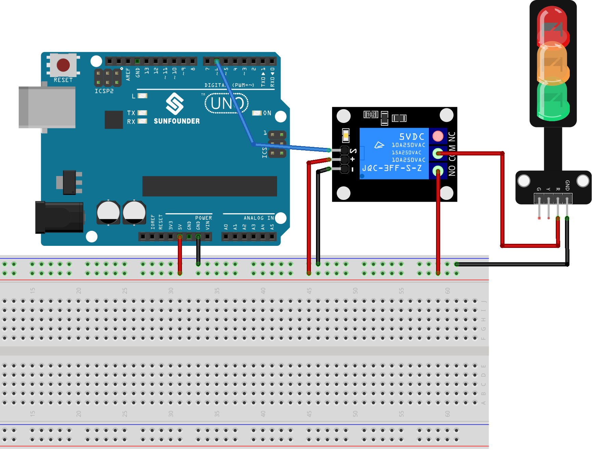

 .. note::

    Hallo und willkommen in der SunFounder Raspberry Pi & Arduino & ESP32 Enthusiasten-Gemeinschaft auf Facebook! Tauchen Sie tiefer ein in die Welt von Raspberry Pi, Arduino und ESP32 mit anderen Enthusiasten.

    **Warum beitreten?**

    - **Expertenunterstützung**: Lösen Sie Nachverkaufsprobleme und technische Herausforderungen mit Hilfe unserer Gemeinschaft und unseres Teams.
    - **Lernen & Teilen**: Tauschen Sie Tipps und Anleitungen aus, um Ihre Fähigkeiten zu verbessern.
    - **Exklusive Vorschauen**: Erhalten Sie frühzeitigen Zugang zu neuen Produktankündigungen und exklusiven Einblicken.
    - **Spezialrabatte**: Genießen Sie exklusive Rabatte auf unsere neuesten Produkte.
    - **Festliche Aktionen und Gewinnspiele**: Nehmen Sie an Gewinnspielen und Feiertagsaktionen teil.

    👉 Sind Sie bereit, mit uns zu erkunden und zu erschaffen? Klicken Sie auf [|link_sf_facebook|] und treten Sie heute bei!

.. _uno_lesson30_relay_module:

Lektion 30: Relaismodul
==================================

In dieser Lektion lernst du, wie man ein Relais und ein Arduino Uno verwendet, um ein Ampelmodul zu steuern. Wir demonstrieren, wie man das rote Licht des Ampelmoduls mit dem Relais ein- und ausschaltet. Dieses Projekt ist ideal für Arduino-Anfänger, da es praktische Erfahrungen im Steuern externer Module vermittelt und ein grundlegendes Verständnis der Relaisoperationen bietet.

Benötigte Komponenten
--------------------------

Für dieses Projekt benötigen wir die folgenden Komponenten. 

Es ist definitiv praktisch, ein ganzes Kit zu kaufen. Hier ist der Link: 

.. list-table::
    :widths: 20 20 20
    :header-rows: 1

    *   - Name	
        - ITEMS IN THIS KIT
        - LINK
    *   - Universal Maker Sensor Kit
        - 94
        - |link_umsk|

Du kannst sie auch einzeln über die untenstehenden Links kaufen.

.. list-table::
    :widths: 30 20
    :header-rows: 1

    *   - Component Introduction
        - Purchase Link

    *   - Arduino UNO R3 or R4
        - |link_Uno_R3_buy|
    *   - :ref:`cpn_breadboard`
        - |link_breadboard_buy|
    *   - :ref:`cpn_relay`
        - \-
    *   - :ref:`cpn_traffic`
        - |link_traffic_light_module_buy|

Verkabelung
---------------------------

Code
---------------------------

.. raw:: html

    <iframe src=https://create.arduino.cc/editor/sunfounder01/304bb1cc-7b9e-4290-b63a-baec5ed90521/preview?embed style="height:510px;width:100%;margin:10px 0" frameborder=0></iframe>

Code-Analyse
---------------------------

#. Einrichten des Relais-Pins:

   - Das Relaismodul ist mit Pin 6 des Arduino verbunden. Dieser Pin wird als ``relayPin`` definiert, um ihn im Code leichter referenzieren zu können.

   .. raw:: html

       

   .. code-block:: arduino
    
      const int relayPin = 6;

#. Konfigurieren des Relais-Pins als Ausgang:

   - In der ``setup()``-Funktion wird der Relais-Pin mit der Funktion ``pinMode()`` als Ausgang festgelegt. Das bedeutet, dass der Arduino Signale (entweder HIGH oder LOW) an diesen Pin senden wird.

   .. raw:: html

       

   .. code-block:: arduino

      void setup() {
        pinMode(relayPin, OUTPUT);
      }

#. Schalten des Relais EIN und AUS:

   - In der ``loop()``-Funktion wird das Relais zunächst mit ``digitalWrite(relayPin, LOW)`` in den AUS-Zustand versetzt. Es bleibt 3 Sekunden lang in diesem Zustand (``delay(3000)``).
   - Dann wird das Relais mit ``digitalWrite(relayPin, HIGH)`` in den EIN-Zustand versetzt. Auch in diesem Zustand bleibt es 3 Sekunden lang.
   - Dieser Zyklus wird unendlich oft wiederholt.

   .. raw:: html

       

   .. code-block:: arduino

      void loop() {
        digitalWrite(relayPin, LOW);
        delay(3000);

        digitalWrite(relayPin, HIGH);
        delay(3000);
      }