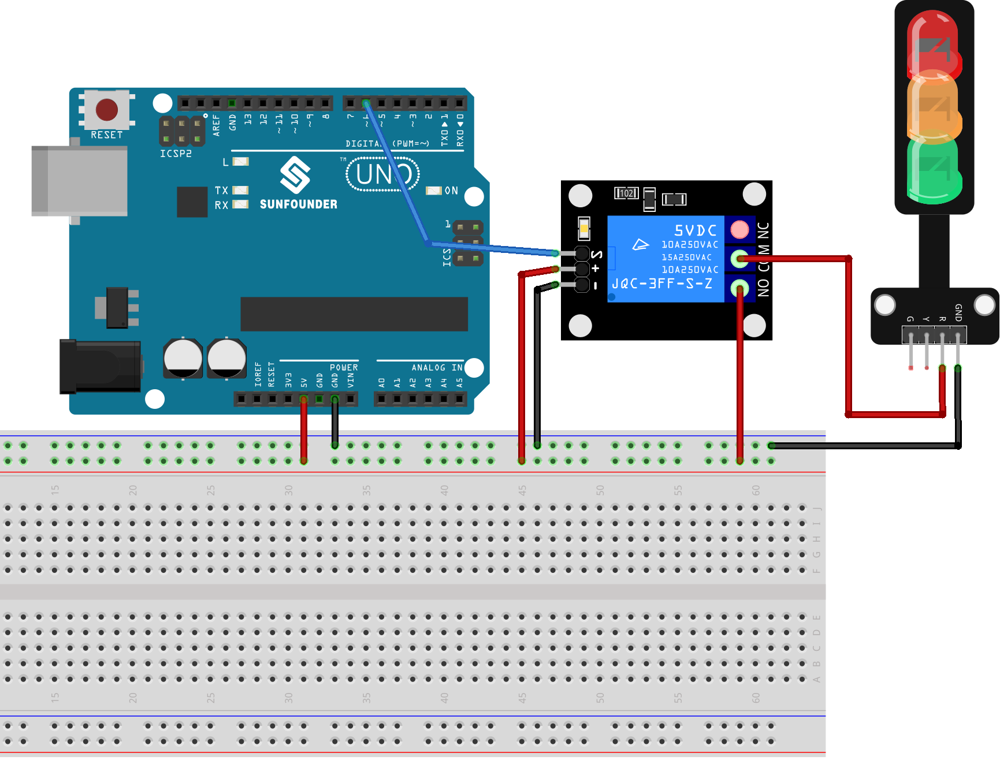

.. note::

    Bonjour, bienvenue dans la communauté des passionnés de SunFounder Raspberry Pi, Arduino et ESP32 sur Facebook ! Plongez dans l’univers du Raspberry Pi, d’Arduino et de l’ESP32 avec d’autres passionnés.

    **Pourquoi nous rejoindre ?**

    - **Support d’experts** : Résolvez vos problèmes après-vente et relevez des défis techniques avec l’aide de notre communauté et de notre équipe.
    - **Apprendre & Partager** : Échangez des astuces et des tutoriels pour améliorer vos compétences.
    - **Aperçus exclusifs** : Accédez en avant-première aux annonces et aperçus des nouveaux produits.
    - **Réductions spéciales** : Profitez d’offres exclusives sur nos derniers produits.
    - **Promotions festives et cadeaux** : Participez à des concours et événements promotionnels spéciaux.

    👉 Prêt à explorer et à créer avec nous ? Cliquez sur [|link_sf_facebook|] et rejoignez-nous dès aujourd’hui !

.. _uno_lesson30_relay_module:

Leçon 30 : Module Relais
============================

Dans cette leçon, vous apprendrez à utiliser un relais avec un Arduino Uno pour contrôler un module de feu tricolore. Nous verrons comment allumer et éteindre le feu rouge du module de signalisation à l’aide du relais. Ce projet est idéal pour les débutants en Arduino, offrant une expérience pratique dans le contrôle de modules externes et une compréhension des bases du fonctionnement des relais.

Composants nécessaires
-------------------------

Pour ce projet, nous avons besoin des composants suivants.

Il est plus pratique d’acheter un kit complet, voici le lien :

.. list-table::
    :widths: 20 20 20
    :header-rows: 1

    *   - Nom	
        - ARTICLES DANS CE KIT
        - LIEN
    *   - Kit capteur universel pour bricoleurs
        - 94
        - |link_umsk|

Vous pouvez également les acheter séparément via les liens ci-dessous.

.. list-table::
    :widths: 30 20
    :header-rows: 1

    *   - Introduction du composant
        - Lien d'achat

    *   - Arduino UNO R3 ou R4
        - |link_Uno_R3_buy|
    *   - :ref:`cpn_breadboard`
        - |link_breadboard_buy|
    *   - :ref:`cpn_relay`
        - \-
    *   - :ref:`cpn_traffic`
        - |link_traffic_light_module_buy|

Câblage
---------

Code
------

.. raw:: html

    <iframe src=https://create.arduino.cc/editor/sunfounder01/304bb1cc-7b9e-4290-b63a-baec5ed90521/preview?embed style="height:510px;width:100%;margin:10px 0" frameborder=0></iframe>

Analyse du code
-------------------

1. Définition de la broche du relais :

   - Le module relais est connecté à la broche 6 de l’Arduino. Cette broche est définie comme ``relayPin`` pour faciliter la référence dans le code.   

   .. raw:: html

       

   .. code-block:: arduino
    
      const int relayPin = 6;

2. Configuration de la broche du relais comme sortie :

   - Dans la fonction ``setup()``, la broche du relais est définie en tant que ``OUTPUT`` à l’aide de la fonction ``pinMode()``. Cela signifie que l’Arduino enverra des signaux (HIGH ou LOW) à cette broche.

   .. code-block:: arduino

      void setup() {
        pinMode(relayPin, OUTPUT);
      }

3. Activation et désactivation du relais :

   - Dans la fonction ``loop()``, le relais est d’abord désactivé avec ``digitalWrite(relayPin, LOW)`` et reste dans cet état pendant 3 secondes (``delay(3000)``).
   - Ensuite, le relais est activé avec ``digitalWrite(relayPin, HIGH)`` et reste dans cet état pendant 3 secondes.
   - Ce cycle se répète indéfiniment.

   .. code-block:: arduino

      void loop() {
        digitalWrite(relayPin, LOW);
        delay(3000);

        digitalWrite(relayPin, HIGH);
        delay(3000);
      }