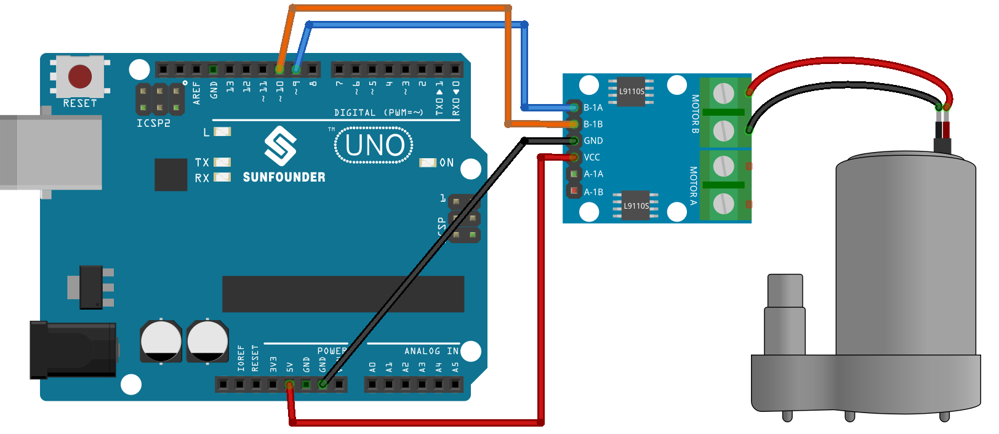

 .. note::

    Hallo und willkommen in der SunFounder Raspberry Pi & Arduino & ESP32 Enthusiasten-Gemeinschaft auf Facebook! Tauchen Sie tiefer ein in die Welt von Raspberry Pi, Arduino und ESP32 mit anderen Enthusiasten.

    **Warum beitreten?**

    - **Expertenunterstützung**: Lösen Sie Nachverkaufsprobleme und technische Herausforderungen mit Hilfe unserer Gemeinschaft und unseres Teams.
    - **Lernen & Teilen**: Tauschen Sie Tipps und Anleitungen aus, um Ihre Fähigkeiten zu verbessern.
    - **Exklusive Vorschauen**: Erhalten Sie frühzeitigen Zugang zu neuen Produktankündigungen und exklusiven Einblicken.
    - **Spezialrabatte**: Genießen Sie exklusive Rabatte auf unsere neuesten Produkte.
    - **Festliche Aktionen und Gewinnspiele**: Nehmen Sie an Gewinnspielen und Feiertagsaktionen teil.

    👉 Sind Sie bereit, mit uns zu erkunden und zu erschaffen? Klicken Sie auf [|link_sf_facebook|] und treten Sie heute bei!

.. _uno_lesson31_pump:

Lektion 31: Kreiselpumpe
==================================

In dieser Lektion lernen Sie, wie Sie eine Kreiselpumpe mit einem Arduino Uno R3 oder R4 und einer L9110-Motorsteuerplatine steuern. Sie erfahren, wie Sie den Arduino so einrichten und programmieren, dass die Pumpe in eine Richtung startet, für eine bestimmte Dauer läuft und dann stoppt. Diese praktische Erfahrung ist ideal für Anfänger und bietet grundlegende Einblicke in die Verwaltung von Motoroperationen und das Verständnis von Ausgangssteuerungen in Arduino-Projekten.

Benötigte Komponenten
--------------------------

Für dieses Projekt benötigen wir die folgenden Komponenten. 

Es ist definitiv praktisch, ein komplettes Kit zu kaufen, hier ist der Link: 

.. list-table::
    :widths: 20 20 20
    :header-rows: 1

    *   - Name	
        - ITEMS IN THIS KIT
        - LINK
    *   - Universal Maker Sensor Kit
        - 94
        - |link_umsk|

Sie können sie auch einzeln über die unten stehenden Links kaufen.

.. list-table::
    :widths: 30 20
    :header-rows: 1

    *   - Component Introduction
        - Purchase Link

    *   - Arduino UNO R3 or R4
        - |link_Uno_R3_buy|
    *   - :ref:`cpn_pump`
        - \-
    *   - :ref:`cpn_l9110`
        - \-

* Arduino UNO R3 or R4
* :ref:`cpn_pump`
* :ref:`cpn_l9110`

Verkabelung
---------------------------

Code
---------------------------

.. raw:: html

    <iframe src=https://create.arduino.cc/editor/sunfounder01/f5fad7fa-4b2c-4630-a832-d3a5e077d9fa/preview?embed style="height:510px;width:100%;margin:10px 0" frameborder=0></iframe>

Code-Analyse
---------------------------

1. Zwei Pins werden zur Steuerung des Motors definiert, nämlich ``motorB_1A`` und ``motorB_2A``. Diese Pins werden mit der L9110-Motorsteuerplatine verbunden, um die Richtung und Geschwindigkeit des Motors zu steuern.
  
   .. code-block:: arduino
   
      const int motorB_1A = 9;
      const int motorB_2A = 10;

2. Konfigurieren der Pins und Steuern des Motors:

   - Die Funktion ``setup()`` initialisiert die Pins als ``OUTPUT``, was bedeutet, dass sie Signale an die Motorsteuerplatine senden können.

   - Die Funktion ``analogWrite()`` wird verwendet, um die Motordrehzahl einzustellen. Hier führt das Setzen eines Pins auf ``HIGH`` und des anderen auf ``LOW`` dazu, dass die Pumpe in eine Richtung dreht. Nach einer Verzögerung von 5 Sekunden werden beide Pins auf 0 gesetzt, wodurch der Motor ausgeschaltet wird.

   .. raw:: html

       
   
   .. code-block:: arduino
   
      void setup() {
         pinMode(motorB_1A, OUTPUT);  // set pump pin 1 as output
         pinMode(motorB_2A, OUTPUT);  // set pump pin 2 as output
         analogWrite(motorB_1A, HIGH); 
         analogWrite(motorB_2A, LOW);
         delay(5000);// wait for 5 seconds
         analogWrite(motorB_1A, 0);  // turn off the pump
         analogWrite(motorB_2A, 0);
      }
