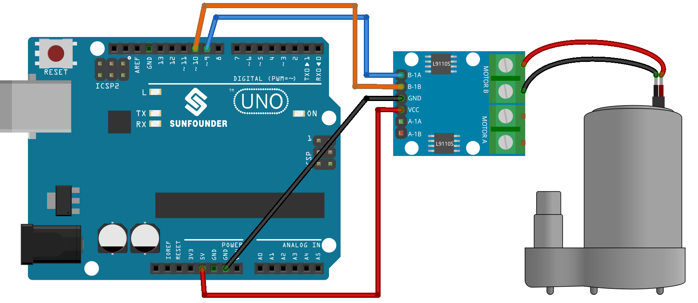

.. note::

    Bonjour, bienvenue dans la communauté des passionnés de SunFounder Raspberry Pi, Arduino et ESP32 sur Facebook ! Plongez dans l’univers du Raspberry Pi, d’Arduino et de l’ESP32 avec d’autres passionnés.

    **Pourquoi nous rejoindre ?**

    - **Support d’experts** : Résolvez vos problèmes après-vente et relevez des défis techniques avec l’aide de notre communauté et de notre équipe.
    - **Apprendre & Partager** : Échangez des astuces et des tutoriels pour améliorer vos compétences.
    - **Aperçus exclusifs** : Accédez en avant-première aux annonces et aperçus des nouveaux produits.
    - **Réductions spéciales** : Profitez d’offres exclusives sur nos derniers produits.
    - **Promotions festives et cadeaux** : Participez à des concours et événements promotionnels spéciaux.

    👉 Prêt à explorer et à créer avec nous ? Cliquez sur [|link_sf_facebook|] et rejoignez-nous dès aujourd’hui !

.. _uno_lesson31_pump:

Leçon 31 : Pompe centrifuge
==============================

Dans cette leçon, vous apprendrez à contrôler une pompe centrifuge avec un Arduino Uno R3 ou R4 et une carte de contrôle moteur L9110. Vous découvrirez comment configurer et programmer l’Arduino pour démarrer la pompe dans une direction, la faire fonctionner pendant une durée spécifique, puis l’arrêter. Cette expérience pratique est idéale pour les débutants et offre une compréhension fondamentale de la gestion des moteurs et du contrôle des sorties dans les projets Arduino.

Composants nécessaires
-------------------------

Pour ce projet, nous avons besoin des composants suivants.

Il est plus pratique d’acheter un kit complet, voici le lien :

.. list-table::
    :widths: 20 20 20
    :header-rows: 1

    *   - Nom	
        - ARTICLES DANS CE KIT
        - LIEN
    *   - Kit capteur universel pour bricoleurs
        - 94
        - |link_umsk|

Vous pouvez également les acheter séparément via les liens ci-dessous.

.. list-table::
    :widths: 30 20
    :header-rows: 1

    *   - Introduction du composant
        - Lien d'achat

    *   - Arduino UNO R3 ou R4
        - |link_Uno_R3_buy|
    *   - :ref:`cpn_pump`
        - \-
    *   - :ref:`cpn_l9110`
        - \-

* Arduino UNO R3 ou R4
* :ref:`cpn_pump`
* :ref:`cpn_l9110`

Câblage
----------

Code
-------

.. raw:: html

    <iframe src=https://create.arduino.cc/editor/sunfounder01/f5fad7fa-4b2c-4630-a832-d3a5e077d9fa/preview?embed style="height:510px;width:100%;margin:10px 0" frameborder=0></iframe>

Analyse du code
----------------

1. Définition des broches de contrôle du moteur :
   
   - Deux broches sont définies pour contrôler le moteur, spécifiquement ``motorB_1A`` et ``motorB_2A``. Ces broches seront connectées à la carte de contrôle moteur L9110 pour réguler la direction et la vitesse du moteur.
  
   .. code-block:: arduino
   
      const int motorB_1A = 9;
      const int motorB_2A = 10;

2. Configuration des broches et contrôle du moteur :

   - La fonction ``setup()`` initialise les broches en tant que ``OUTPUT``, ce qui signifie qu’elles enverront des signaux à la carte de contrôle moteur.

   - La fonction ``analogWrite()`` est utilisée pour régler la vitesse du moteur. Ici, en mettant une broche à ``HIGH`` et l’autre à ``LOW``, la pompe tourne dans une direction. Après un délai de 5 secondes, les deux broches sont mises à 0, ce qui arrête le moteur.

      .. raw:: html

        

   .. code-block:: arduino
   
      void setup() {
         pinMode(motorB_1A, OUTPUT);  // Définir la broche 1 de la pompe comme sortie
         pinMode(motorB_2A, OUTPUT);  // Définir la broche 2 de la pompe comme sortie
         analogWrite(motorB_1A, HIGH); 
         analogWrite(motorB_2A, LOW);
         delay(5000); // Attendre 5 secondes
         analogWrite(motorB_1A, 0);  // Arrêter la pompe
         analogWrite(motorB_2A, 0);
      }
