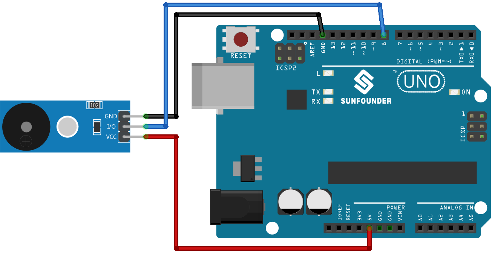

.. note::

    Hello, welcome to the SunFounder Raspberry Pi & Arduino & ESP32 Enthusiasts Community on Facebook! Dive deeper into Raspberry Pi, Arduino, and ESP32 with fellow enthusiasts.

    **Why Join?**

    - **Expert Support**: Solve post-sale issues and technical challenges with help from our community and team.
    - **Learn & Share**: Exchange tips and tutorials to enhance your skills.
    - **Exclusive Previews**: Get early access to new product announcements and sneak peeks.
    - **Special Discounts**: Enjoy exclusive discounts on our newest products.
    - **Festive Promotions and Giveaways**: Take part in giveaways and holiday promotions.

    👉 Ready to explore and create with us? Click [|link_sf_facebook|] and join today!

.. _uno_lesson32_passive_buzzer:

Lesson 32: Passive Buzzer Module
==================================

In this lesson, you will learn how to play a melody on a passive buzzer module using Arduino. We'll cover programming the Arduino to control the buzzer and create various note durations. This project is ideal for beginners as it provides hands-on experience in producing sound and understanding musical notes within electronic components. You'll also gain practical insight into using the Arduino Uno board and the passive buzzer module.

Required Components
---------------------------

.. list-table::
    :widths: 30 20
    :header-rows: 1

    *   - Component Introduction
        - Purchase Link

    *   - Arduino UNO R3 or R4
        - |link_Uno_R3_buy|
    *   - :ref:`cpn_buzzer`
        - |link_passive_buzzer_module_buy|

Wiring
---------------------------

Code
---------------------------

.. raw:: html

    <iframe src=https://create.arduino.cc/editor/sunfounder01/eebc46ab-2a9d-4731-8778-3c8f07b0003b/preview?embed style="height:510px;width:100%;margin:10px 0" frameborder=0></iframe>

Code Analysis
---------------------------

1. Including the pitches library:
   This library provides the frequency values for various musical notes, allowing you to use musical notation in your code.

   .. code-block:: arduino
       
      #include "pitches.h"

2. Defining constants and arrays:

   * ``buzzerPin`` is the digital pin on the Arduino where the buzzer is connected.

   * ``melody[]`` is an array that stores the sequence of notes to be played.

   * ``noteDurations[]`` is an array that stores the duration of each note in the melody.

   .. raw:: html
      
       

   .. code-block:: arduino
   
      const int buzzerPin = 8;
      int melody[] = {
        NOTE_C4, NOTE_G3, NOTE_G3, NOTE_A3, NOTE_G3, 0, NOTE_B3, NOTE_C4
      };
      int noteDurations[] = {
        4, 8, 8, 4, 4, 4, 4, 4
      };

3. Playing the melody:

   * The ``for`` loop iterates over each note in the melody.

   * The ``tone()`` function plays a note on the buzzer for a specific duration.

   * A delay is added between notes to distinguish them.

   * The ``noTone()`` function stops the sound.

   .. raw:: html
      
       

   .. code-block:: arduino
   
      void setup() {
        for (int thisNote = 0; thisNote < 8; thisNote++) {
          int noteDuration = 1000 / noteDurations[thisNote];
          tone(buzzerPin, melody[thisNote], noteDuration);
          int pauseBetweenNotes = noteDuration * 1.30;
          delay(pauseBetweenNotes);
          noTone(buzzerPin);
        }
      }

4. Empty loop function:
   Since the melody is played only once in the setup, there's no code in the loop function.
