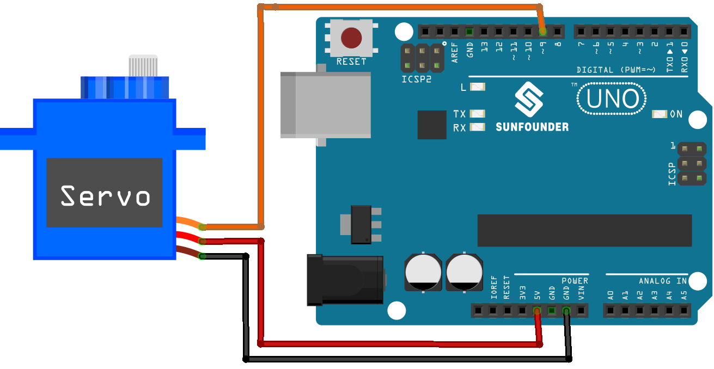

.. note::

    Hello, welcome to the SunFounder Raspberry Pi & Arduino & ESP32 Enthusiasts Community on Facebook! Dive deeper into Raspberry Pi, Arduino, and ESP32 with fellow enthusiasts.

    **Why Join?**

    - **Expert Support**: Solve post-sale issues and technical challenges with help from our community and team.
    - **Learn & Share**: Exchange tips and tutorials to enhance your skills.
    - **Exclusive Previews**: Get early access to new product announcements and sneak peeks.
    - **Special Discounts**: Enjoy exclusive discounts on our newest products.
    - **Festive Promotions and Giveaways**: Take part in giveaways and holiday promotions.

    👉 Ready to explore and create with us? Click [|link_sf_facebook|] and join today!

.. _uno_lesson33_servo:

Lesson 33: Servo Motor (SG90)
==================================

In this lesson, you will learn how to use Arduino to control a servo motor and make it rotate from 0 to 180 degrees and back. We will cover the usage of the Servo library, defining and using variables for servo control, as well as implementing a for loop for gradual movement. This project is ideal for beginners as it provides hands-on experience with motor control and basic programming principles in Arduino.

Required Components
---------------------------

.. list-table::
    :widths: 30 20
    :header-rows: 1

    *   - Component Introduction
        - Purchase Link

    *   - Arduino UNO R3 or R4
        - |link_Uno_R3_buy|
    *   - :ref:`cpn_servo`
        - |link_servo_buy|

Wiring
---------------------------

Code
---------------------------

.. raw:: html

    <iframe src=https://create.arduino.cc/editor/sunfounder01/12bb5427-6260-4b46-88a7-4b98f9db3ace/preview?embed style="height:510px;width:100%;margin:10px 0" frameborder=0></iframe>

Code Analysis
---------------------------

1. Here, the ``Servo`` library is included which allows for easy control of the servo motor. The pin connected to the servo and the initial angle of the servo are also defined.

   .. code-block:: arduino

      #include <Servo.h>
      const int servoPin = 9;  // Define the servo pin
      int angle = 0;           // Initialize the angle variable to 0 degrees
      Servo servo;             // Create a servo object

2. The ``setup()`` function runs once when the Arduino starts. The servo is attached to the defined pin using the ``attach()`` function.

   .. code-block:: arduino

      void setup() {
        servo.attach(servoPin);
      }

3. The main loop has two ``for`` loops. The first loop increases the angle from 0 to 180 degrees, and the second loop decreases the angle from 180 to 0 degrees. The ``servo.write(angle)`` command sets the servo to the specified angle. The ``delay(15)`` causes the servo to wait for 15 milliseconds before moving to the next angle, controlling the speed of the scanning movement.

   .. code-block:: arduino

      void loop() {
        // scan from 0 to 180 degrees
        for (angle = 0; angle < 180; angle++) {
          servo.write(angle);
          delay(15);
        }
        // now scan back from 180 to 0 degrees
        for (angle = 180; angle > 0; angle--) {
          servo.write(angle);
          delay(15);
        }
      }