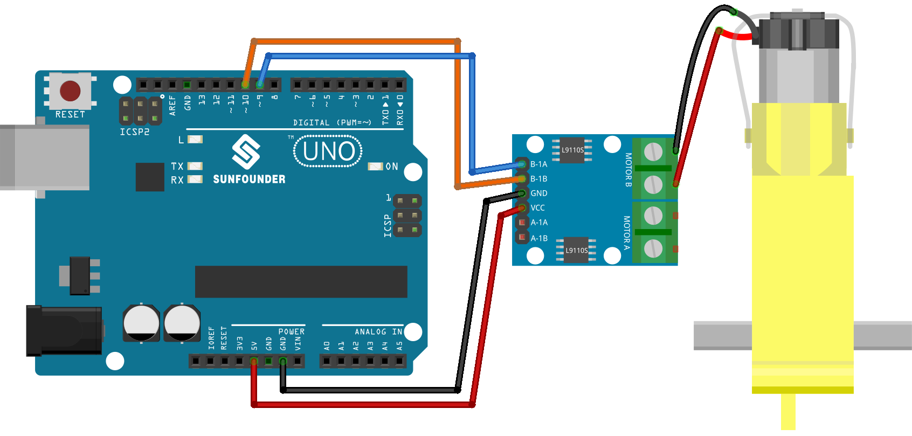

.. _uno_lesson34_motor:

Lesson 34: TT Motor
==================================

In this lesson, you will learn how to control a motor using an Arduino Uno R3 or R4 and an L9110 motor control board. We'll cover defining motor pins and setting their speed through programming. This tutorial will walk you through the process of connecting and controlling a motor, demonstrating the basic principles of motor operation and control in Arduino projects. Geared towards beginners, this lesson provides a hands-on approach to understanding output operations on the Arduino platform.

Required Components
---------------------------

.. list-table::
    :widths: 30 20
    :header-rows: 1

    *   - Component Introduction
        - Purchase Link

    *   - Arduino UNO R3 or R4
        - |link_Uno_R3_buy|
    *   - :ref:`cpn_ttmotor`
        - \-
    *   - :ref:`cpn_l9110`
        - \-

Wiring
---------------------------

Code
---------------------------

.. raw:: html

    <iframe src=https://create.arduino.cc/editor/sunfounder01/89894de5-2114-4056-a064-0c495c6de447/preview?embed style="height:510px;width:100%;margin:10px 0" frameborder=0></iframe>

Code Analysis
---------------------------

1. The first part of the code defines the motor control pins. These are connected to the L9110 motor control board.

   .. code-block:: arduino
   
      // Define the motor pins
      const int motorB_1A = 9;
      const int motorB_2A = 10;

2. The ``setup()`` function initializes the motor control pins as output using the ``pinMode()`` function. Then it uses ``analogWrite()`` to set the speed of the motor. The value passed to ``analogWrite()`` can range from 0 (off) to 255 (full speed). A ``delay()`` function is then used to pause the code for 5000 milliseconds (or 5 seconds), after which the motor speed is set to 0 (off).

   .. code-block:: arduino
   
      void setup() {
        pinMode(motorB_1A, OUTPUT);  // set motor pin 1 as output
        pinMode(motorB_2A, OUTPUT);  // set motor pin 2 as output
   
        analogWrite(motorB_1A, 255);  // set motor speed (0-255)
        analogWrite(motorB_2A, 0);
   
        delay(5000);
   
        analogWrite(motorB_1A, 0);  
        analogWrite(motorB_2A, 0);
      }
