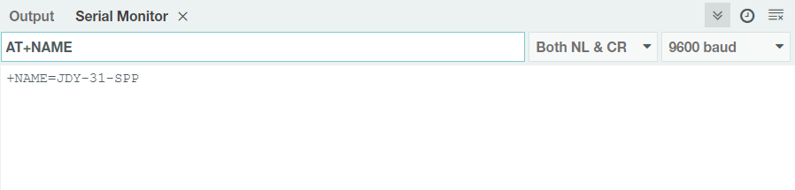

.. note::

    こんにちは、SunFounder Raspberry Pi & Arduino & ESP32 Enthusiasts Communityへようこそ！Facebook上で、仲間と一緒にRaspberry Pi、Arduino、ESP32をさらに深く探求しましょう。

    **なぜ参加するのか？**

    - **専門的なサポート**：購入後の問題や技術的な課題をコミュニティやチームの助けを借りて解決。
    - **学びと共有**：スキルを向上させるためのヒントやチュートリアルを交換。
    - **限定プレビュー**：新製品発表や予告編に早期アクセス。
    - **特別割引**：最新製品の特別割引を楽しむ。
    - **フェスティブプロモーションとプレゼント**：プレゼントやホリデープロモーションに参加。

    👉 私たちと一緒に探索と創造を始める準備はできましたか？[|link_sf_facebook|]をクリックして、今すぐ参加しましょう！
.. _uno_lesson36_bluetooth:

レッスン36: Bluetoothモジュールの始め方
===================================================

このプロジェクトでは、Arduinoを介してBluetoothモジュールと通信する方法を紹介します。

まず、回路を組み立て、ソフトウェアシリアル通信を使用します。BluetoothモジュールのTXピンをUnoボードのピン3に、RXピンをピン4に接続します。

必要なコンポーネント
--------------------------

このプロジェクトでは、以下のコンポーネントが必要です。

一式キットを購入するのが便利です。こちらのリンクをご覧ください:

.. list-table::
    :widths: 20 20 20
    :header-rows: 1

    *   - Name	
        - ITEMS IN THIS KIT
        - LINK
    *   - Universal Maker Sensor Kit
        - 94
        - |link_umsk|

以下のリンクから別々に購入することもできます。

.. list-table::
    :widths: 30 20
    :header-rows: 1

    *   - Component Introduction
        - Purchase Link

    *   - Arduino UNO R3 or R4
        - |link_Uno_R3_buy|
    *   - :ref:`cpn_jdy31`
        - |link_jdy31_bluetooth_module_buy|
    *   - :ref:`cpn_breadboard`
        - |link_breadboard_buy|

1. 回路を組み立てる
-----------------------------

.. image:: img/Lesson_36_Bluetooth_uno_bb.png
    :width: 100%

2. コードをアップロードする
-----------------------------

このコードは、ArduinoのSoftwareSerialライブラリを使用してソフトウェアシリアル通信を確立し、Arduinoがデジタルピン3と4（RxとTx）を介してJDY-31 Bluetoothモジュールと通信できるようにします。データ転送をチェックし、受信したメッセージを互いに転送し、9600のボーレートで通信します。 **このコードを使用することで、Arduinoのシリアルモニターを使用してJDY-31 BluetoothモジュールにATコマンドを送信し、その応答を受信することができます** 。

.. raw:: html
    
    <iframe src=https://create.arduino.cc/editor/sunfounder01/ae75dbe4-f50d-41a4-915a-b2a30b0f4ebe/preview?embed style="height:510px;width:100%;margin:10px 0" frameborder=0></iframe>

3. Bluetoothモジュールの設定
-----------------------------------------

右上の虫眼鏡アイコン（シリアルモニター）をクリックし、ボーレートを ``9600`` に設定します。次に、 ``New Line`` ドロップダウンボックスから ``both NL & CR`` を選択します。

.. image:: img/Lesson_36_bluetooth_serial_1_shadow.png 

以下に、Bluetoothモジュールの設定に使用するATコマンドの例を示します。 ``AT+NAME`` を入力してBluetoothデバイスの名前を取得します。Bluetoothの名前を変更する場合は、 ``AT+NAME`` の後に新しい名前を追加してください。

* **Bluetoothデバイスの名前を取得する:** ``AT+NAME`` 

  .. image:: img/Lesson_36_bluetooth_serial_2.gif

* **Bluetoothデバイスの名前を設定する:** ``AT+NAME``（新しい名前を続けて入力）。 ``+OK`` と表示されれば設定は成功です。再度 ``AT+NAME`` を送信して確認することができます。

.. note::
学習体験の一貫性を保つため、Bluetoothモジュールのデフォルトのボーレートを変更せずにデフォルトの値である9600ボーレートのままにすることをお勧めします。関連するコースでは、9600ボーレートを使用してBluetoothと通信します。

* **Set Bluetooth baudrate:** ``AT+BAUD``（ボーレートを示す番号を続けて入力）。

    * 4 == 9600
    * 5 == 19200
    * 6 == 38400
    * 7 == 57600
    * 8 == 115200
    * 9 == 128000

以下の表に他のATコマンドを示します。

+------------+-------------------------------------+-------------+
|   コマンド |               機能                   |   デフォルト |
+============+=====================================+=============+
| AT+VERSION | バージョン番号                       | JDY-31-V1.2 |
+------------+-------------------------------------+-------------+
| AT+RESET   | ソフトリセット                       |             |
+------------+-------------------------------------+-------------+
| AT+DISC    | 切断（接続時有効）                   |             |
+------------+-------------------------------------+-------------+
| AT+LADDR   | モジュールのMACアドレスを照会         |             |
+------------+-------------------------------------+-------------+
| AT+PIN     | 接続パスワードの設定または照会        | 1234        |
+------------+-------------------------------------+-------------+
| AT+BAUD    | ボーレートの設定または照会            | 9600        |
+------------+-------------------------------------+-------------+
| AT+NAME    | ブロードキャスト名の設定または照会 | JDY-31-SPP  |
+------------+-------------------------------------+-------------+
| AT+DEFAULT | 工場出荷時設定にリセット           |             |
+------------+-------------------------------------+-------------+
| AT+ENLOG   | シリアルポートステータス出力       | 1           |
+------------+-------------------------------------+-------------+

4. 携帯電話のBluetoothデバッグツールを通じて通信する
-----------------------------------------------------------------------------------

"Serial Bluetooth Terminal"というアプリを使用して、BluetoothモジュールからArduinoにメッセージを送信し、Bluetoothの相互作用をシミュレートできます。Bluetoothモジュールは受信したメッセージをシリアルポートを介してArduinoに送信し、同様にArduinoもシリアルポートを介してBluetoothモジュールにメッセージを送信できます。

a. **Serial Bluetooth Terminalのインストール**

   Google Playにアクセスして、|link_serial_bluetooth_terminal| をダウンロードしてインストールします。

b. **Bluetoothを接続する**

   まず、スマートフォンで **Bluetooth** をオンにします。
   
      .. image:: img/Lesson_36_app_1_shadow.png
         :width: 60%
         :align: center
   
   スマートフォンの **Bluetooth設定** に移動し、 **JDY-31-SPP** のような名前を探します。
   
      .. image:: img/Lesson_36_app_2_shadow.png
         :width: 60%
         :align: center
   
   それをクリックした後、ポップアップウィンドウで **ペア** リクエストに同意します。ペアリングコードを求められた場合は、「1234」と入力してください。
   
      .. image:: img/Lesson_36_app_3_shadow.png
         :width: 60%
         :align: center
   

c. **Bluetoothモジュールと通信する**

   Serial Bluetooth Terminalを開き、「JDY-31-SPP」に接続します。

   .. image:: img/Lesson_36_bluetooth_serial_4_shadow.png 

   接続に成功すると、シリアルポートモニターに接続成功のプロンプトが表示されます。

   .. image:: img/Lesson_36_bluetooth_serial_5_shadow.png 

   シリアルモニターにメッセージを入力してBluetoothモジュールに送信します。

   .. image:: img/Lesson_36_bluetooth_serial_6_shadow.png 

   送信後、このメッセージがSerial Bluetooth Terminalアプリに表示されます。同様に、 **Serial Bluetooth Terminal** アプリでBluetooth経由でArduinoにデータを送信できます。

   .. image:: img/Lesson_36_bluetooth_serial_7_shadow.png

   シリアルモニターでBluetoothからのメッセージを確認できます。

   .. image:: img/Lesson_36_bluetooth_serial_8_shadow.png  
