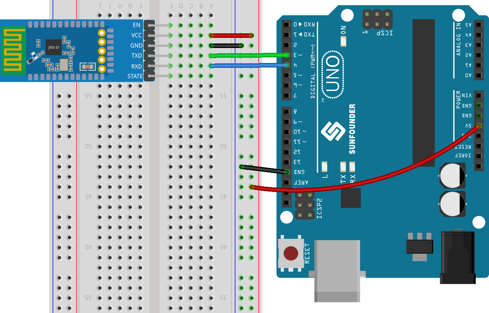
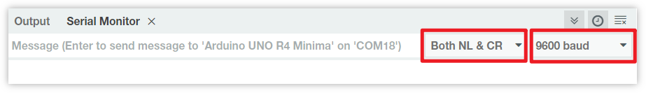

.. _uno_lesson36_bluetooth:

Lesson 36: Get Started with Bluetooth Module
===================================================

In this project, we demonstrate how to communicate with a Bluetooth module through Arduino. 

Firstly, we need to set up the circuit and use software serial communication. Connect the TX pin of the Bluetooth module to pin 3 of the Uno board, and connect the RX pin of the Bluetooth module to pin 4 of the Uno board.

Required Components
---------------------------

.. list-table::
    :widths: 30 20
    :header-rows: 1

    *   - Component Introduction
        - Purchase Link

    *   - Arduino UNO R3 or R4
        - |link_Uno_R3_buy|
    *   - :ref:`cpn_jdy31`
        - |link_jdy31_bluetooth_module_buy|
    *   - :ref:`cpn_breadboard`
        - |link_breadboard_buy|

1. Build the Circuit
-----------------------------

2. Upload the code
-----------------------------

The code establishes a software serial communication using Arduino’s SoftwareSerial library, allowing the Arduino to communicate with the JDY-31 Bluetooth module through its digital pins 3 and 4 (as Rx and Tx). It checks for data transfer between them, forwarding received messages from one to the other at a baud rate of 9600. **With this code, you can use the Arduino’s serial monitor to send AT commands to the JDY-31 Bluetooth module and receive its responses**.

.. raw:: html
    
    <iframe src=https://create.arduino.cc/editor/sunfounder01/ae75dbe4-f50d-41a4-915a-b2a30b0f4ebe/preview?embed style="height:510px;width:100%;margin:10px 0" frameborder=0></iframe>

3. Configuring the Bluetooth module
-----------------------------------------

Click the magnifying glass icon (Serial Monitor) in the upper right corner and set the baud rate to ``9600``. Then, select ``both NL & CR`` from the drop-down option of the ``New Line`` dropdown box.

The following are some examples of using AT commands to configure Bluetooth modules: Enter ``AT+NAME`` to obtain the name of the Bluetooth device. If you want to modify the Bluetooth name, please add a new name after ``AT+NAME``.

* **Query the name of a Bluetooth device:** ``AT+NAME`` 

  .. image:: img/Lesson_36_bluetooth_serial_2.gif

* **Set Bluetooth device name:** ``AT+NAME`` (following by the new name). ``+OK`` means the setting was successful. You can send ``AT+NAME`` again to verify.

  .. image:: img/Lesson_36_bluetooth_serial_3.gif 

.. note::
   To ensure consistency in the learning experience, it is recommended not to modify the default baud rate of the Bluetooth module and **keep it at its default value of 4 (i.e. 9600 baud rate)**. In relevant courses, we communicate with Bluetooth using a baud rate of 9600.

* **Set Bluetooth baudrate:** ``AT+BAUD`` (followed by the number indicating the baudrate). 

    * 4 == 9600
    * 5 == 19200
    * 6 == 38400
    * 7 == 57600
    * 8 == 115200
    * 9 == 128000

Please refer to the table below for more AT commands.

+------------+-------------------------------------+-------------+
|   Command  |               Function              |   Default   |
+============+=====================================+=============+
| AT+VERSION | Version Number                      | JDY-31-V1.2 |
+------------+-------------------------------------+-------------+
| AT+RESET   | Soft reset                          |             |
+------------+-------------------------------------+-------------+
| AT+DISC    | Disconnect (valid when connected)   |             |
+------------+-------------------------------------+-------------+
| AT+LADDR   | Query the MAC address of the module |             |
+------------+-------------------------------------+-------------+
| AT+PIN     | Set or query connection password    | 1234        |
+------------+-------------------------------------+-------------+
| AT+BAUD    | Set or query baud rate              | 9600        |
+------------+-------------------------------------+-------------+
| AT+NAME    | Set or query broadcast name         | JDY-31-SPP  |
+------------+-------------------------------------+-------------+
| AT+DEFAULT | Factory reset                       |             |
+------------+-------------------------------------+-------------+
| AT+ENLOG   | Serial port status output           | 1           |
+------------+-------------------------------------+-------------+

4. Communicating through Bluetooth debugging tools on mobile phones
-----------------------------------------------------------------------------------

We can use an app called "Serial Bluetooth Terminal" to send messages from the Bluetooth module to Arduino, simulating the process of Bluetooth interaction. The Bluetooth module will send received messages to Arduino through serial port, and similarly, Arduino can also send messages to bluetooth module through serial port.

a. **Install Serial Bluetooth Terminal**

   Go to Google Play to download and install |link_serial_bluetooth_terminal| .

b. **Connect Bluetooth**

   Initially, turn on **Bluetooth** on your smartphone.
   
      .. image:: img/Lesson_36_app_1_shadow.png
         :width: 60%
         :align: center
   
   Navigate to the **Bluetooth settings** on your smartphone and look for names like **JDY-31-SPP**.
   
      .. image:: img/Lesson_36_app_2_shadow.png
         :width: 60%
         :align: center
   
   After clicking it, agree to the **Pair** request in the pop-up window. If prompted for a pairing code, please enter "1234".
   
      .. image:: img/Lesson_36_app_3_shadow.png
         :width: 60%
         :align: center
   

c. **Communicate with Bluetooth module**

   Open the Serial Bluetooth Terminal. Connect to "JDY-31-SPP".

   .. image:: img/Lesson_36_bluetooth_serial_4_shadow.png 

   After successful connection, you can see the prompt of successful connection in the serial port monitor.

   .. image:: img/Lesson_36_bluetooth_serial_5_shadow.png 

   Input the message in the serial monitor and send it to the Bluetooth module.

   .. image:: img/Lesson_36_bluetooth_serial_6_shadow.png 

   After sending, you can see this message in the Serial Bluetooth Terminal APP. Similarly, data can be sent to Arduino via Bluetooth in **Serial Bluetooth Terminal** APP.

   .. image:: img/Lesson_36_bluetooth_serial_7_shadow.png

   You can see this message from Bluetooth in the serial monitor.

   .. image:: img/Lesson_36_bluetooth_serial_8_shadow.png  