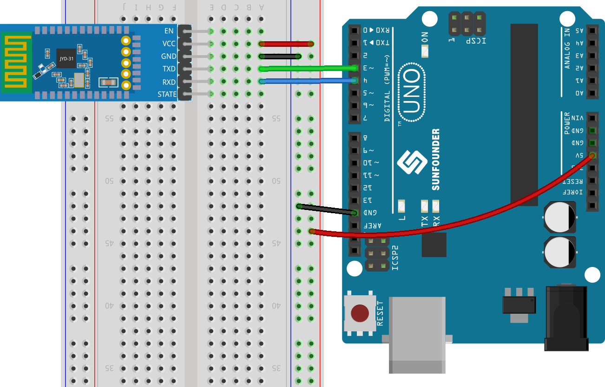
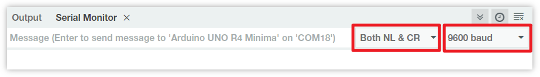

 
.. note::

   Hallo und willkommen in der SunFounder Raspberry Pi & Arduino & ESP32 Enthusiasten-Gemeinschaft auf Facebook! Tauchen Sie tiefer ein in die Welt von Raspberry Pi, Arduino und ESP32 mit anderen Enthusiasten.

   **Warum beitreten?**

   - **Expertenunterstützung**: Lösen Sie Nachverkaufsprobleme und technische Herausforderungen mit Hilfe unserer Gemeinschaft und unseres Teams.
   - **Lernen & Teilen**: Tauschen Sie Tipps und Anleitungen aus, um Ihre Fähigkeiten zu verbessern.
   - **Exklusive Vorschauen**: Erhalten Sie frühzeitigen Zugang zu neuen Produktankündigungen und exklusiven Einblicken.
   - **Spezialrabatte**: Genießen Sie exklusive Rabatte auf unsere neuesten Produkte.
   - **Festliche Aktionen und Gewinnspiele**: Nehmen Sie an Gewinnspielen und Feiertagsaktionen teil.

   👉 Sind Sie bereit, mit uns zu erkunden und zu erschaffen? Klicken Sie auf [|link_sf_facebook|] und treten Sie heute bei!

.. _uno_lesson36_bluetooth:

Lektion 36: Einstieg in das Bluetooth-Modul
===================================================

In diesem Projekt demonstrieren wir, wie man über Arduino mit einem Bluetooth-Modul kommuniziert. 

Zunächst müssen wir die Schaltung aufbauen und die serielle Software-Kommunikation verwenden. Verbinden Sie den TX-Pin des Bluetooth-Moduls mit Pin 3 des Uno-Boards und den RX-Pin des Bluetooth-Moduls mit Pin 4 des Uno-Boards.

Benötigte Komponenten
--------------------------

Für dieses Projekt benötigen wir die folgenden Komponenten.

Es ist definitiv praktisch, ein ganzes Kit zu kaufen, hier ist der Link: 

.. list-table::
    :widths: 20 20 20
    :header-rows: 1

    *   - Name	
        - ITEMS IN THIS KIT
        - LINK
    *   - Universal Maker Sensor Kit
        - 94
        - |link_umsk|

Sie können sie auch einzeln über die folgenden Links kaufen.

.. list-table::
    :widths: 30 20
    :header-rows: 1

    *   - Component Introduction
        - Purchase Link

    *   - Arduino UNO R3 or R4
        - |link_Uno_R3_buy|
    *   - :ref:`cpn_jdy31`
        - |link_jdy31_bluetooth_module_buy|
    *   - :ref:`cpn_breadboard`
        - |link_breadboard_buy|

1. Schaltung aufbauen
-----------------------------

2. Code hochladen
-----------------------------

Der Code stellt eine serielle Software-Kommunikation mithilfe der SoftwareSerial-Bibliothek von Arduino her, sodass der Arduino über seine digitalen Pins 3 und 4 (als Rx und Tx) mit dem JDY-31 Bluetooth-Modul kommunizieren kann. Er überprüft den Datentransfer zwischen ihnen und leitet empfangene Nachrichten mit einer Baudrate von 9600 weiter. **Mit diesem Code können Sie den seriellen Monitor von Arduino verwenden, um AT-Befehle an das JDY-31 Bluetooth-Modul zu senden und dessen Antworten zu empfangen**.

.. raw:: html
    
    <iframe src=https://create.arduino.cc/editor/sunfounder01/ae75dbe4-f50d-41a4-915a-b2a30b0f4ebe/preview?embed style="height:510px;width:100%;margin:10px 0" frameborder=0></iframe>

3. Bluetooth-Modul konfigurieren
-----------------------------------------

Klicken Sie auf das Lupensymbol (Serial Monitor) in der oberen rechten Ecke und stellen Sie die Baudrate auf ``9600`` ein. Wählen Sie dann ``both NL & CR`` aus dem Dropdown-Menü des ``New Line`` Dropdown-Feldes.

Im Folgenden sind einige Beispiele für die Verwendung von AT-Befehlen zur Konfiguration von Bluetooth-Modulen aufgeführt: Geben Sie ``AT+NAME`` ein, um den Namen des Bluetooth-Geräts zu erhalten. Wenn Sie den Bluetooth-Namen ändern möchten, fügen Sie nach ``AT+NAME`` einen neuen Namen hinzu.

* **Den Namen eines Bluetooth-Geräts abfragen:** ``AT+NAME`` 

  .. image:: img/Lesson_36_bluetooth_serial_2.gif

* **Bluetooth-Gerätenamen setzen:** ``AT+NAME`` (gefolgt vom neuen Namen). ``+OK`` bedeutet, dass die Einstellung erfolgreich war. Sie können ``AT+NAME`` erneut senden, um zu überprüfen.

  .. image:: img/Lesson_36_bluetooth_serial_3.gif 

.. note::
   Um Konsistenz beim Lernerlebnis zu gewährleisten, wird empfohlen, die Standard-Baudrate des Bluetooth-Moduls nicht zu ändern und **bei ihrem Standardwert von 4 (i.e. 9600 baud rate) zu belassen**. In den relevanten Kursen kommunizieren wir mit Bluetooth mit einer Baudrate von 9600.

* **Bluetooth-Baudrate setzen:** ``AT+BAUD`` (gefolgt von der Nummer, die die Baudrate angibt). 

    * 4 == 9600
    * 5 == 19200
    * 6 == 38400
    * 7 == 57600
    * 8 == 115200
    * 9 == 128000

Bitte beachten Sie die folgende Tabelle für weitere AT-Befehle.

.. list-table::
    :widths: 20 50 20
    :header-rows: 1

    * - Befehl
      - Funktion
      - Standard
    * - AT+VERSION
      - Versionsnummer
      - JDY-31-V1.2
    * - AT+RESET
      - Soft-Reset
      -
    * - AT+DISC
      - Trennen (gültig, wenn verbunden)
      -
    * - AT+LADDR
      - MAC-Adresse des Moduls abfragen
      -
    * - AT+PIN
      - Verbindungskennwort festlegen
      - 1234
    * - AT+BAUD
      - Baudrate festlegen oder abfragen
      - 9600
    * - AT+NAME
      - Broadcast-Namen festlegen oder abfragen
      - JDY-31-SPP
    * - AT+DEFAULT
      - Werkseinstellungen zurücksetzen
      -
    * - AT+ENLOG
      - Statusausgabe des seriellen Ports
      - 1

4. Kommunikation über Bluetooth-Debugging-Tools auf Mobiltelefonen
-----------------------------------------------------------------------------------

Wir können eine App namens "Serial Bluetooth Terminal" verwenden, um Nachrichten vom Bluetooth-Modul an Arduino zu senden und den Prozess der Bluetooth-Interaktion zu simulieren. Das Bluetooth-Modul sendet empfangene Nachrichten über den seriellen Port an Arduino, und ebenso kann Arduino Nachrichten über den seriellen Port an das Bluetooth-Modul senden.

a. **Serial Bluetooth Terminal installieren**

   Gehen Sie zu Google Play, um |link_serial_bluetooth_terminal| herunterzuladen und zu installieren.

b. **Bluetooth verbinden**

   Schalten Sie zunächst **Bluetooth** auf Ihrem Smartphone ein.
   
      .. image:: img/Lesson_36_app_1_shadow.png
         :width: 60%
         :align: center
   
   Navigieren Sie zu den **Bluetooth-Einstellungen** auf Ihrem Smartphone und suchen Sie nach Namen wie **JDY-31-SPP**.
   
      .. image:: img/Lesson_36_app_2_shadow.png
         :width: 60%
         :align: center
   
   Nach dem Anklicken stimmen Sie der **Pairing-Anfrage** im Pop-up-Fenster zu. Wenn Sie nach einem Pairing-Code gefragt werden, geben Sie bitte "1234" ein.
   
      .. image:: img/Lesson_36_app_3_shadow.png
         :width: 60%
         :align: center
   

c. **Mit dem Bluetooth-Modul kommunizieren**

   Öffnen Sie das Serial Bluetooth Terminal. Verbinden Sie sich mit "JDY-31-SPP".

   .. image:: img/Lesson_36_bluetooth_serial_4_shadow.png 

   Nach erfolgreicher Verbindung können Sie die Aufforderung zur erfolgreichen Verbindung im seriellen Monitor sehen.

   .. image:: img/Lesson_36_bluetooth_serial_5_shadow.png 

   Geben Sie die Nachricht im seriellen Monitor ein und senden Sie sie an das Bluetooth-Modul.

   .. image:: img/Lesson_36_bluetooth_serial_6_shadow.png 

   Nach dem Senden können Sie diese Nachricht in der Serial Bluetooth Terminal App sehen. Ebenso können Daten über Bluetooth in der **Serial Bluetooth Terminal** App an Arduino gesendet werden.

   .. image:: img/Lesson_36_bluetooth_serial_7_shadow.png

   Sie können diese Nachricht vom Bluetooth im seriellen Monitor sehen.

   .. image:: img/Lesson_36_bluetooth_serial_8_shadow.png  