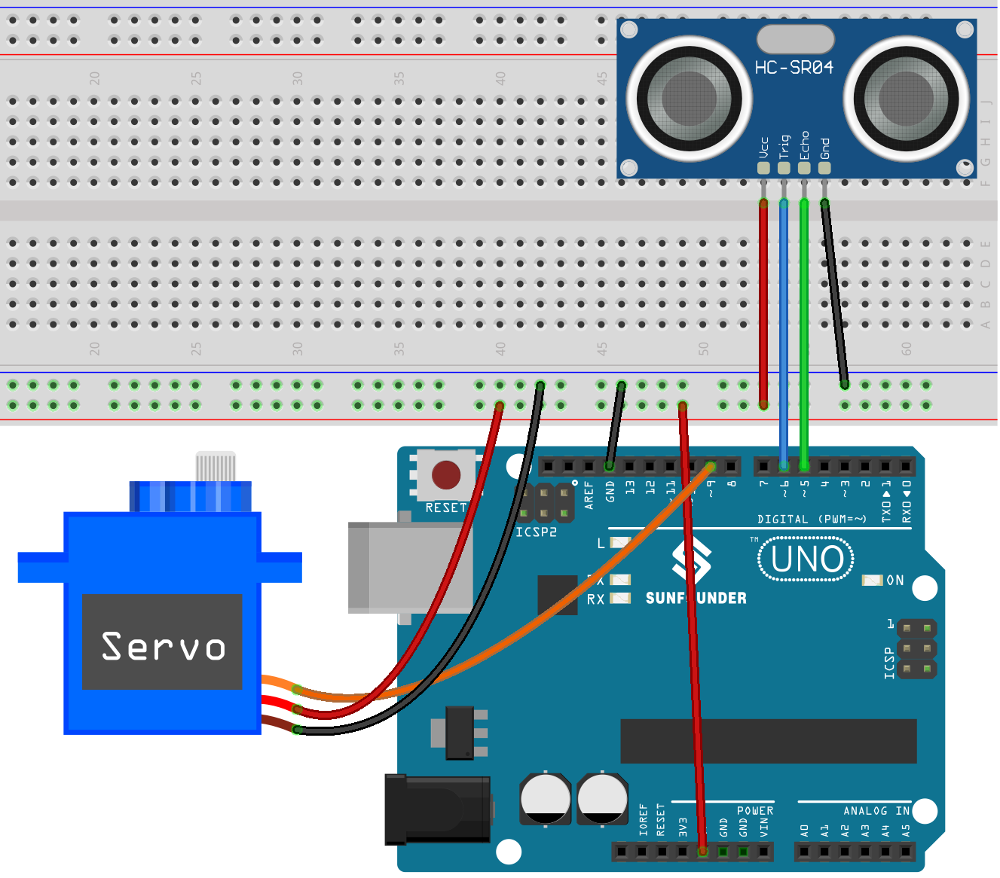

.. note::

   Hallo und willkommen in der SunFounder Raspberry Pi & Arduino & ESP32 Enthusiasten-Gemeinschaft auf Facebook! Tauchen Sie tiefer ein in die Welt von Raspberry Pi, Arduino und ESP32 mit anderen Enthusiasten.

   **Warum beitreten?**

   - **Expertenunterstützung**: Lösen Sie Nachverkaufsprobleme und technische Herausforderungen mit Hilfe unserer Gemeinschaft und unseres Teams.
   - **Lernen & Teilen**: Tauschen Sie Tipps und Anleitungen aus, um Ihre Fähigkeiten zu verbessern.
   - **Exklusive Vorschauen**: Erhalten Sie frühzeitigen Zugang zu neuen Produktankündigungen und exklusiven Einblicken.
   - **Spezialrabatte**: Genießen Sie exklusive Rabatte auf unsere neuesten Produkte.
   - **Festliche Aktionen und Gewinnspiele**: Nehmen Sie an Gewinnspielen und Feiertagsaktionen teil.

   👉 Sind Sie bereit, mit uns zu erkunden und zu erschaffen? Klicken Sie auf [|link_sf_facebook|] und treten Sie heute bei!

.. _uno_lesson37_trashcan:

Lesson 37: Intelligenter Mülleimer
=======================================

In diesem Projekt dreht sich alles um das Konzept eines intelligenten Mülleimers. Das Hauptziel ist es, dass sich der Deckel des Mülleimers automatisch öffnet, wenn sich ein Objekt auf eine festgelegte Entfernung (in diesem Fall 20 cm) nähert. Diese Funktionalität wird durch die Verwendung eines Ultraschall-Abstandssensors in Kombination mit einem Servomotor erreicht. Der Abstand zwischen dem Objekt und dem Sensor wird kontinuierlich gemessen. Wenn das Objekt nahe genug ist, wird der Servomotor aktiviert, um den Deckel zu öffnen.

Benötigte Komponenten
--------------------------

In diesem Projekt benötigen wir die folgenden Komponenten. 

Es ist definitiv praktisch, ein komplettes Kit zu kaufen. Hier ist der Link: 

.. list-table::
    :widths: 20 20 20
    :header-rows: 1

    *   - Name	
        - ITEMS IN THIS KIT
        - LINK
    *   - Universal Maker Sensor Kit
        - 94
        - |link_umsk|

Man kann sie auch einzeln über die unten stehenden Links kaufen.

.. list-table::
    :widths: 30 20
    :header-rows: 1

    *   - Component Introduction
        - Purchase Link

    *   - Arduino UNO R3 or R4
        - |link_Uno_R3_buy|
    *   - :ref:`cpn_ultrasonic`
        - |link_ultrasonic_buy|
    *   - :ref:`cpn_servo`
        - |link_servo_buy|
    *   - :ref:`cpn_breadboard`
        - |link_breadboard_buy|
        

Verkabelung
---------------------------

Code
---------------------------

.. raw:: html

    <iframe src=https://create.arduino.cc/editor/sunfounder01/f9aacc6c-809f-4fd2-9246-23bb4bdf78a2/preview?embed style="height:510px;width:100%;margin:10px 0" frameborder=0></iframe>

Code-Analyse
---------------------------

Das Projekt basiert auf der Echtzeitüberwachung des Abstands zwischen einem Objekt und einem Mülleimer. Ein Ultraschallsensor misst kontinuierlich diesen Abstand, und wenn sich ein Objekt auf weniger als 20 cm nähert, interpretiert der Mülleimer dies als Absicht, Abfall zu entsorgen, und öffnet automatisch seinen Deckel. Diese Automatisierung verleiht einem gewöhnlichen Mülleimer Intelligenz und Bequemlichkeit.

#. Erste Einrichtung und Variablendeklaration

   Hier binden wir die ``Servo``-Bibliothek ein und definieren die Konstanten und Variablen, die wir verwenden werden. Die Pins für den Servo und den Ultraschallsensor werden deklariert. Außerdem haben wir ein Array ``averDist``, um die drei Distanzmessungen zu speichern.

   .. code-block:: arduino
       
      #include <Servo.h>
      Servo servo;
      const int servoPin = 9;
      const int openAngle = 0;
      const int closeAngle = 90;
      const int trigPin = 6;
      const int echoPin = 5;
      long distance, averageDistance;
      long averDist[3];
      const int distanceThreshold = 20;

#. ``setup()``-Funktion

   Die ``setup()``-Funktion initialisiert die serielle Kommunikation, konfiguriert die Pins des Ultraschallsensors und stellt die Anfangsposition des Servos auf die geschlossene Position ein.

   .. code-block:: arduino
   
      void setup() {
        Serial.begin(9600);
        pinMode(trigPin, OUTPUT);
        pinMode(echoPin, INPUT);
        servo.attach(servoPin);
        servo.write(closeAngle);
        delay(100);
      }

#. ``loop()``-Funktion

   Die ``loop()``-Funktion ist dafür verantwortlich, kontinuierlich den Abstand zu messen, dessen Durchschnitt zu berechnen und dann zu entscheiden, ob der Deckel des Mülleimers basierend auf diesem durchschnittlichen Abstand geöffnet oder geschlossen wird.

   .. code-block:: arduino
   
      void loop() {
        for (int i = 0; i <= 2; i++) {
          distance = readDistance();
          averDist[i] = distance;
          delay(10);
        }
        averageDistance = (averDist[0] + averDist[1] + averDist[2]) / 3;
        Serial.println(averageDistance);
        if (averageDistance <= distanceThreshold) {
          servo.write(openAngle);
          delay(3500);
        } else {
          servo.write(closeAngle);
          delay(1000);
        }
      }

#. Abstandsmessfunktion

   Diese Funktion, ``readDistance()``, interagiert tatsächlich mit dem Ultraschallsensor. Sie sendet einen Impuls und wartet auf ein Echo. Die Zeit, die für das Echo benötigt wird, wird dann verwendet, um den Abstand zwischen dem Sensor und einem Objekt davor zu berechnen.

   Sie können sich auf das :ref:`cpn_ultrasonic_principle` des Ultraschallsensors beziehen.

   .. code-block:: arduino
   
      float readDistance() {
        digitalWrite(trigPin, LOW);
        delayMicroseconds(2);
        digitalWrite(trigPin, HIGH);
        delayMicroseconds(10);
        digitalWrite(trigPin, LOW);
        float distance = pulseIn(echoPin, HIGH) / 58.00;
        return distance;
      }