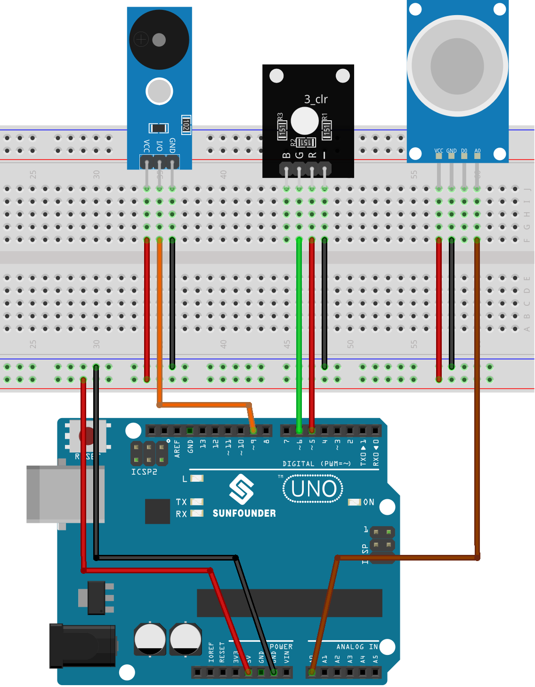

.. note::

    こんにちは、SunFounder Raspberry Pi & Arduino & ESP32 Enthusiasts Communityへようこそ！Facebook上で、仲間と一緒にRaspberry Pi、Arduino、ESP32をさらに深く探求しましょう。

    **なぜ参加するのか？**

    - **専門的なサポート**：購入後の問題や技術的な課題をコミュニティやチームの助けを借りて解決。
    - **学びと共有**：スキルを向上させるためのヒントやチュートリアルを交換。
    - **限定プレビュー**：新製品発表や予告編に早期アクセス。
    - **特別割引**：最新製品の特別割引を楽しむ。
    - **フェスティブプロモーションとプレゼント**：プレゼントやホリデープロモーションに参加。

    👉 私たちと一緒に探索と創造を始める準備はできましたか？[|link_sf_facebook|]をクリックして、今すぐ参加しましょう！
    
.. _uno_lesson38_gas_leak_alarm:

Lesson 38: ガス漏れアラーム
==================================

このプロジェクトでは、Arduino Unoボードを使用してガス漏れ検知シナリオをシミュレートします。MQ-2ガスセンサーとRGB LEDを組み込むことで、ガス濃度を継続的に読み取ります。この濃度が事前に設定された閾値を超えると、アラーム（ブザー）が作動し、RGB LEDが赤く点灯します。逆に、濃度がこの閾値以下にとどまる場合、アラームは作動せず、LEDは緑色に点灯します。このデモはあくまで例示的なものであり、実際のガス漏れ検知システムの代替として使用しないでください。

必要なコンポーネント
--------------------------

このプロジェクトでは、以下のコンポーネントが必要です。

一式キットを購入するのが便利です。こちらのリンクをご覧ください:

.. list-table::
    :widths: 20 20 20
    :header-rows: 1

    *   - Name	
        - ITEMS IN THIS KIT
        - LINK
    *   - Universal Maker Sensor Kit
        - 94
        - |link_umsk|

以下のリンクから別々に購入することもできます。

.. list-table::
    :widths: 30 20
    :header-rows: 1

    *   - Component Introduction
        - Purchase Link

    *   - Arduino UNO R3 or R4
        - |link_Uno_R3_buy|
    *   - :ref:`cpn_gas`
        - |link_mq2_gas_sensor_module_buy|
    *   - :ref:`cpn_buzzer`
        - |link_passive_buzzer_module_buy|
    *   - :ref:`cpn_rgb`
        - \-
    *   - :ref:`cpn_breadboard`
        - |link_breadboard_buy|

配線
---------------------------

コード
---------------------------

.. raw:: html

    <iframe src=https://create.arduino.cc/editor/sunfounder01/314a351a-9c54-4938-bb72-1471f1807adb/preview?embed style="height:510px;width:100%;margin:10px 0" frameborder=0></iframe>

コード解析
---------------------------

このプロジェクトの基本原理は、ガス濃度を継続的に監視することです。検出されたガス濃度が一定の閾値を超えると、アラームが鳴り、LEDの色が赤に変わります。これは潜在的に危険な状態を示す警告メカニズムとして機能します。濃度が閾値以下に下がると、アラームは解除され、LEDは緑に変わり、安全な環境を示します。

1. 定数と変数の定義

   以下の行では、各コンポーネントのピン番号を宣言および初期化します。``sensorPin``はMQ-2ガスセンサーが接続されているアナログピンを示します。``sensorValue``はセンサーのアナログ出力を格納する整数変数です。``buzzerPin``はブザーが接続されているデジタルピンを示します。最後に、``RPin``と``GPin``はRGB LEDの赤と緑のチャンネルのピンです。

   .. code-block:: arduino
   
      // Define the pin numbers for the Gas Sensor
      const int sensorPin = A0;
      int sensorValue;
   
      // Define the pin number for the buzzer
      const int buzzerPin = 9;
   
      // Define pin numbers for the RGB LED
      const int RPin = 5;  // R channel of RGB LED
      const int GPin = 6;  // G channel of RGB LED
   
2. ``setup()``での初期化

   ``setup()``関数は必要な設定を初期化します。シリアル通信はボーレート9600で開始され、シリアルモニタでセンサーの読み取り値を表示できるようになります。ブザーとRGB LEDのピンは ``OUTPUT`` として設定され、外部コンポーネントに信号を送るようになります。

   .. code-block:: arduino
   
      void setup() {
        Serial.begin(9600);  // Start serial communication at 9600 baud rate
   
        // Initialize the buzzer and RGB LED pins as output
        pinMode(buzzerPin, OUTPUT);
        pinMode(RPin, OUTPUT);
        pinMode(GPin, OUTPUT);
      }
   

3. メインループ：センサーの読み取りとアラームのトリガー

   ``loop()``関数はガスセンサーの出力を継続的に読み取ります。この読み取り値はシリアルモニタに表示され、観察できます。センサー値に応じて、次の2つのシナリオが発生します：
   
   - 値が300を超えると、 ``tone()`` を使用してブザーが作動し、RGB LEDが赤くなります。
   - 値が300未満の場合、 ``noTone()`` を使用してブザーが停止し、LEDが緑になります。
   
   最後に、次のループ繰り返しまでの間に50ミリ秒の遅延が導入され、読み取り頻度を管理し、CPUの負荷を軽減します。

   .. code-block:: arduino
   
      void loop() {
        // Read the analog value of the gas sensor
        sensorValue = analogRead(sensorPin);
   
        // Print the sensor value to the serial monitor
        Serial.print("Analog output: ");
        Serial.println(sensorValue);
   
        // If the sensor value exceeds the threshold, trigger the alarm and make the RGB LED red
        if (sensorValue > 300) {
          tone(buzzerPin, 500, 300);
          digitalWrite(GPin, LOW);
          digitalWrite(RPin, HIGH);
        } else {
          // If the sensor value is below the threshold, turn off the alarm and make the RGB LED green
          noTone(buzzerPin);
          digitalWrite(RPin, LOW);
          digitalWrite(GPin, HIGH);
        }
   
        // Wait for 50 milliseconds before the next loop iteration
        delay(50);
      }
   
   
