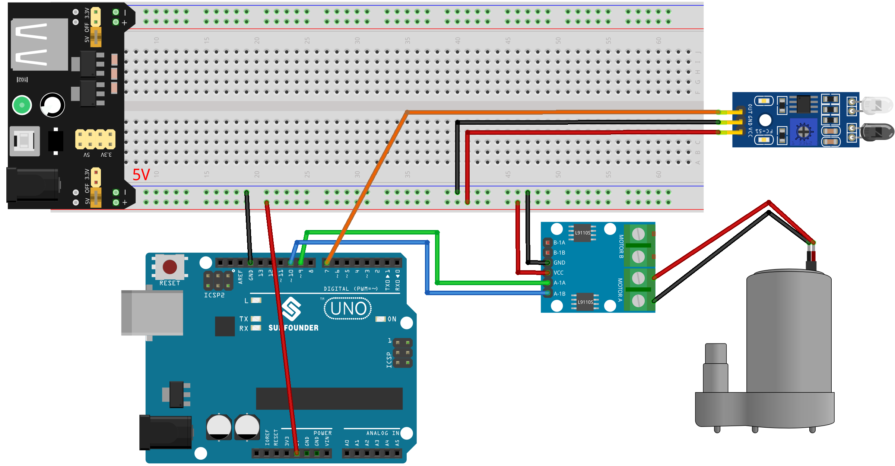

.. note::

    Hello, welcome to the SunFounder Raspberry Pi & Arduino & ESP32 Enthusiasts Community on Facebook! Dive deeper into Raspberry Pi, Arduino, and ESP32 with fellow enthusiasts.

    **Why Join?**

    - **Expert Support**: Solve post-sale issues and technical challenges with help from our community and team.
    - **Learn & Share**: Exchange tips and tutorials to enhance your skills.
    - **Exclusive Previews**: Get early access to new product announcements and sneak peeks.
    - **Special Discounts**: Enjoy exclusive discounts on our newest products.
    - **Festive Promotions and Giveaways**: Take part in giveaways and holiday promotions.

    👉 Ready to explore and create with us? Click [|link_sf_facebook|] and join today!

.. _uno_lesson39_soap_dispenser:

Lesson 39: Automatic soap dispenser
=====================================

The Automatic Soap Dispenser project uses an Arduino Uno board along with an infrared obstacle avoidance sensor and a water pump. The sensor detects the presence of an object such as a hand, which activates the water pump to dispense soap.

Required Components
---------------------------

.. list-table::
    :widths: 30 20
    :header-rows: 1

    *   - Component Introduction
        - Purchase Link

    *   - Arduino UNO R3 or R4
        - |link_Uno_R3_buy|
    *   - :ref:`cpn_ir_obstacle`
        - |link_obstacle_avoidance_module_buy|
    *   - :ref:`cpn_pump`
        - \-
    *   - :ref:`cpn_l9110`
        - \-
    *   - :ref:`cpn_power_module`
        - \-
    *   - :ref:`cpn_breadboard`
        - |link_breadboard_buy|
        

Wiring
---------------------------

Code
---------------------------

.. raw:: html

    <iframe src=https://create.arduino.cc/editor/sunfounder01/47ef3a59-afe1-40a8-9b36-1ff5db59af15/preview?embed style="height:510px;width:100%;margin:10px 0" frameborder=0></iframe>

Code Analysis
---------------------------

The main idea behind this project is to create a hands-free soap dispensing system. The infrared obstacle avoidance sensor detects when an object (like a hand) is close. Upon detecting an object, the sensor sends a signal to the Arduino, which in turn triggers the water pump to dispense soap. The pump stays active for a brief period, dispensing soap, then turns off.

#. **Defining the pins for the sensor and the pump**

   In this code snippet, we define the Arduino pins that connect to the sensor and pump. We define pin 7 as the sensor pin and we will use the variable ``sensorValue`` to store the data read from this sensor. For the water pump, we use two pins, 9 and 10.
   
   .. code-block:: arduino
   
      const int sensorPin = 7;
      int sensorValue;
      const int pump1A = 9;
      const int pump1B = 10;

#. **Setting up the sensor and pump**

   In the ``setup()`` function, we define the modes for the pins we're using. The sensor pin is set to ``INPUT`` as it will be used to receive data from the sensor. The pump pins are set to ``OUTPUT`` as they will send commands to the pump. We ensure that the pin ``pump1B`` starts in a ``LOW`` state (off), and we start the serial communication with a baud rate of 9600.

   .. code-block:: arduino
   
      void setup() {
        pinMode(sensorPin, INPUT);
        pinMode(pump1A, OUTPUT);    
        pinMode(pump1B, OUTPUT);    
        digitalWrite(pump1B, LOW);  
        Serial.begin(9600);
      }

#. **Continuously checking the sensor and controlling the pump**

   In the ``loop()`` function, the Arduino constantly reads the value from the sensor using ``digitalRead()`` and assigns it to ``sensorValue()``. It then prints this value to the serial monitor for debugging purposes. If the sensor detects an object, ``sensorValue()`` will be 0. When this happens, ``pump1A`` is set to ``HIGH``, activating the pump, and a delay of 700 milliseconds allows the pump to dispense soap. The pump is then deactivated by setting ``pump1A`` to ``LOW``, and a 1-second delay gives the user time to move their hand away before the cycle repeats.

   .. note:: 
   
      If the sensor is not working properly, adjust the IR transmitter and receiver to make them parallel. Additionally, you can adjust the detection range using the built-in potentiometer.

   .. code-block:: arduino
   
      void loop() {
        sensorValue = digitalRead(sensorPin);
        Serial.println(sensorValue);
        if (sensorValue == 0) {  
          digitalWrite(pump1A, HIGH);
          delay(700);
          digitalWrite(pump1A, LOW);
          delay(1000);
        }
      }
