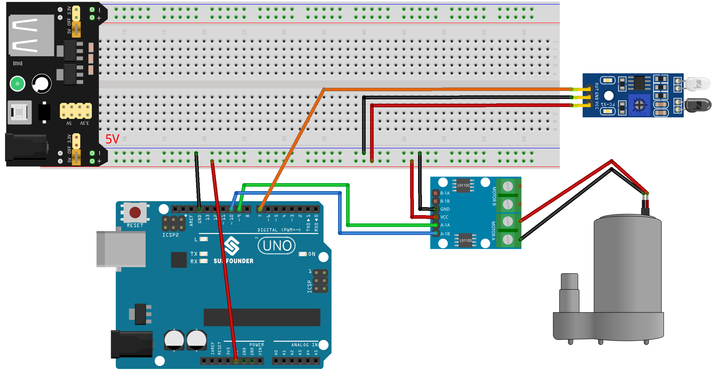

.. note::

    Bonjour, bienvenue dans la communauté des passionnés de SunFounder Raspberry Pi & Arduino & ESP32 sur Facebook ! Explorez plus en profondeur les univers du Raspberry Pi, Arduino et ESP32 avec d'autres passionnés.

    **Pourquoi rejoindre ?**

    - **Support d'experts** : Résolvez les problèmes post-vente et les défis techniques avec l'aide de notre communauté et de notre équipe.
    - **Apprendre & Partager** : Échangez des conseils et des tutoriels pour améliorer vos compétences.
    - **Aperçus exclusifs** : Bénéficiez d'un accès anticipé aux annonces de nouveaux produits et aux avant-premières.
    - **Réductions spéciales** : Profitez de réductions exclusives sur nos nouveaux produits.
    - **Promotions festives et cadeaux** : Participez à des tirages au sort et à des promotions de fêtes.

    👉 Prêt à explorer et à créer avec nous ? Cliquez sur [|link_sf_facebook|] et rejoignez-nous aujourd'hui !

.. _uno_lesson39_soap_dispenser:

Leçon 39 : Distributeur automatique de savon
=============================================================

Le projet de Distributeur Automatique de Savon utilise une carte Arduino Uno ainsi qu'un capteur infrarouge de détection d'obstacles et une pompe à eau. Le capteur détecte la présence d'un objet tel qu'une main, ce qui active la pompe à eau pour distribuer le savon.

Composants requis
--------------------------

Pour ce projet, nous avons besoin des composants suivants.

Il est définitivement pratique d'acheter un kit complet, voici le lien :

.. list-table::
    :widths: 20 20 20
    :header-rows: 1

    *   - Nom	
        - ARTICLES DANS CE KIT
        - LIEN
    *   - Kit de capteurs universel pour créateurs
        - 94
        - |link_umsk|

Vous pouvez également les acheter séparément via les liens ci-dessous.

.. list-table::
    :widths: 30 20
    :header-rows: 1

    *   - Introduction du composant
        - Lien d'achat

    *   - Arduino UNO R3 ou R4
        - |link_Uno_R3_buy|
    *   - :ref:`cpn_ir_obstacle`
        - |link_obstacle_avoidance_module_buy|
    *   - :ref:`cpn_pump`
        - \-
    *   - :ref:`cpn_l9110`
        - \-
    *   - :ref:`cpn_power_module`
        - \-
    *   - :ref:`cpn_breadboard`
        - |link_breadboard_buy|
        

Câblage
---------------------------

Code
---------------------------

.. raw:: html

    <iframe src=https://create.arduino.cc/editor/sunfounder01/47ef3a59-afe1-40a8-9b36-1ff5db59af15/preview?embed style="height:510px;width:100%;margin:10px 0" frameborder=0></iframe>

Analyse du code
---------------------------

L'idée principale derrière ce projet est de créer un système de distribution de savon sans contact. Le capteur infrarouge de détection d'obstacles détecte lorsqu'un objet (comme une main) est proche. En détectant un objet, le capteur envoie un signal à l'Arduino, qui à son tour active la pompe à eau pour distribuer le savon. La pompe reste active pendant une courte période, distribue le savon, puis s'éteint.

#. **Définition des broches pour le capteur et la pompe**

   Dans ce fragment de code, nous définissons les broches Arduino qui se connectent au capteur et à la pompe. Nous définissons la broche 7 comme la broche du capteur et nous utiliserons la variable ``sensorValue`` pour stocker les données lues de ce capteur. Pour la pompe à eau, nous utilisons deux broches, 9 et 10.
   
   .. code-block:: arduino
   
      const int sensorPin = 7;
      int sensorValue;
      const int pump1A = 9;
      const int pump1B = 10;

#. **Configuration du capteur et de la pompe**

   Dans la fonction ``setup()``, nous définissons les modes pour les broches que nous utilisons. La broche du capteur est réglée sur ``INPUT`` car elle sera utilisée pour recevoir des données du capteur. Les broches de la pompe sont réglées sur ``OUTPUT`` car elles enverront des commandes à la pompe. Nous nous assurons que la broche ``pump1B`` commence en état ``LOW`` (éteint), et nous commençons la communication série à un débit de 9600 bauds.

   .. code-block:: arduino
   
      void setup() {
        pinMode(sensorPin, INPUT);
        pinMode(pump1A, OUTPUT);    
        pinMode(pump1B, OUTPUT);    
        digitalWrite(pump1B, LOW);  
        Serial.begin(9600);
      }

#. **Vérification continue du capteur et contrôle de la pompe**

   Dans la fonction ``loop()``, l'Arduino lit en continu la valeur du capteur en utilisant ``digitalRead()`` et l'attribue à ``sensorValue()``. Il imprime ensuite cette valeur sur le moniteur série à des fins de débogage. Si le capteur détecte un objet, ``sensorValue()`` sera 0. Lorsque cela se produit, ``pump1A`` est réglé sur ``HIGH``, activant la pompe, et un délai de 700 millisecondes permet à la pompe de distribuer du savon. La pompe est ensuite désactivée en réglant ``pump1A`` sur ``LOW``, et un délai d'une seconde donne le temps à l'utilisateur de retirer sa main avant que le cycle ne se répète.

   .. note:: 
   
      Si le capteur ne fonctionne pas correctement, ajustez l'émetteur IR et le récepteur pour les rendre parallèles. De plus, vous pouvez ajuster la portée de détection à l'aide du potentiomètre intégré.

   .. code-block:: arduino
   
      void loop() {
        sensorValue = digitalRead(sensorPin);
        Serial.println(sensorValue);
        if (sensorValue == 0) {  
          digitalWrite(pump1A, HIGH);
          delay(700);
          digitalWrite(pump1A, LOW);
          delay(1000);
        }
      }
