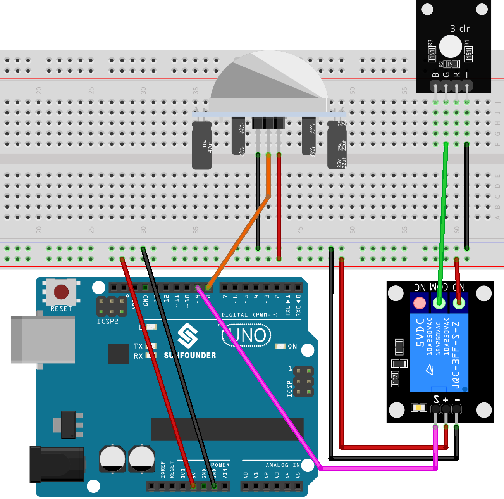

.. note::

    Hello, welcome to the SunFounder Raspberry Pi & Arduino & ESP32 Enthusiasts Community on Facebook! Dive deeper into Raspberry Pi, Arduino, and ESP32 with fellow enthusiasts.

    **Why Join?**

    - **Expert Support**: Solve post-sale issues and technical challenges with help from our community and team.
    - **Learn & Share**: Exchange tips and tutorials to enhance your skills.
    - **Exclusive Previews**: Get early access to new product announcements and sneak peeks.
    - **Special Discounts**: Enjoy exclusive discounts on our newest products.
    - **Festive Promotions and Giveaways**: Take part in giveaways and holiday promotions.

    👉 Ready to explore and create with us? Click [|link_sf_facebook|] and join today!

.. _uno_lesson40_motion_triggered_relay:

Lesson 40: Motion triggered relay
==================================

This Arduino project aims to control a relay-operated light using a passive infrared (PIR) sensor. When the PIR sensor detects motion, the relay is activated, turning the light on. The light remains on for 5 seconds after the last detected motion.

.. warning::
    As a demonstration, we are using a relay to control an RGB LED module. However, in real-life scenarios, this may not be the most practical approach.
    
    **While you can connect the relay to other appliances in actual applications, extreme caution is required when dealing with HIGH AC voltage. Improper or incorrect use can lead to severe injury or even death. Therefore, it is intended for people who are familiar with and knowledgeable about HIGH AC voltage. Always prioritize safety.**

Required Components
---------------------------

.. list-table::
    :widths: 30 20
    :header-rows: 1

    *   - Component Introduction
        - Purchase Link

    *   - Arduino UNO R3 or R4
        - |link_Uno_R3_buy|
    *   - :ref:`cpn_pir_motion`
        - \-
    *   - :ref:`cpn_relay`
        - \-
    *   - :ref:`cpn_rgb`
        - \-
    *   - :ref:`cpn_breadboard`
        - |link_breadboard_buy|
        

Wiring
---------------------------

Code
---------------------------

.. raw:: html

    <iframe src=https://create.arduino.cc/editor/sunfounder01/1678870f-2731-4a6c-826d-2433214c4be4/preview?embed style="height:510px;width:100%;margin:10px 0" frameborder=0></iframe>

Code Analysis
---------------------------

The project revolves around the PIR motion sensor's capability to detect motion. When motion is detected, a signal is sent to the Arduino, triggering the relay module, which in turn activates a light. The light stays on for a specified duration (in this case, 5 seconds) after the last detected motion, ensuring the area remains illuminated for a short period even if motion ceases.

1. **Initial setup and variable declarations**

   This segment defines constants and variables that will be used throughout the code. We set up the relay and PIR pins and a delay constant for motion. We also have a variable to keep track of the last detected motion time and a flag to monitor if motion is detected.

   .. code-block:: arduino
   
      // Define the pin number for the relay
      const int relayPin = 9;
   
      // Define the pin number for the PIR sensor
      const int pirPin = 8;
   
      // Motion delay threshold in milliseconds
      const unsigned long MOTION_DELAY = 5000;
   
      unsigned long lastMotionTime = 0;  // Timestamp of the last motion detection
      bool motionDetected = false;       // Flag to track if motion is detected
   
   

2. **Configuration of pins in setup() function**

   In the ``setup()`` function, we configure the pin modes for both the relay and PIR sensor. We also initialize the relay to be off at the start.

   .. code-block:: arduino
   
      void setup() {
        pinMode(relayPin, OUTPUT);    // Set relayPin as an output pin
        pinMode(pirPin, INPUT);       // Set the PIR pin as an input
        digitalWrite(relayPin, LOW);  // Turn off the relay initially
      }

3. **Main logic in loop() function**

   The ``loop()`` function contains the primary logic. When the PIR sensor detects motion, it sends a ``HIGH`` signal, turning on the relay and updating the ``lastMotionTime``. If there's no motion for the specified delay (5 seconds in this case), the relay is turned off.
   
   This approach ensures that even if motion is sporadic or brief, the light remains on for at least 5 seconds after the last detected motion, providing a consistent illumination duration.

   .. code-block:: arduino
   
      void loop() {
        if (digitalRead(pirPin) == HIGH) {
          lastMotionTime = millis();     // Update the last motion time
          digitalWrite(relayPin, HIGH);  // Turn on the relay (and hence the light)
          motionDetected = true;
        }
   
        // If motion was detected earlier and 5 seconds have elapsed, turn off the relay
        if (motionDetected && (millis() - lastMotionTime >= MOTION_DELAY)) {
          digitalWrite(relayPin, LOW);  // Turn off the relay
          motionDetected = false;
        }
      }
   
   
   