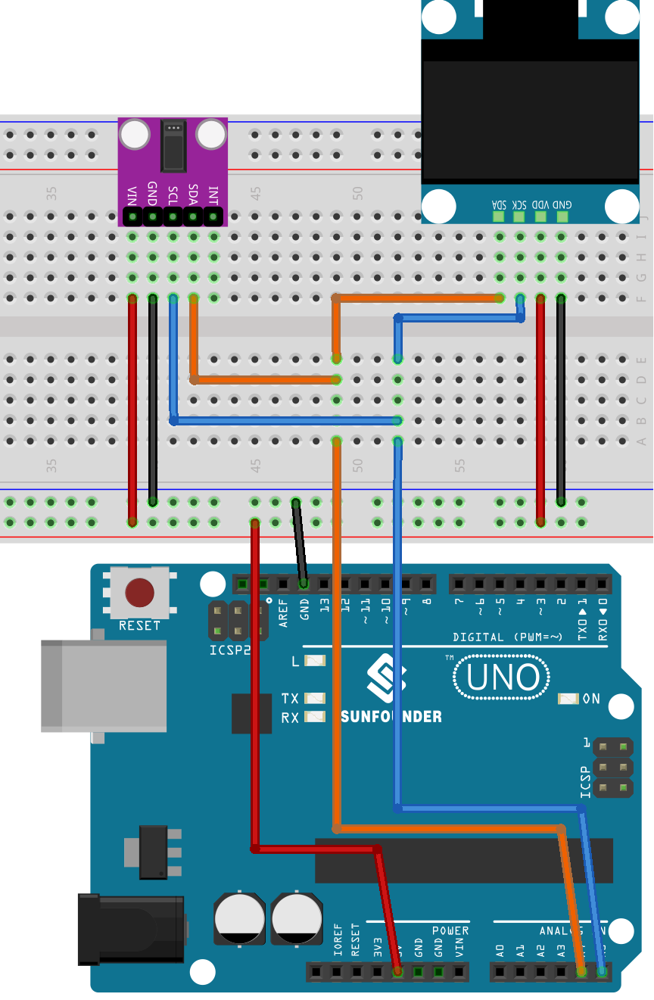

.. note::

    こんにちは、SunFounder Raspberry Pi & Arduino & ESP32 Enthusiasts Communityへようこそ！Facebook上で、仲間と一緒にRaspberry Pi、Arduino、ESP32をさらに深く探求しましょう。

    **なぜ参加するのか？**

    - **専門的なサポート**：購入後の問題や技術的な課題をコミュニティやチームの助けを借りて解決。
    - **学びと共有**：スキルを向上させるためのヒントやチュートリアルを交換。
    - **限定プレビュー**：新製品発表や予告編に早期アクセス。
    - **特別割引**：最新製品の特別割引を楽しむ。
    - **フェスティブプロモーションとプレゼント**：プレゼントやホリデープロモーションに参加。

    👉 私たちと一緒に探索と創造を始める準備はできましたか？[|link_sf_facebook|]をクリックして、今すぐ参加しましょう！
    
.. _uno_lesson41_heartrate_monitor:

Lesson 41: 心拍数モニター
==================================

このArduinoプロジェクトでは、MAX30102パルスオキシメーターセンサーとSSD1306 OLEDディスプレイを使用してシンプルな心拍数モニターを作成することを目指します。コードは心拍間の時間を測定することで心拍数を計測します。4回の測定を行い、その平均を計算し、得られた平均心拍数をOLEDスクリーンに表示します。センサーが指を検出しない場合、センサーに指を正しく配置するようユーザーに促します。

必要なコンポーネント
--------------------------

このプロジェクトでは、以下のコンポーネントが必要です。

一式キットを購入するのが便利です。こちらのリンクをご覧ください:

.. list-table::
    :widths: 20 20 20
    :header-rows: 1

    *   - Name	
        - ITEMS IN THIS KIT
        - LINK
    *   - Universal Maker Sensor Kit
        - 94
        - |link_umsk|

以下のリンクから別々に購入することもできます。

.. list-table::
    :widths: 30 20
    :header-rows: 1

    *   - Component Introduction
        - Purchase Link

    *   - Arduino UNO R3 or R4
        - |link_Uno_R3_buy|
    *   - :ref:`cpn_max30102`
        - |link_max30102_module_buy|
    *   - :ref:`cpn_oled`
        - \-
    *   - :ref:`cpn_breadboard`
        - |link_breadboard_buy|

配線
---------------------------

コード
---------------------------

.. note:: 
   ライブラリをインストールするには、Arduinoライブラリマネージャを開き、 **"SparkFun MAX3010x"** 、 **"Adafruit SSD1306"** 、および **"Adafruit GFX"**を検索してインストールしてください。

.. raw:: html

    <iframe src=https://create.arduino.cc/editor/sunfounder01/0f574652-4575-46b9-88b7-2d30573bcb71/preview?embed style="height:510px;width:100%;margin:10px 0" frameborder=0></iframe>

コード解析
---------------------------

このプロジェクトの基本原理は、MAX30102センサーを使用して指を通る血流の脈動をキャプチャすることです。血液が体内を流れると、指先の血管内の血液量に微小な変化が生じます。センサーは指を通して光を照射し、吸収または反射された光の量を測定することで、これらの微小な容積変化を検出します。次の脈拍までの時間間隔を使用して、1分間の心拍数（BPM）を計算します。この値は4回の測定の平均を取り、OLED画面に表示されます。

1. **ライブラリのインクルードと初期宣言**:

   コードは、OLEDディスプレイ、MAX30102センサー、および心拍数計算用の必要なライブラリをインクルードすることから始まります。さらに、OLEDディスプレイの構成と心拍数計算用の変数が宣言されます。

   .. note:: 
      ライブラリをインストールするには、Arduinoライブラリマネージャを開き、**"SparkFun MAX3010x"** 、**"Adafruit SSD1306"** 、および**"Adafruit GFX"**を検索してインストールしてください。

   .. code-block:: arduino

      #include <Adafruit_GFX.h>  // OLED  libraries
      #include <Adafruit_SSD1306.h>
      #include <Wire.h>
      #include "MAX30105.h"   // MAX3010x library
      #include "heartRate.h"  // Heart rate  calculating algorithm

      // ... Variables and OLED configuration

   このプロジェクトでは、いくつかのビットマップも作成しました。 ``PROGMEM`` キーワードは、配列がArduinoマイクロコントローラのプログラムメモリに格納されることを示します。プログラムメモリ(PROGMEM)にデータを格納することで、大量のデータがRAMを占有するのを防ぐことができます。

   .. code-block:: arduino

      static const unsigned char PROGMEM beat1_bmp[] = {...}

      static const unsigned char PROGMEM beat2_bmp[] = {...}

2. **セットアップ関数**:

   I2C通信を初期化し、シリアル通信を開始し、OLEDディスプレイを初期化し、MAX30102センサーを設定します。

   .. code-block:: arduino

      void setup() {
          Wire.setClock(400000);
          Serial.begin(9600);
          display.begin(SSD1306_SWITCHCAPVCC, SCREEN_ADDRESS);
          // ... Rest of the setup code

3. **メインループ**:

   ここにコア機能が含まれています。センサーからIR値を読み取ります。指が検出されると（IR値が50,000を超えると）、プログラムは心拍が検知されるかどうかを確認します。心拍が検知されると、OLED画面にBPMを表示し、脈拍間の時間を使用してBPMを計算します。そうでない場合は、センサーに指を置くようユーザーに促します。
   
   また、2つの心拍ビットマップを用意しており、これらのビットマップを切り替えることで、動的な視覚効果を実現できます。

   .. code-block:: arduino

      void loop() {
        // Get IR value from sensor
        long irValue = particleSensor.getIR();  
      
        //If a finger is detected
        if (irValue > 50000) {
      
          // Check if a beat is detected
          if (checkForBeat(irValue) == true) {

            // Update OLED display
            // Calculate the BPM
      
            // Calculate the average BPM
            //Print the IR value, current BPM value, and average BPM value to the serial monitor

            // Update OLED display
            
          }
        }
        else {
          // ... Prompt to place the finger on the sensor
        }
      }
      

