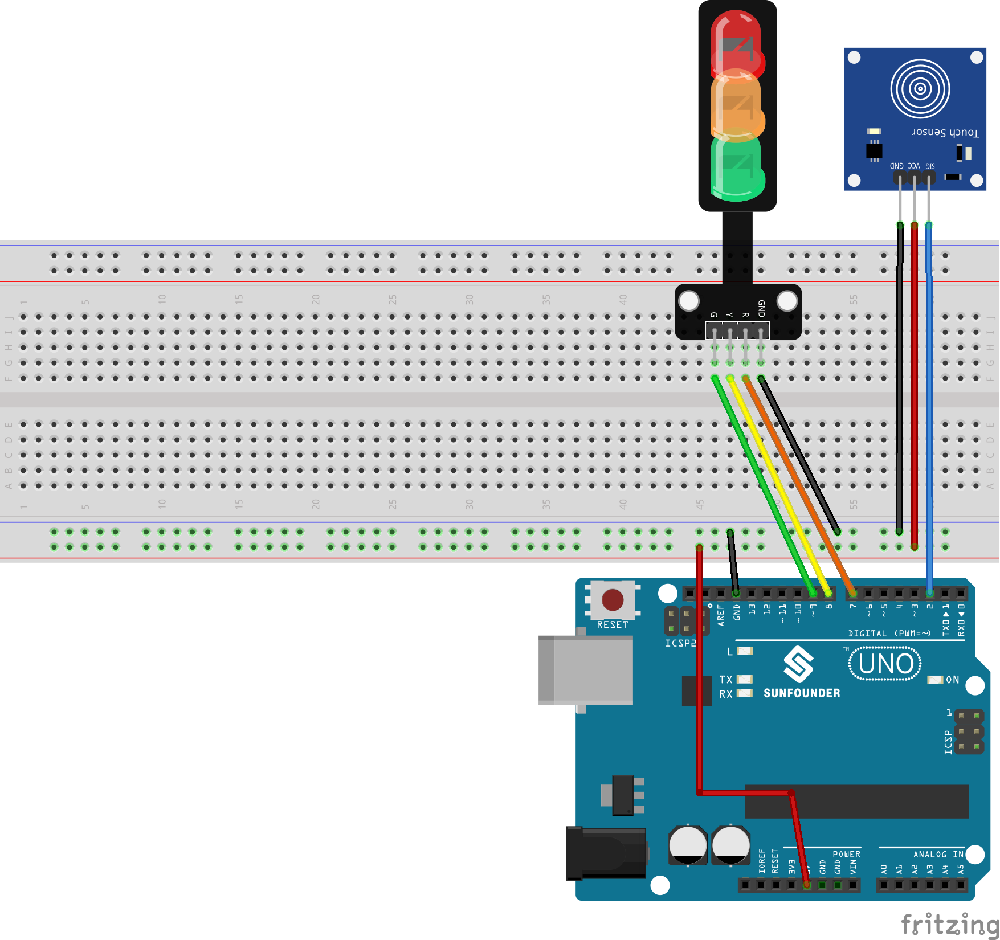

.. note::

    こんにちは、SunFounder Raspberry Pi & Arduino & ESP32 Enthusiasts Communityへようこそ！Facebook上で、仲間と一緒にRaspberry Pi、Arduino、ESP32をさらに深く探求しましょう。

    **なぜ参加するのか？**

    - **専門的なサポート**：購入後の問題や技術的な課題をコミュニティやチームの助けを借りて解決。
    - **学びと共有**：スキルを向上させるためのヒントやチュートリアルを交換。
    - **限定プレビュー**：新製品発表や予告編に早期アクセス。
    - **特別割引**：最新製品の特別割引を楽しむ。
    - **フェスティブプロモーションとプレゼント**：プレゼントやホリデープロモーションに参加。

    👉 私たちと一緒に探索と創造を始める準備はできましたか？[|link_sf_facebook|]をクリックして、今すぐ参加しましょう！
    
.. _uno_touch_toggle_light:

レッスン42: タッチ切り替えライト
==================================

このプロジェクトは、タッチセンサーと交通信号LEDモジュールを利用したシンプルな交通信号制御システムの実装です。タッチセンサーを作動させると、LEDが次の順序で点灯します：赤 -> 黄 -> 緑。

必要なコンポーネント
--------------------------

このプロジェクトでは、以下のコンポーネントが必要です。

一式キットを購入するのが便利です。こちらのリンクをご覧ください:

.. list-table::
    :widths: 20 20 20
    :header-rows: 1

    *   - Name	
        - ITEMS IN THIS KIT
        - LINK
    *   - Universal Maker Sensor Kit
        - 94
        - |link_umsk|

以下のリンクから別々に購入することもできます。

.. list-table::
    :widths: 30 20
    :header-rows: 1

    *   - Component Introduction
        - Purchase Link

    *   - Arduino UNO R3 or R4
        - |link_Uno_R3_buy|
    *   - :ref:`cpn_touch`
        - \-
    *   - :ref:`cpn_traffic`
        - \-
    *   - :ref:`cpn_breadboard`
        - |link_breadboard_buy|

配線
---------------------------

コード
---------------------------

.. raw:: html

  <iframe src=https://create.arduino.cc/editor/sunfounder01/f53d6cf6-ed27-49d3-b4d3-12f29b417a89/preview?embed style="height:510px;width:100%;margin:10px 0" frameborder=0></iframe>

コード解析
---------------------------

このプロジェクトの操作は簡単です。センサーのタッチ検出が次のLEDの点灯をトリガーします（赤 -> 黄 -> 緑）。これは ``currentLED`` 変数によって制御されます。

1. ピンの定義と初期値の設定

   .. code-block:: arduino
   
      const int touchSensorPin = 2;  // Touch sensor pin
      const int rledPin = 7;         // Red LED pin
      const int yledPin = 8;         // Yellow LED pin
      const int gledPin = 9;         // Green LED pin
      int lastTouchState;            // Previous touch sensor state
      int currentTouchState;         // Current touch sensor state
      int currentLED = 0;            // Current LED: 0->Red, 1->Yellow, 2->Green
   
   これらの行は、Arduinoボードのコンポーネントに対するピン接続を確立し、タッチセンサーとLEDの状態を初期化します。

2. setup() 関数

   .. code-block:: arduino
   
       void setup() {
         Serial.begin(9600);              // Initialize serial communication
         pinMode(touchSensorPin, INPUT);  // Set touch sensor pin as input
         // Configure LED pins as outputs
         pinMode(rledPin, OUTPUT);
         pinMode(yledPin, OUTPUT);
         pinMode(gledPin, OUTPUT);
         currentTouchState = digitalRead(touchSensorPin); // Read initial touch state
       }
   
   この関数は、Arduinoの初期設定を行い、入力モードと出力モードを定義し、デバッグ用にシリアル通信を開始します。

3. loop() 関数

   .. code-block:: arduino
   
       void loop() {
         lastTouchState = currentTouchState;                        // Store the last state
         currentTouchState = digitalRead(touchSensorPin);           // Read new touch state
         if (lastTouchState == LOW && currentTouchState == HIGH) {  // Detect touch
           Serial.println("Sensor touched");
           turnAllLEDsOff();  // Turn off all LEDs
           // Activate the next LED in sequence
           switch (currentLED) {
             case 0:
               digitalWrite(rledPin, HIGH);
               currentLED = 1;
               break;
             case 1:
               digitalWrite(yledPin, HIGH);
               currentLED = 2;
               break;
             case 2:
               digitalWrite(gledPin, HIGH);
               currentLED = 0;
               break;
           }
         }
       }

   ループ関数はタッチセンサーを継続的に監視し、タッチが検出されるとLEDを順に切り替え、常に1つのLEDのみが点灯するようにします。

4. LED消灯関数

   .. code-block:: arduino
      
       void turnAllLEDsOff() {
         // Set all LED pins to LOW, turning them off
         digitalWrite(rledPin, LOW);
         digitalWrite(yledPin, LOW);
         digitalWrite(gledPin, LOW);
       }

   この補助関数は、すべてのLEDを消灯し、サイクルプロセスを支援します。
