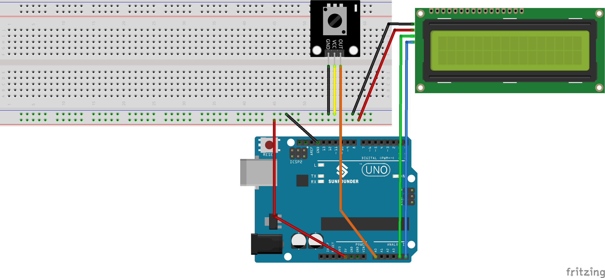

.. note::

    こんにちは、SunFounder Raspberry Pi & Arduino & ESP32 Enthusiasts Communityへようこそ！Facebook上で、仲間と一緒にRaspberry Pi、Arduino、ESP32をさらに深く探求しましょう。

    **なぜ参加するのか？**

    - **専門的なサポート**：購入後の問題や技術的な課題をコミュニティやチームの助けを借りて解決。
    - **学びと共有**：スキルを向上させるためのヒントやチュートリアルを交換。
    - **限定プレビュー**：新製品発表や予告編に早期アクセス。
    - **特別割引**：最新製品の特別割引を楽しむ。
    - **フェスティブプロモーションとプレゼント**：プレゼントやホリデープロモーションに参加。

    👉 私たちと一緒に探索と創造を始める準備はできましたか？[|link_sf_facebook|]をクリックして、今すぐ参加しましょう！
.. _uno_potentiometer_scale_value:

Lesson 43: ポテンショメータのスケール値
=============================================================

このプロジェクトでは、ポテンショメータの値を読み取り、I2Cインターフェースを備えたLCD 1620に表示することに焦点を当てています。
さらに、その値をシリアルモニタに送信してリアルタイムで監視します。
このプロジェクトの特徴的な点は、LCDに表示されるポテンショメータの値を、読み取り値に比例した可変長バーとしてグラフィカルに表示することです。

必要なコンポーネント
--------------------------

このプロジェクトでは、以下のコンポーネントが必要です。

一式キットを購入するのが便利です。こちらのリンクをご覧ください:

.. list-table::
    :widths: 20 20 20
    :header-rows: 1

    *   - Name	
        - ITEMS IN THIS KIT
        - LINK
    *   - Universal Maker Sensor Kit
        - 94
        - |link_umsk|

以下のリンクから別々に購入することもできます。

.. list-table::
    :widths: 30 20
    :header-rows: 1

    *   - Component Introduction
        - Purchase Link

    *   - Arduino UNO R3 or R4
        - |link_Uno_R3_buy|
    *   - :ref:`cpn_potentiometer`
        - \-
    *   - :ref:`cpn_i2c_lcd1602`
        - \-
    *   - :ref:`cpn_breadboard`
        - |link_breadboard_buy|

配線
---------------------------

コード
---------------------------

.. raw:: html

   <iframe src=https://create.arduino.cc/editor/sunfounder01/b51d7dac-b89b-4785-8620-907914fe983c/preview?embed style="height:510px;width:100%;margin:10px 0" frameborder=0></iframe>

コード解析
---------------------------

このプロジェクトの核心機能は、ポテンショメータの値を継続的に読み取り、それをスケール範囲（0-16）にマップし、結果を数値とグラフィックの両方でLCDに表示することです。読み取り値が大きく変化したときのみディスプレイを更新することで、視覚的なスムーズさを保ちながらジッターを最小限に抑えています。

1. **ライブラリのインクルードと初期化**:

   .. code-block:: arduino
   
      #include <Wire.h>
      #include <LiquidCrystal_I2C.h>
      LiquidCrystal_I2C lcd(0x27, 16, 2);

   このセグメントでは、I2C通信およびLCD制御用の必要なライブラリを組み込みます。その後、I2Cアドレスが``0x27``であるLCDインスタンスを初期化し、``16列``および``2行``のサイズを指定します。

2. **変数の宣言**:

   .. code-block:: arduino
   
      int lastRead = 0;     // Stores the last read value from the potentiometer
      int currentRead = 0;  // Holds the current read value from the potentiometer

   変数 ``lastRead`` と ``currentRead`` は、異なる時点でのポテンショメータの読み取り値を追跡するために使用されます。

3. **setup()関数**:

   .. code-block:: arduino
   
      void setup() {
        lcd.init();          // Initiates the LCD
        lcd.backlight();     // Activates the LCD's backlight
        Serial.begin(9600);  // Commences serial communication at 9600 baud
      }

   この関数は、LCDを準備し、シリアル通信を開始して、プロジェクトの動作環境を設定します。

4. **メインループ**:

   .. code-block:: arduino
   
      void loop() {
        currentRead = analogRead(A0);
        int barLength = map(currentRead, 0, 1023, 0, 16);
        if (abs(lastRead - currentRead) > 2) {
          lcd.clear();
          lcd.setCursor(0, 0);
          lcd.print("Value:");
          lcd.setCursor(7, 0);
          lcd.print(currentRead);
          Serial.println(currentRead);
          for (int i = 0; i < barLength; i++) {
            lcd.setCursor(i, 1);
            lcd.print(char(255));
          }
        }
        lastRead = currentRead;
        delay(200);
      }

   * ポテンショメータの値を読み取り、視覚表示に適したスケールに変換します。
   * 有意な変化が検出されたときのみLCDを更新し、数値と対応するバーグラフを表示します。
   * 読み取り値をシリアルモニタにも送信し、外部で観察できるようにします。
   * 繰り返し間に短い遅延を導入することで、安定性と応答性を確保します。
