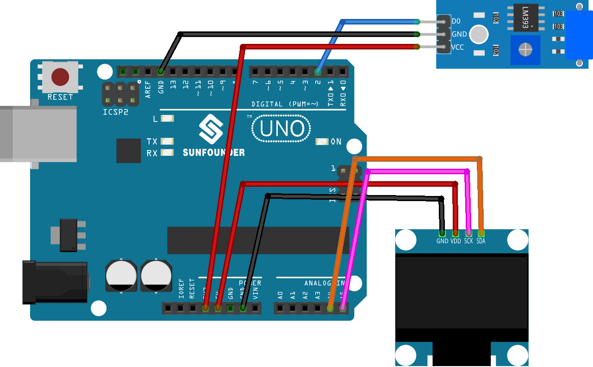

.. note::

    こんにちは、SunFounder Raspberry Pi & Arduino & ESP32 Enthusiasts Communityへようこそ！Facebook上で、仲間と一緒にRaspberry Pi、Arduino、ESP32をさらに深く探求しましょう。

    **なぜ参加するのか？**

    - **専門的なサポート**：購入後の問題や技術的な課題をコミュニティやチームの助けを借りて解決。
    - **学びと共有**：スキルを向上させるためのヒントやチュートリアルを交換。
    - **限定プレビュー**：新製品発表や予告編に早期アクセス。
    - **特別割引**：最新製品の特別割引を楽しむ。
    - **フェスティブプロモーションとプレゼント**：プレゼントやホリデープロモーションに参加。

    👉 私たちと一緒に探索と創造を始める準備はできましたか？[|link_sf_facebook|]をクリックして、今すぐ参加しましょう！
    
.. _uno_digital_dice:

Lesson 44: デジタルサイコロ
=============================================================

このプログラムは、OLEDディスプレイを使用してサイコロの振りをシミュレートします。
振動スイッチを振ることでシミュレーションがトリガーされ、ディスプレイが1から6までの数字をサイコロのように順に表示します。
短時間後に表示が停止し、ランダムに選ばれた数字がサイコロの結果として表示されます。

必要なコンポーネント
--------------------------

このプロジェクトでは、以下のコンポーネントが必要です。

一式キットを購入するのが便利です。こちらのリンクをご覧ください:

.. list-table::
    :widths: 20 20 20
    :header-rows: 1

    *   - Name	
        - ITEMS IN THIS KIT
        - LINK
    *   - Universal Maker Sensor Kit
        - 94
        - |link_umsk|

以下のリンクから別々に購入することもできます。

.. list-table::
    :widths: 30 20
    :header-rows: 1

    *   - Component Introduction
        - Purchase Link

    *   - Arduino UNO R3 or R4
        - |link_Uno_R3_buy|
    *   - :ref:`cpn_vibration`
        - |link_sw420_vibration_module_buy|
    *   - :ref:`cpn_oled`
        - \-
    *   - :ref:`cpn_breadboard`
        - |link_breadboard_buy|

配線
---------------------------

コード
---------------------------

.. raw:: html

    <iframe src=https://create.arduino.cc/editor/sunfounder01/70e73ef9-2968-4845-befd-23185286fd93/preview?embed style="height:510px;width:100%;margin:10px 0" frameborder=0></iframe>

コード解析
---------------------------

コードの詳細な解析：

1. 変数の初期化:

   ``vibPin``: 振動センサーに接続されたデジタルピン。

2. 揮発性変数:

   ``rolling``: サイコロの転がり状態を示す揮発性フラグ。割り込みサービスルーチンとメインプログラムの両方でアクセスされるため揮発性としています。

3. ``setup()``:

   振動センサーの入力モードを設定。
   センサーに割り込みを割り当て、状態変化時にrollDice関数をトリガー。
   OLEDディスプレイを初期化。

4. ``loop()``:

   ``rolling``がtrueであるかを継続的にチェックし、この状態では1から6までのランダムな数字を表示。センサーが500ミリ秒以上振動すると転がりが停止。

5. ``rollDice()``:

   振動センサーの割り込みサービスルーチン。センサーが振られた時に現在の時間を記録してサイコロの転がりを開始。

6. ``displayNumber()``:

   OLEDスクリーンに選択された数字を表示。
