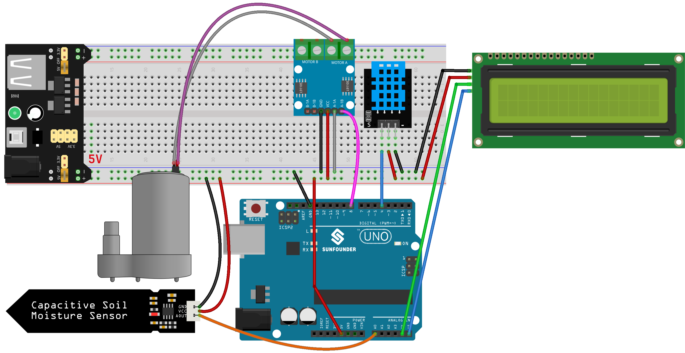

.. https://github.com/sunfounder/Elite-Explorer-Kit/blob/docs/docs/source/fun_projects/08_fun_plant_monitor.rst

.. _uno_plant_monitor:

Lesson 45: Plant Monitor
=============================================================

This project intelligently automates plant watering by triggering a water pump whenever the soil's moisture level dips below a predetermined threshold. 
It also features an LCD display that showcases the temperature, humidity, 
and soil moisture levels, offering users valuable insights into the plant's environmental conditions.

Required Components
---------------------------

.. list-table::
    :widths: 30 20
    :header-rows: 1

    *   - Component Introduction
        - Purchase Link

    *   - Arduino UNO R3 or R4
        - |link_Uno_R3_buy|
    *   - :ref:`cpn_breadboard`
        - |link_breadboard_buy|
    *   - :ref:`cpn_i2c_lcd1602`
        - |link_i2clcd1602_buy|
    *   - :ref:`cpn_pump`
        - \-
    *   - :ref:`cpn_l9110`
        - \-
    *   - :ref:`cpn_soil`
        - |link_soil_moisture_buy|
    *   - :ref:`cpn_dht11`
        - \-

Wiring
---------------------------

Code
---------------------------

.. raw:: html

    <iframe src=https://create.arduino.cc/editor/sunfounder01/700a51fb-6bb3-46c0-b0eb-5b03a6eb681e/preview?embed style="height:510px;width:100%;margin:10px 0" frameborder=0></iframe>

Code Analysis
---------------------------

The code is structured to seamlessly manage plant watering by monitoring environmental parameters:

1. Library Inclusions and Constants/Variables:

   Incorporate ``Wire.h``, ``LiquidCrystal_I2C.h``, and ``DHT.h`` libraries for functionality.
   Specify pin assignments and settings for the DHT11 sensor, soil moisture sensor, and water pump.

2. ``setup()``:

   Configure pin modes for the moisture sensor and pump.
   Initially deactivate the pump.
   Initialize and backlight the LCD.
   Activate the DHT sensor.

3. ``loop()``:

   Measure humidity and temperature via the DHT sensor.
   Gauge soil moisture through the soil moisture sensor.
   Display the temperature and humidity on the LCD, then show soil moisture levels.
   Assess soil moisture to decide on water pump activation; if soil moisture is under 500 (adjustable threshold), run the pump for 1 second.

