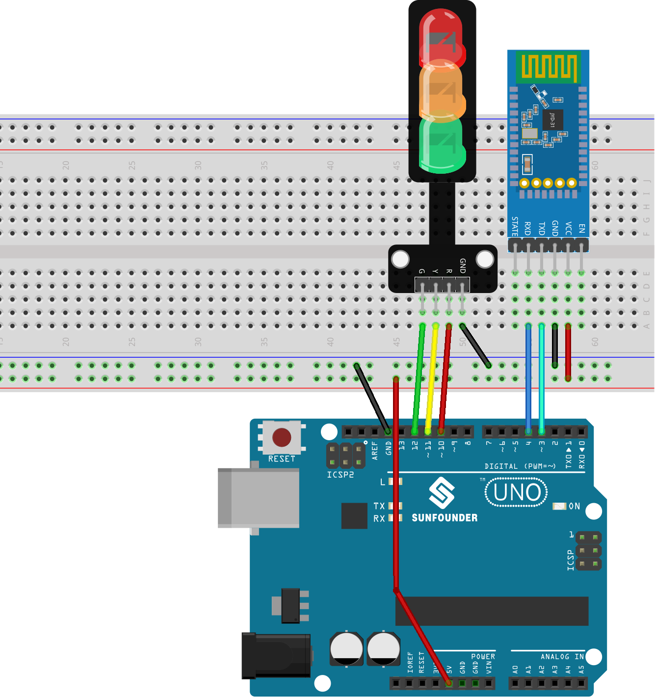

.. note::

    Hello, welcome to the SunFounder Raspberry Pi & Arduino & ESP32 Enthusiasts Community on Facebook! Dive deeper into Raspberry Pi, Arduino, and ESP32 with fellow enthusiasts.

    **Why Join?**

    - **Expert Support**: Solve post-sale issues and technical challenges with help from our community and team.
    - **Learn & Share**: Exchange tips and tutorials to enhance your skills.
    - **Exclusive Previews**: Get early access to new product announcements and sneak peeks.
    - **Special Discounts**: Enjoy exclusive discounts on our newest products.
    - **Festive Promotions and Giveaways**: Take part in giveaways and holiday promotions.

    👉 Ready to explore and create with us? Click [|link_sf_facebook|] and join today!

.. _uno_bluetooth_traffic_light:

Lesson 47: Bluetooth Traffic Light
=============================================================

This project is designed to control a traffic light (Red, Yellow, Green LEDs) using Bluetooth communication. The user can send a character ('R', 'Y', or 'G') from a Bluetooth device. When the Arduino receives one of these characters, it lights up the corresponding LED, while ensuring the other two LEDs are turned off.

Required Components
--------------------------

In this project, we need the following components. 

It's definitely convenient to buy a whole kit, here's the link: 

.. list-table::
    :widths: 20 20 20
    :header-rows: 1

    *   - Name	
        - ITEMS IN THIS KIT
        - LINK
    *   - Universal Maker Sensor Kit
        - 94
        - |link_umsk|

You can also buy them separately from the links below.

.. list-table::
    :widths: 30 20
    :header-rows: 1

    *   - Component Introduction
        - Purchase Link

    *   - Arduino UNO R3 or R4
        - |link_Uno_R3_buy|
    *   - :ref:`cpn_breadboard`
        - |link_breadboard_buy|
    *   - :ref:`cpn_traffic`
        - \-
    *   - :ref:`cpn_jdy31`
        - \-

Wiring
---------------------------

Code
---------------------------

.. raw:: html

   <iframe src=https://create.arduino.cc/editor/sunfounder01/5b9bd574-c807-4370-8e09-61f5f5a60b42/preview?embed style="height:510px;width:100%;margin:10px 0" frameborder=0></iframe>

App and Bluetooth module Connection
-----------------------------------------------
We can use an app called "Serial Bluetooth Terminal" to send messages from the Bluetooth module to Arduino.

a. **Install Serial Bluetooth Terminal**

   Go to Google Play to download and install |link_serial_bluetooth_terminal| .

b. **Connect Bluetooth**

   Initially, turn on **Bluetooth** on your smartphone.
   
      .. image:: img/09-app_1_shadow.png
         :width: 60%
         :align: center
   
   Navigate to the **Bluetooth settings** on your smartphone and look for names like **JDY-31-SPP**.
   
      .. image:: img/09-app_2_shadow.png
         :width: 60%
         :align: center
   
   After clicking it, agree to the **Pair** request in the pop-up window. If prompted for a pairing code, please enter "1234".
   
      .. image:: img/09-app_3_shadow.png
         :width: 60%
         :align: center
   

c. **Communicate with Bluetooth module**

   Open the Serial Bluetooth Terminal. Connect to "JDY-31-SPP".

   .. image:: img/00-bluetooth_serial_4_shadow.png 

d. **Send command**

   Use the Serial Bluetooth Terminal app to send commands to Arduino via Bluetooth. Send R to turn on the red light, Y for yellow, and G for green.

   .. image:: img/16-R_shadow.png 
      :width: 85%
      :align: center

   .. image:: img/16-Y_shadow.png 
      :width: 85%
      :align: center

   .. image:: img/16-G_shadow.png 
      :width: 85%
      :align: center

Code Analysis
---------------------------

#. Initialization and Bluetooth setup

   .. code-block:: arduino

      // Set up Bluetooth module communication
      #include <SoftwareSerial.h>
      const int bluetoothTx = 3;
      const int bluetoothRx = 4;
      SoftwareSerial bleSerial(bluetoothTx, bluetoothRx);
   
   We begin by including the SoftwareSerial library to help us with Bluetooth communication. The Bluetooth module's TX and RX pins are then defined and associated with pins 3 and 4 on the Arduino. Finally, we initialize the ``bleSerial`` object for Bluetooth communication.

#. LED Pin Definitions

   .. code-block:: arduino

      // Pin numbers for each LED
      const int rledPin = 10;  //red
      const int yledPin = 11;  //yellow
      const int gledPin = 12;  //green

   Here, we're defining which Arduino pins our LEDs are connected to. The red LED is on pin 10, yellow on 11, and green on 12.

#. setup() Function

   .. code-block:: arduino

      void setup() {
         pinMode(rledPin, OUTPUT);
         pinMode(yledPin, OUTPUT);
         pinMode(gledPin, OUTPUT);

         Serial.begin(9600);
         bleSerial.begin(9600);
      }

   In the ``setup()`` function, we set the LED pins as ``OUTPUT``. We also start serial communication for both the Bluetooth module and the default serial (connected to the computer) at a baud rate of 9600.

#. Main loop() for Bluetooth Communication

   .. code-block:: arduino

      void loop() {
         while (bleSerial.available() > 0) {
            character = bleSerial.read();
            Serial.println(character);

            if (character == 'R') {
               toggleLights(rledPin);
            } else if (character == 'Y') {
               toggleLights(yledPin);
            } else if (character == 'G') {
               toggleLights(gledPin);
            }
         }
      }

   Inside our main ``loop()``, we continuously check if data is available from the Bluetooth module. If we receive data, we read the character and display it in the serial monitor. Depending on the character received (R, Y, or G), we toggle the respective LED using the ``toggleLights()`` function.

#. Toggle Lights Function

   .. code-block:: arduino

      void toggleLights(int targetLight) {
         digitalWrite(rledPin, LOW);
         digitalWrite(yledPin, LOW);
         digitalWrite(gledPin, LOW);

         digitalWrite(targetLight, HIGH);
      }

   This function, ``toggleLights()``, turns off all the LEDs first. After ensuring they are all off, it turns on the specified target LED. This ensures that only one LED is on at a time.