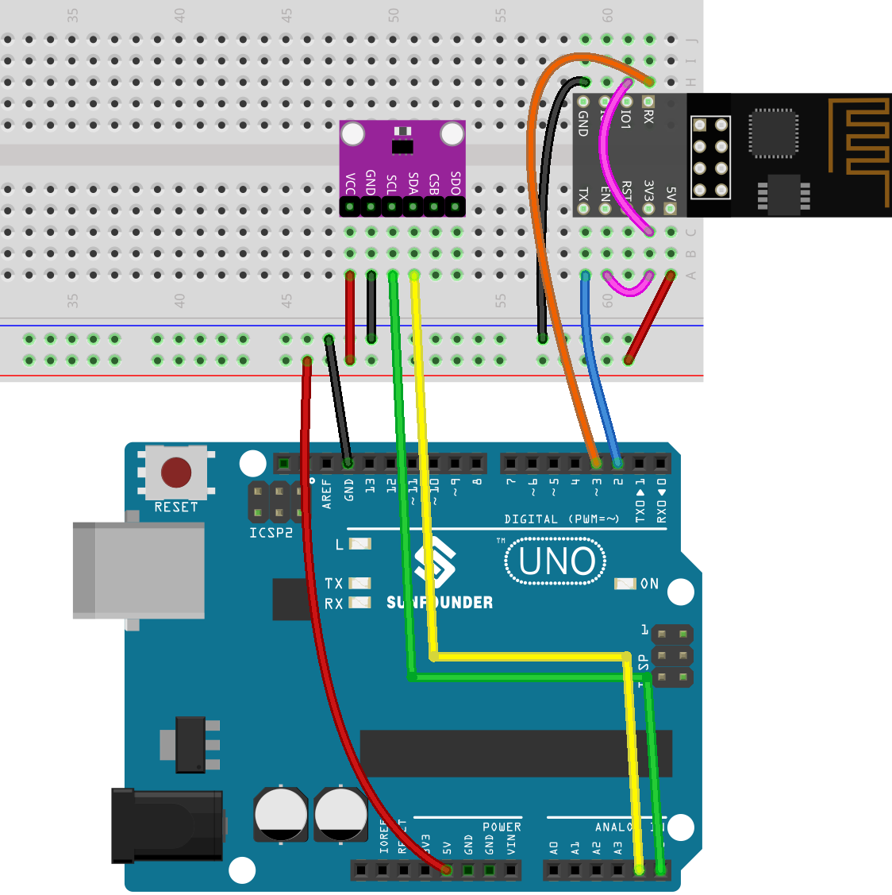
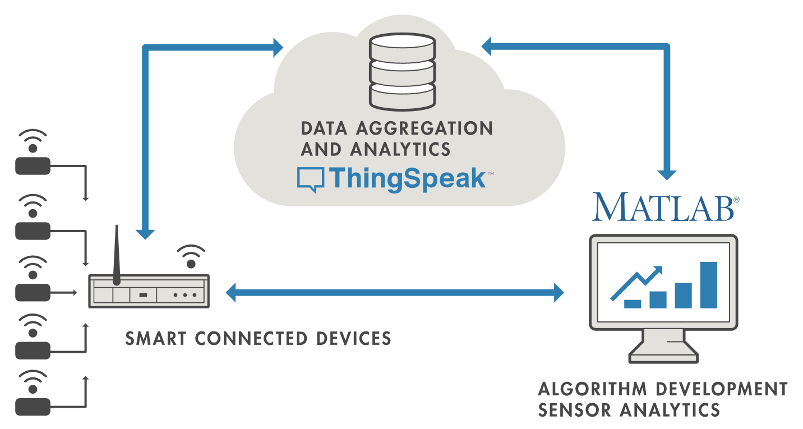
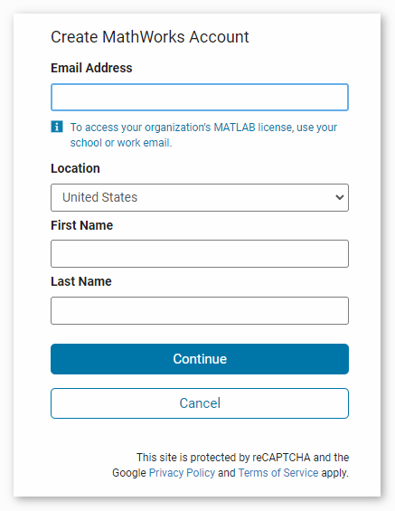
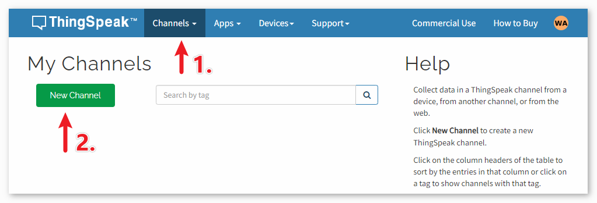
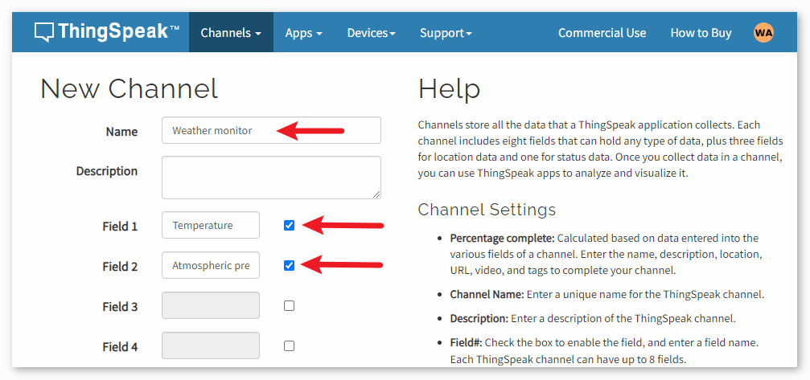

.. https://github.com/sunfounder/ultimate-sensor-kit/blob/docs/docs/source/iot_project/05-iot_Weather_monitor.rst

.. _uno_iot_weather_monito:

Lesson 48: Weather Monitor with ThingSpeak
=============================================================

This project collects temperature and pressure data using an Atmospheric Pressure Sensor. The collected data is then transmitted to the ThingSpeak cloud platform via an ESP8266 module and Wi-Fi network at regular time intervals.

Required Components
---------------------------

.. list-table::
    :widths: 30 20
    :header-rows: 1

    *   - Component Introduction
        - Purchase Link

    *   - Arduino UNO R3 or R4
        - |link_Uno_R3_buy|
    *   - :ref:`cpn_breadboard`
        - |link_breadboard_buy|
    *   - :ref:`cpn_esp8266`
        - \-
    *   - :ref:`cpn_bmp280`
        - \-

Wiring
---------------------------

Configure ThingSpeak
-----------------------------

|link_thingspeak| ™ is an IoT analytics platform service that allows you to aggregate, visualize and analyze live data streams in the cloud. ThingSpeak provides instant visualizations of data posted by your devices to ThingSpeak. With the ability to execute MATLAB® code in ThingSpeak you can perform online analysis and processing of the data as it comes in. ThingSpeak is often used for prototyping and proof of concept IoT systems that require analytics.

.. raw:: html
    
       

**1) Creating ThingSpeak Account**
^^^^^^^^^^^^^^^^^^^^^^^^^^^^^^^^^^^^^^^^

The first thing you need to do is to create an account with ThingSpeak. Since the collaboration with MATLAB, you can use your MathWorks credentials to login to |link_thingspeak|.

If you do not have one, you need to create an account with MathWorks and login to ThingSpeak Application.

**2) Creating the channel**
^^^^^^^^^^^^^^^^^^^^^^^^^^^^^^^^^^^^^^^^

After logging in, create a new channel to store the data by going to "Channels" > "My Channels" and clicking on "New Channel".

For this project, we need to create a channel called "**Weather Monitor**" with two fields: **Field 1** for "**Temperature**" and **Field 2** for "**Atmospheric Pressure**".

.. raw:: html
    
       

Code
--------------------------- 

#. Open the ``Lesson_48_Iot_Weather_Monitor.ino`` file under the path of ``universal-maker-sensor-kit\arduino_uno\Lesson_48_Iot_Weather_Monitor``, or copy this code into **Arduino IDE**.

   .. note:: 
      To install the library, use the Arduino Library Manager and search for **"Adafruit BMP280"** and install it. 

   .. raw:: html
      
      <iframe src=https://create.arduino.cc/editor/sunfounder01/59eeae43-5dcc-46d7-833f-65fd2bdb3603/preview?embed style="height:510px;width:100%;margin:10px 0" frameborder=0></iframe>

#. You need to enter the ``mySSID`` and ``myPWD`` of the WiFi you are using. 

   .. code-block:: arduino

    String mySSID = "your_ssid";     // WiFi SSID
    String myPWD = "your_password";  // WiFi Password

#. You also need to modify the ``myAPI`` with your ThingSpeak Channel API key.

   .. code-block:: arduino
    
      String myAPI = "xxxxxxxxxxxx";  // API Key

   .. image:: img/05-thingspeak_api_shadow.png
       :width: 80%
       :align: center
   
   
   Here you can find **your unique API KEY that you must keep private**. 

#. After selecting the correct board and port, click the **Upload** button.

#. Open the Serial monitor(set baudrate to **9600**) and wait for a prompt such as a successful connection to appear.

   .. image:: img/05-ready_1_shadow.png
          :width: 95%

   .. image:: img/05-ready_2_shadow.png
          :width: 95%

Code Analysis
---------------------------

#. Initialization and Bluetooth setup

   .. code-block:: arduino

      // Set up Bluetooth module communication
      #include <SoftwareSerial.h>
      const int bluetoothTx = 3;
      const int bluetoothRx = 4;
      SoftwareSerial bleSerial(bluetoothTx, bluetoothRx);
   
   We begin by including the SoftwareSerial library to help us with Bluetooth communication. The Bluetooth module's TX and RX pins are then defined and associated with pins 3 and 4 on the Arduino. Finally, we initialize the ``bleSerial`` object for Bluetooth communication.

#. LED Pin Definitions

   .. code-block:: arduino

      // Pin numbers for each LED
      const int rledPin = 10;  //red
      const int yledPin = 11;  //yellow
      const int gledPin = 12;  //green

   Here, we're defining which Arduino pins our LEDs are connected to. The red LED is on pin 10, yellow on 11, and green on 12.

#. setup() Function

   .. code-block:: arduino

      void setup() {
         pinMode(rledPin, OUTPUT);
         pinMode(yledPin, OUTPUT);
         pinMode(gledPin, OUTPUT);

         Serial.begin(9600);
         bleSerial.begin(9600);
      }

   In the ``setup()`` function, we set the LED pins as ``OUTPUT``. We also start serial communication for both the Bluetooth module and the default serial (connected to the computer) at a baud rate of 9600.

#. Main loop() for Bluetooth Communication

   .. code-block:: arduino

      void loop() {
         while (bleSerial.available() > 0) {
            character = bleSerial.read();
            Serial.println(character);

            if (character == 'R') {
               toggleLights(rledPin);
            } else if (character == 'Y') {
               toggleLights(yledPin);
            } else if (character == 'G') {
               toggleLights(gledPin);
            }
         }
      }

   Inside our main ``loop()``, we continuously check if data is available from the Bluetooth module. If we receive data, we read the character and display it in the serial monitor. Depending on the character received (R, Y, or G), we toggle the respective LED using the ``toggleLights()`` function.

#. Toggle Lights Function

   .. code-block:: arduino

      void toggleLights(int targetLight) {
         digitalWrite(rledPin, LOW);
         digitalWrite(yledPin, LOW);
         digitalWrite(gledPin, LOW);

         digitalWrite(targetLight, HIGH);
      }

   This function, ``toggleLights()``, turns off all the LEDs first. After ensuring they are all off, it turns on the specified target LED. This ensures that only one LED is on at a time.