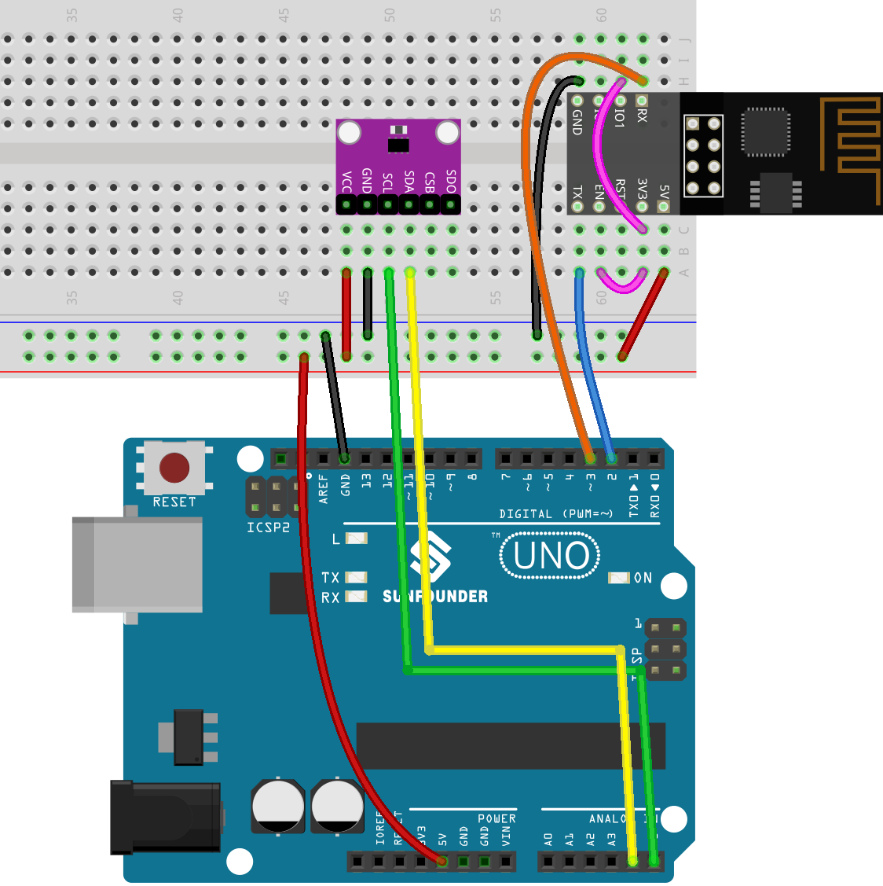
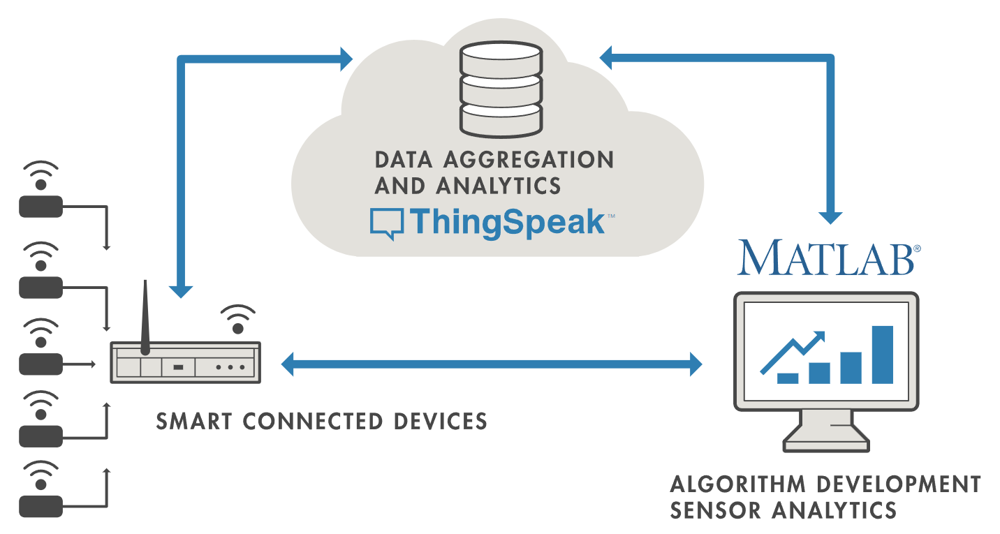
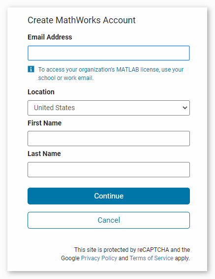
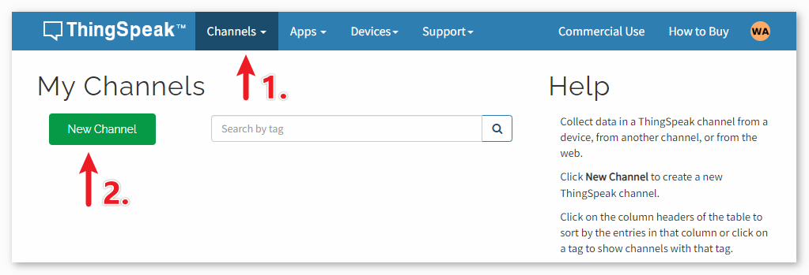
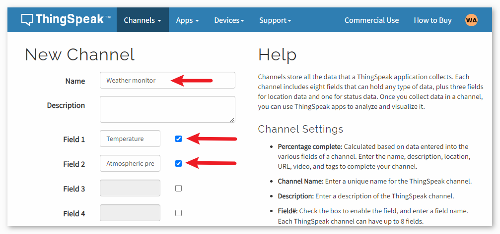

.. note::

    Bonjour, bienvenue dans la communauté des passionnés de SunFounder Raspberry Pi & Arduino & ESP32 sur Facebook ! Explorez plus en profondeur les univers du Raspberry Pi, de l'Arduino et de l'ESP32 avec d'autres passionnés.

    **Pourquoi rejoindre ?**

    - **Support d'experts** : Résolvez les problèmes post-vente et les défis techniques avec l'aide de notre communauté et de notre équipe.
    - **Apprendre & Partager** : Échangez des conseils et des tutoriels pour améliorer vos compétences.
    - **Aperçus exclusifs** : Obtenez un accès en avant-première aux annonces de nouveaux produits et aux coups d'œil indiscrets.
    - **Réductions spéciales** : Profitez de réductions exclusives sur nos produits les plus récents.
    - **Promotions festives et cadeaux** : Participez à des tirages au sort et à des promotions pendant les fêtes.

    👉 Prêts à explorer et créer avec nous ? Cliquez sur [|link_sf_facebook|] et rejoignez-nous aujourd'hui !

.. _uno_iot_weather_monito:

Leçon 48 : Moniteur météorologique avec ThingSpeak
=============================================================

Ce projet collecte des données de température et de pression atmosphérique à l'aide d'un capteur de pression atmosphérique. Les données recueillies sont ensuite transmises à la plateforme cloud ThingSpeak via un module ESP8266 et un réseau Wi-Fi à intervalles réguliers de temps.

Composants requis
--------------------------

Pour ce projet, nous avons besoin des composants suivants.

Il est certainement pratique d'acheter un kit complet, voici le lien :

.. list-table::
    :widths: 20 20 20
    :header-rows: 1

    *   - Nom	
        - ARTICLES DANS CE KIT
        - LIEN
    *   - Kit de capteurs universel pour créateurs
        - 94
        - |link_umsk|

Vous pouvez également les acheter séparément via les liens ci-dessous.

.. list-table::
    :widths: 30 20
    :header-rows: 1

    *   - Introduction du composant
        - Lien d'achat

    *   - Arduino UNO R3 ou R4
        - |link_Uno_R3_buy|
    *   - :ref:`cpn_breadboard`
        - |link_breadboard_buy|
    *   - :ref:`cpn_esp8266`
        - \-
    *   - :ref:`cpn_bmp280`
        - \-

Câblage
---------------------------

Configurer ThingSpeak
-----------------------------

|link_thingspeak| ™ est un service de plateforme d'analyse IoT qui vous permet d'agréger, de visualiser et d'analyser des flux de données en direct dans le cloud. ThingSpeak offre des visualisations instantanées des données postées par vos appareils sur ThingSpeak. Avec la possibilité d'exécuter du code MATLAB® dans ThingSpeak, vous pouvez effectuer des analyses et des traitements en ligne des données au fur et à mesure de leur arrivée. ThingSpeak est souvent utilisé pour le prototypage et la preuve de concept des systèmes IoT qui nécessitent des analyses.

.. raw:: html
    
       

**1) Création d'un compte ThingSpeak**
^^^^^^^^^^^^^^^^^^^^^^^^^^^^^^^^^^^^^^^^

La première chose à faire est de créer un compte sur ThingSpeak. Depuis la collaboration avec MATLAB, vous pouvez utiliser vos identifiants MathWorks pour vous connecter à |link_thingspeak|.

Si vous n'en avez pas, vous devez créer un compte chez MathWorks et vous connecter à l'application ThingSpeak.

**2) Création du canal**
^^^^^^^^^^^^^^^^^^^^^^^^^^^^^^^^^^^^^^^^

Après vous être connecté, créez un nouveau canal pour stocker les données en allant dans "Canaux" > "Mes Canaux" et en cliquant sur "Nouveau Canal".

Pour ce projet, nous devons créer un canal appelé "**Weather Monitor**" avec deux champs : **Field 1** pour "**Temperature**" et **Field 2** pour "**Atmospheric Pressure**".

.. raw:: html
    
       

Code
--------------------------- 

#. Ouvrez le fichier ``Lesson_48_Iot_Weather_Monitor.ino`` sous le chemin ``universal-maker-sensor-kit\arduino_uno\Lesson_48_Iot_Weather_Monitor``, ou copiez ce code dans **Arduino IDE**.

   .. note:: 
      Pour installer la bibliothèque, utilisez le Gestionnaire de bibliothèques Arduino et recherchez **"Adafruit BMP280"** et installez-la. 

   .. raw:: html
      
      <iframe src=https://create.arduino.cc/editor/sunfounder01/59eeae43-5dcc-46d7-833f-65fd2bdb3603/preview?embed style="height:510px;width:100%;margin:10px 0" frameborder=0></iframe>

#. Vous devez entrer le ``mySSID`` et ``myPWD`` du WiFi que vous utilisez. 

   .. code-block:: arduino

    String mySSID = "votre_ssid";     // SSID WiFi
    String myPWD = "votre_mot_de_passe";  // Mot de passe WiFi

#. Vous devez également modifier le ``myAPI`` avec votre clé API du canal ThingSpeak.

   .. code-block:: arduino
    
      String myAPI = "xxxxxxxxxxxx";  // Clé API

   .. image:: img/05-thingspeak_api_shadow.png
       :width: 80%
       :align: center
   
   
   Ici, vous trouverez **votre clé API unique que vous devez garder privée**. 

#. Après avoir sélectionné la bonne carte et le bon port, cliquez sur le bouton **Télécharger**.

#. Ouvrez le moniteur série (réglez le débit en bauds sur **9600**) et attendez une invite telle qu'une connexion réussie apparaît.

   .. image:: img/05-ready_1_shadow.png
          :width: 95%

   .. image:: img/05-ready_2_shadow.png
          :width: 95%

Analyse du code
---------------------------

#. Initialisation et configuration Bluetooth

   .. code-block:: arduino

      // Configuration de la communication du module Bluetooth
      #include <SoftwareSerial.h>
      const int bluetoothTx = 3;  // TX du Bluetooth
      const int bluetoothRx = 4;  // RX du Bluetooth
      SoftwareSerial bleSerial(bluetoothTx, bluetoothRx);
   
   Nous commençons par inclure la bibliothèque SoftwareSerial pour nous aider avec la communication Bluetooth. Les broches TX et RX du module Bluetooth sont ensuite définies et connectées aux broches 3 et 4 de l'Arduino. Enfin, nous initialisons l'objet ``bleSerial`` pour la communication Bluetooth.

#. Définition des broches des LED

   .. code-block:: arduino

      // Numéros des broches pour chaque LED
      const int rledPin = 10;  // LED rouge
      const int yledPin = 11;  // LED jaune
      const int gledPin = 12;  // LED verte

   Ici, nous définissons quelles broches de l'Arduino nos LEDs sont connectées. La LED rouge est sur la broche 10, la jaune sur la broche 11, et la verte sur la broche 12.

#. Fonction setup()

   .. code-block:: arduino

      void setup() {
         pinMode(rledPin, OUTPUT);  // Définir la broche de la LED rouge comme sortie
         pinMode(yledPin, OUTPUT);  // Définir la broche de la LED jaune comme sortie
         pinMode(gledPin, OUTPUT);  // Définir la broche de la LED verte comme sortie

         Serial.begin(9600);  // Commencer la communication série à 9600 bauds
         bleSerial.begin(9600);  // Commencer la communication Bluetooth à 9600 bauds
      }

   Dans la fonction ``setup()``, nous configurons les broches des LED comme ``OUTPUT``. Nous démarrons également la communication série pour le module Bluetooth et la série par défaut (connectée à l'ordinateur) à un débit de 9600 bauds.

#. Boucle principale pour la communication Bluetooth

   .. code-block:: arduino

      void loop() {
         while (bleSerial.available() > 0) {
            char character = bleSerial.read();  // Lire le caractère reçu
            Serial.println(character);  // Afficher le caractère sur le moniteur série

            if (character == 'R') {
               toggleLights(rledPin);  // Activer la LED rouge
            } else if (character == 'Y') {
               toggleLights(yledPin);  // Activer la LED jaune
            } else if (character == 'G') {
               toggleLights(gledPin);  // Activer la LED verte
            }
         }
      }

   À l'intérieur de notre boucle principale ``loop()``, nous vérifions continuellement si des données sont disponibles depuis le module Bluetooth. Si nous recevons des données, nous lisons le caractère et l'affichons sur le moniteur série. Selon le caractère reçu (R, Y ou G), nous activons la LED correspondante en utilisant la fonction ``toggleLights()``.

#. Fonction pour basculer les lumières

   .. code-block:: arduino

      void toggleLights(int targetLight) {
         digitalWrite(rledPin, LOW);  // Éteindre la LED rouge
         digitalWrite(yledPin, LOW);  // Éteindre la LED jaune
         digitalWrite(gledPin, LOW);  // Éteindre la LED verte

         digitalWrite(targetLight, HIGH);  // Allumer la LED ciblée
      }

   Cette fonction, ``toggleLights()``, éteint d'abord toutes les LEDs. Après s'être assuré qu'elles sont toutes éteintes, elle allume la LED cible spécifiée. Cela garantit qu'une seule LED est allumée à la fois.
