.. https://github.com/sunfounder/ultimate-sensor-kit/blob/docs/docs/source/iot_project/04-iot_Vibration_alert_system.rst

.. note::

    Hello, welcome to the SunFounder Raspberry Pi & Arduino & ESP32 Enthusiasts Community on Facebook! Dive deeper into Raspberry Pi, Arduino, and ESP32 with fellow enthusiasts.

    **Why Join?**

    - **Expert Support**: Solve post-sale issues and technical challenges with help from our community and team.
    - **Learn & Share**: Exchange tips and tutorials to enhance your skills.
    - **Exclusive Previews**: Get early access to new product announcements and sneak peeks.
    - **Special Discounts**: Enjoy exclusive discounts on our newest products.
    - **Festive Promotions and Giveaways**: Take part in giveaways and holiday promotions.

    👉 Ready to explore and create with us? Click [|link_sf_facebook|] and join today!

.. _uno_iot_vib_alert_system:

Lesson 49: Vibration Alert System with IFTTT
=====================================================

This project sets up a vibration detection system using an Arduino board (Uno R4 or R3) with an ESP8266 module and a vibration sensor (SW-420). When a vibration is detected, the system sends an HTTP request to an IFTTT server, potentially triggering various actions such as sending a notification or an email.

To avoid excessive alerts within a short timeframe, the system has been programmed to send these HTTP requests at a minimum interval of 2 minutes (120000 milliseconds). This interval could be adjusted based on the user's needs.

Required Components
---------------------------

.. list-table::
    :widths: 30 20
    :header-rows: 1

    *   - Component Introduction
        - Purchase Link

    *   - Arduino UNO R3 or R4
        - |link_Uno_R3_buy|
    *   - :ref:`cpn_breadboard`
        - |link_breadboard_buy|
    *   - :ref:`cpn_esp8266`
        - \-
    *   - :ref:`cpn_vibration`
        - \-

Wiring
---------------------------

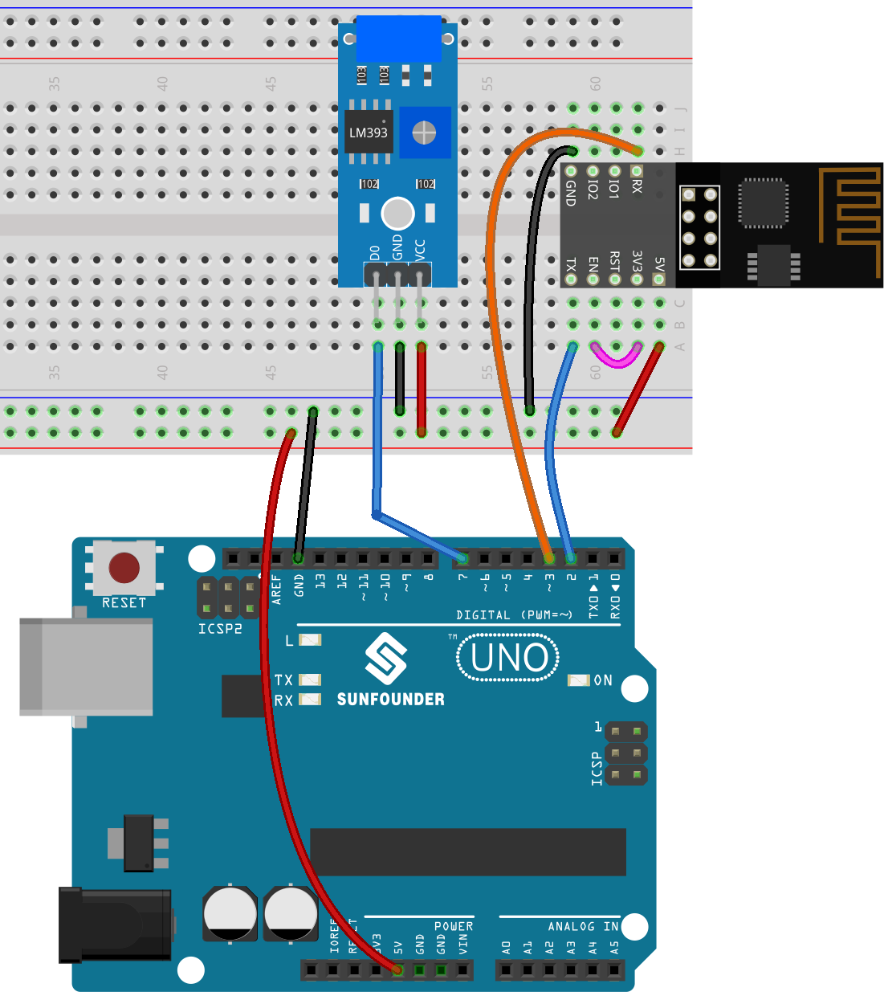

Configure IFTTT
-----------------------------

|link_ifttt| is a private commercial company founded in 2011 that runs online digital automation platforms which it offers as a service. Their platforms provide a visual interface for making cross-platform if statements to its users, which, as of 2020, numbered 18 million people. 

IFTTT stands for “If This Then That.” Basically, if certain conditions are met, then something else will happen. The “if this” part is called a trigger, and the “then that” part is called an action. It joins smart home devices, social media, delivery apps, and more so it can perform automated tasks.

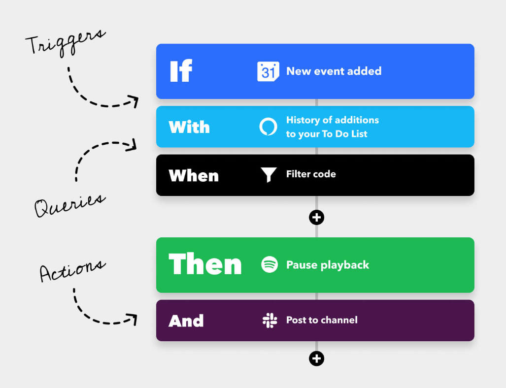

**1) Sign up IFTTT**
^^^^^^^^^^^^^^^^^^^^^^^^^^^^^

Type "https://ifttt.com" in your browser and click on the "Get started" button located at the center of the page. Fill out the form with your information to create an account.

Click "Back" to exit quickstart, return to the IFTTT homepage, refresh the page and log in again.

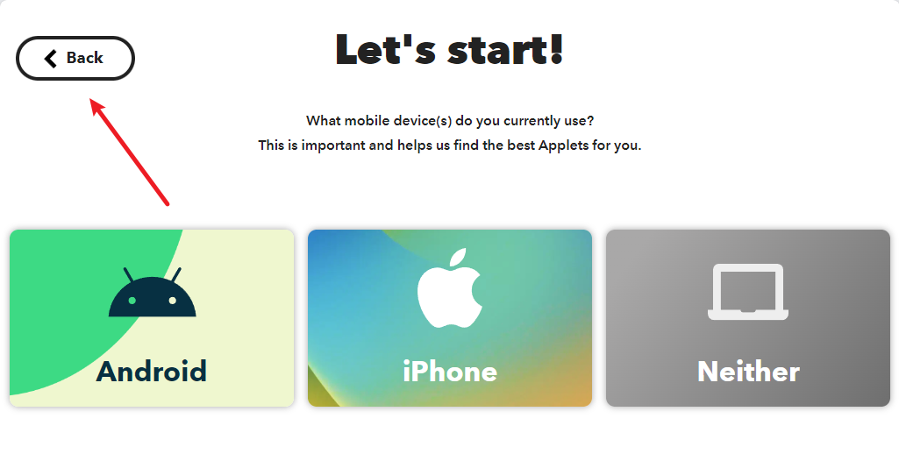

**2) Creating the Applet**
^^^^^^^^^^^^^^^^^^^^^^^^^^^^^

Click "Create" to start creating the Applet.

.. raw:: html
    
       

**If This trigger**

Click "Add" next to "If This" to add a trigger.

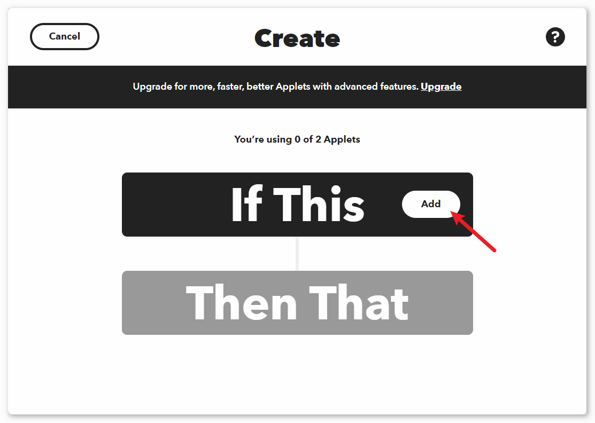

Search for "webhook" and click on "Webhooks".

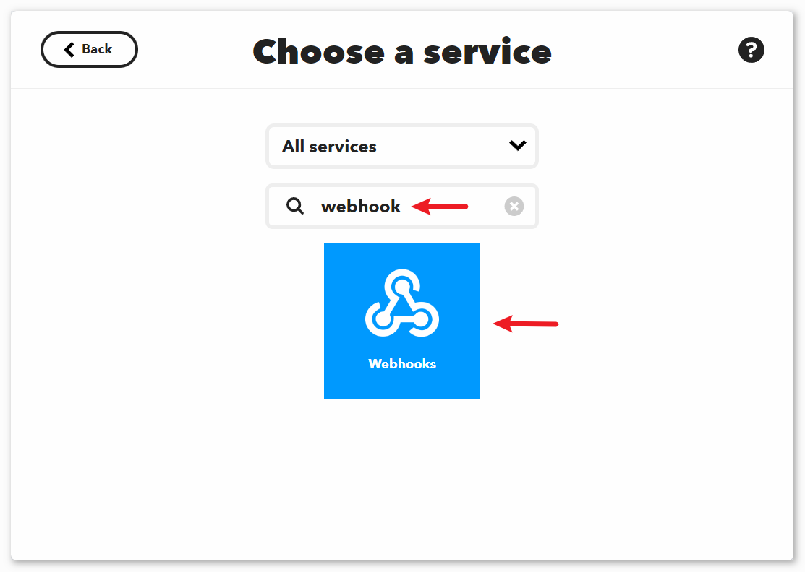

Click on "Receive a web request" on the page shown in the following image.

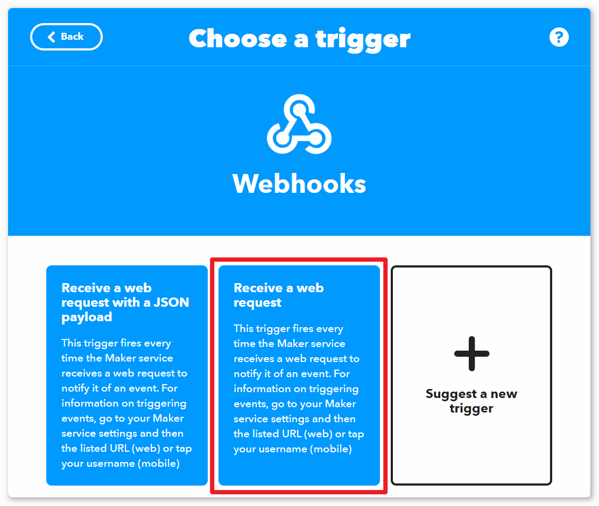

Set the "Event Name" to "vibration_detected".

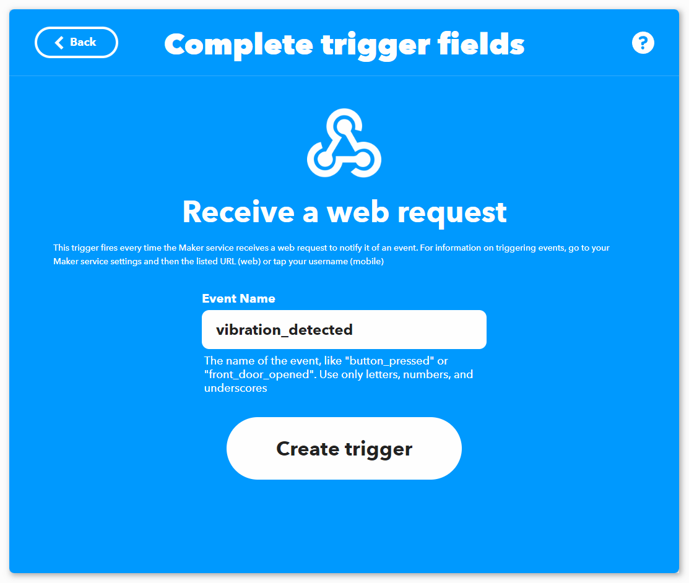

.. raw:: html
    
       

**Then That action**

Click on "Add" next to "Then That" to add a action.

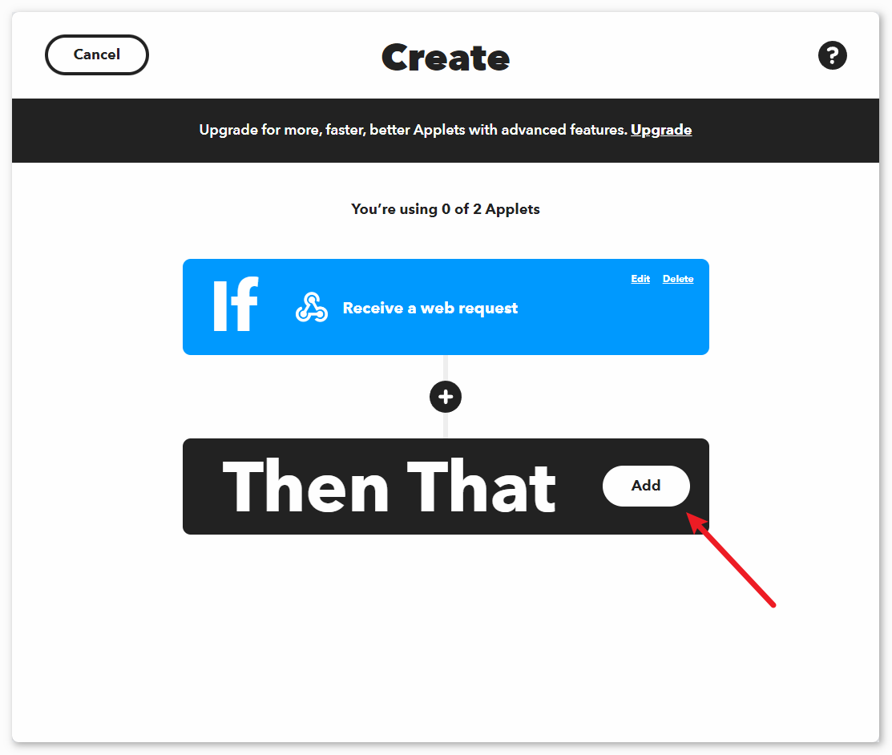

Search for "email" and click on "Email".

.. image:: img/04-ifttt_create_applet_7_shadow.png
    :width: 80%
    :align: center

Click on "Send me a email" on the page shown in the following image.

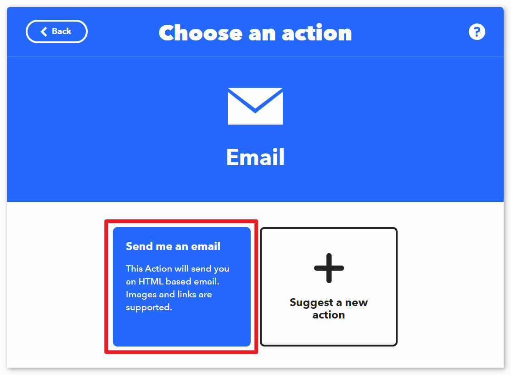

Set the subject and content of the email to be sent when vibration is detected.

As a reference, the subject is set to "[ESP-01] Detected vibration!!!", and the content is set to "Detected vibration, please confirm the situation promptly! {{OccurredAt}}". When sending an email, ``{{OccurredAt}}`` will be automatically replaced with the time when the event occurred.

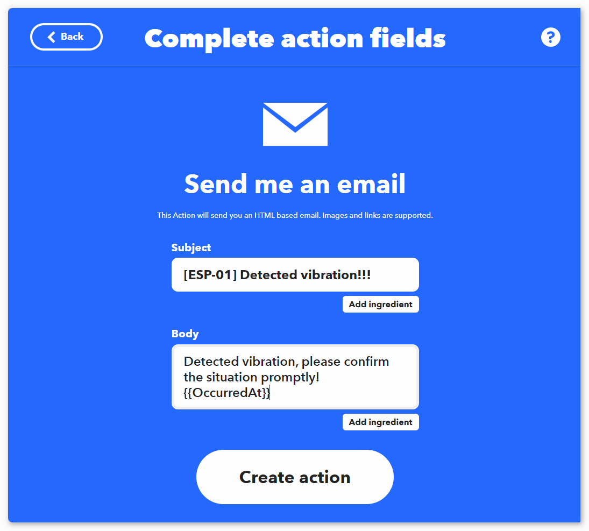

According to the following steps, complete the creation of the Applet.

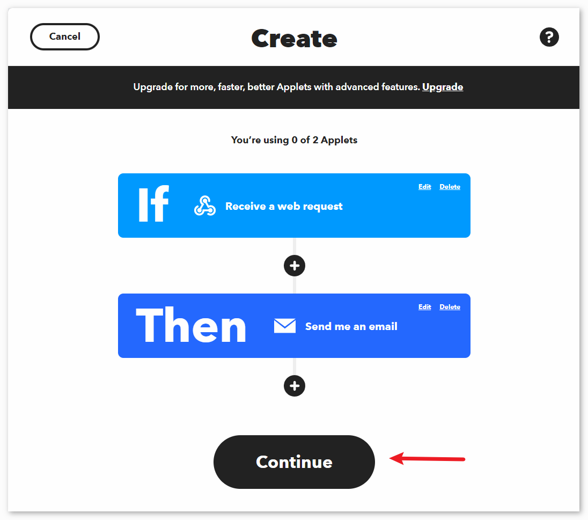

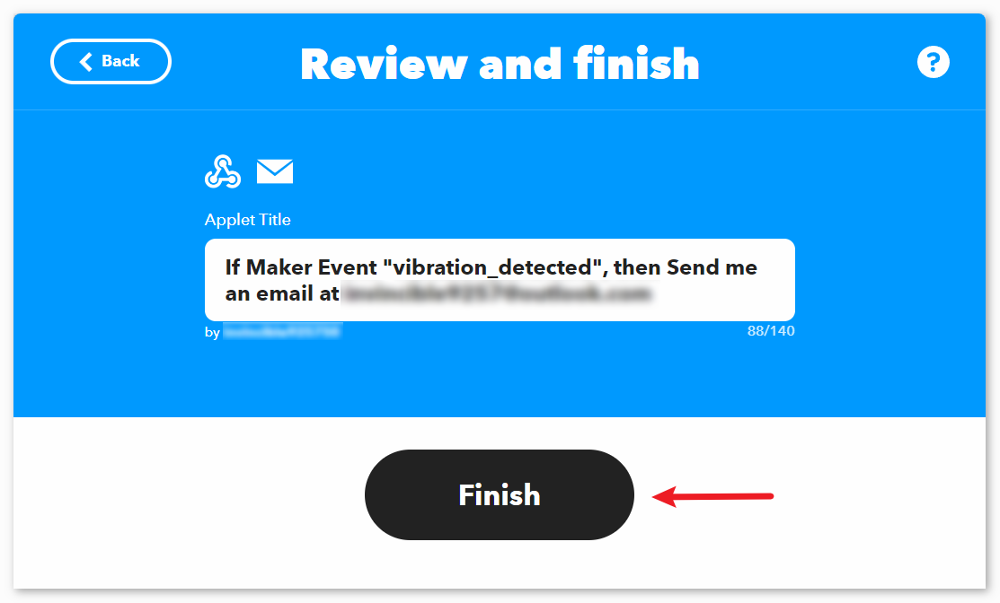

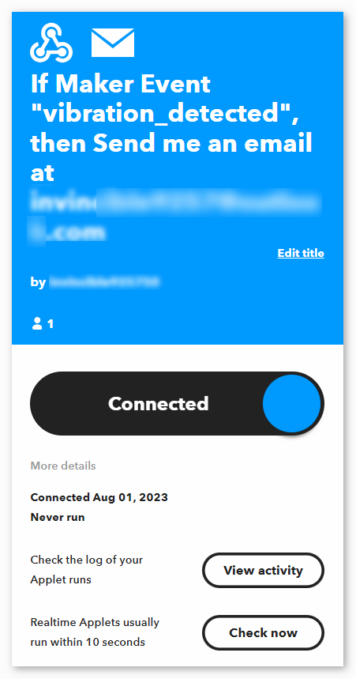

.. raw:: html
    
       

Code
----------------------- 

#. Open the ``Lesson_49_Vibration_alert_system.ino`` file under the path of ``universal-maker-sensor-kit\arduino_uno\Lesson_49_Vibration_alert_system``, or copy this code into **Arduino IDE**.

   .. raw:: html
       
        <iframe src=https://create.arduino.cc/editor/sunfounder01/35a75e1c-6b2a-407d-9724-f83ad50a4a41/preview?embed style="height:510px;width:100%;margin:10px 0" frameborder=0></iframe>

#. You need to enter the ``mySSID`` and ``myPWD`` of the WiFi you are using. 

   .. code-block:: arduino

    String mySSID = "your_ssid";     // WiFi SSID
    String myPWD = "your_password";  // WiFi Password

#. You also need to modify the ``URL`` with both the event name you set and your  API key.

   .. code-block:: arduino
    
      String URL = "/trigger/vibration_detected/with/key/xxxxxxxxxxxxxxxxxx";

   .. image:: img/04-ifttt_apikey_1_shadow.png
       :width: 80%
       :align: center
   
   .. image:: img/04-ifttt_apikey_2_shadow.png
       :width: 80%
       :align: center

   Here you can find **your unique API KEY that you must keep private**. Type in the event name as ``vibration_detected``. Your final URL will appear at the bottom of the webpage. Copy this URL.

   .. image:: img/04-ifttt_apikey_3_shadow.png
       :width: 80%
       :align: center

   .. image:: img/04-ifttt_apikey_4_shadow.png
       :width: 80%
       :align: center

#. After selecting the correct board and port, click the **Upload** button.

#. Open the Serial monitor(set baudrate to **9600**) and wait for a prompt such as a successful connection to appear.

   .. image:: img/04-ready_shadow.png
          :width: 95%

Code Analysis
---------------------------

The ESP8266 module that comes with the kit is already pre-burned with AT firmware. Therefore, the ESP8266 module can be controlled through AT commands. In this project, we use software serial to enable communication between the Arduino Uno board and the ESP8266 module. The Arduino Uno board sends AT commands to the ESP8266 module for network connection and sending requests. You can refer to |link_esp8266_at|.

The Uno board reads sensor values and sends AT commands to the ESP8266 module. The ESP8266 module connects to a network and sends requests to IFTTT servers. 

#. Include SoftwareSerial library for serial communication between Arduino and ESP8266

   .. code-block:: arduino
   
     #include <SoftwareSerial.h>      
     SoftwareSerial espSerial(2, 3);  

#. Configure WiFi credentials and IFTTT server details

   .. code-block:: arduino
   
     String mySSID = "your_ssid";     
     String myPWD = "your_password";  
     String myHOST = "maker.ifttt.com";
     String myPORT = "80";
     String URL = "/trigger/xxx/with/key/xxxx";  

#. Define variables for the vibration sensor and alert frequency control

   .. code-block:: arduino
   
     unsigned long lastAlertTime = 0;                
     const unsigned long postingInterval = 120000L;
     const int sensorPin = 7;

#. In ``setup()``, initialize serial communication, ESP8266 module and connect to WiFi

   .. code-block:: arduino
   
      void setup() {
        Serial.begin(9600);
        espSerial.begin(115200);
      
        // Initialize the ESP8266 module
        sendATCommand("AT+RST", 1000, DEBUG);   //Reset the ESP8266 module
        sendATCommand("AT+CWMODE=1", 1000, DEBUG);  //Set the ESP mode as station mode
        sendATCommand("AT+CWJAP=\"" + mySSID + "\",\"" + myPWD + "\"", 3000, DEBUG);  //Connect to WiFi network
      
        while (!espSerial.find("OK")) {
          //Wait for connection
        }
      }

#. In ``loop()``, detect vibration and send alert if time interval has passed

   .. code-block:: arduino
   
      void loop() {
      
        if (digitalRead(sensorPin)) {
          if (lastAlertTime == 0 || millis() - lastAlertTime > postingInterval) {
            Serial.println("Detected vibration!!!");
            sendAlert();  //Send an HTTP request to IFTTT server
          } else {
            Serial.print("Detected vibration!!! ");
            Serial.println("Since an email has been sent recently, no warning email will be sent this time to avoid bombarding your inbox.");
          }
        } else {
          if (DEBUG) {
            Serial.println("Detecting...");
          }
        }
        delay(500);
      }

#. sendAlert() constructs HTTP request and sends it via ESP8266

   .. code-block:: arduino
   
     void sendAlert() {
   
       String sendData = "GET " + URL + " HTTP/1.1" + "\r\n";
       sendData += "Host: maker.ifttt.com\r\n";
       
       sendATCommand("AT+CIPMUX=0",1000,DEBUG);                           
       sendATCommand("AT+CIPSTART=...",3000,DEBUG);  
       sendATCommand("AT+CIPSEND=" + String(sendData.length()),1000,DEBUG);   
       espSerial.println(sendData);
      
     }  

#. Handling AT Commands sendATCommand()

   This function sends AT commands to the ESP8266 and collects responses. 
   
   .. code-block:: arduino
   
      void sendATCommand(String command, const int timeout, boolean debug) {
        // Print and send command
        Serial.print("AT Command ==> ");
        Serial.print(command);
        Serial.println();
        espSerial.println(command);  // Send the AT command
      
        // Get the response from the ESP8266 module
        String response = "";
        long int time = millis();
        while ((time + timeout) > millis()) {  // Wait for the response until the timeout
          while (espSerial.available()) {
            char c = espSerial.read();
            response += c;
          }
        }
      
        // Print response if debug mode is on
        if (debug) {
          Serial.println(response);
          Serial.println("--------------------------------------");
        }

**Reference**

* |link_esp8266_at|
* |link_ifttt_welcome|
* |link_ifttt_webhook_faq|