.. note::

   Hallo und willkommen in der SunFounder Raspberry Pi & Arduino & ESP32 Enthusiasten-Gemeinschaft auf Facebook! Tauchen Sie tiefer ein in die Welt von Raspberry Pi, Arduino und ESP32 mit anderen Enthusiasten.

   **Warum beitreten?**

   - **Expertenunterstützung**: Lösen Sie Nachverkaufsprobleme und technische Herausforderungen mit Hilfe unserer Gemeinschaft und unseres Teams.
   - **Lernen & Teilen**: Tauschen Sie Tipps und Anleitungen aus, um Ihre Fähigkeiten zu verbessern.
   - **Exklusive Vorschauen**: Erhalten Sie frühzeitigen Zugang zu neuen Produktankündigungen und exklusiven Einblicken.
   - **Spezialrabatte**: Genießen Sie exklusive Rabatte auf unsere neuesten Produkte.
   - **Festliche Aktionen und Gewinnspiele**: Nehmen Sie an Gewinnspielen und Feiertagsaktionen teil.

   👉 Sind Sie bereit, mit uns zu erkunden und zu erschaffen? Klicken Sie auf [|link_sf_facebook|] und treten Sie heute bei!

.. _uno_iot_flame:

Lektion 50: Flammenwarnsystem mit Blynk
============================================================

In diesem Kapitel werden wir Sie durch den Prozess der Erstellung eines Heimflammenalarm-Demonstrators mit Blynk führen. Durch die Nutzung eines Flammensensors können potenzielle Brände in Ihrem Zuhause erkannt werden. Das Senden der erkannten Werte an Blynk ermöglicht eine Fernüberwachung Ihres Zuhauses über das Internet. Im Falle eines Brandes wird Blynk Sie umgehend per E-Mail benachrichtigen.

Benötigte Komponenten
--------------------------

Für dieses Projekt benötigen wir die folgenden Komponenten. 

Es ist definitiv praktisch, ein ganzes Kit zu kaufen, hier ist der Link: 

.. list-table::
    :widths: 20 20 20
    :header-rows: 1

    *   - Name	
        - ITEMS IN THIS KIT
        - LINK
    *   - Universal Maker Sensor Kit
        - 94
        - |link_umsk|

Sie können sie auch separat von den folgenden Links kaufen.

.. list-table::
    :widths: 30 20
    :header-rows: 1

    *   - Component Introduction
        - Purchase Link

    *   - Arduino UNO R3 or R4
        - |link_Uno_R3_buy|
    *   - :ref:`cpn_breadboard`
        - |link_breadboard_buy|
    *   - :ref:`cpn_esp8266`
        - \-
    *   - :ref:`cpn_flame`
        - \-

Verkabelung
---------------------------

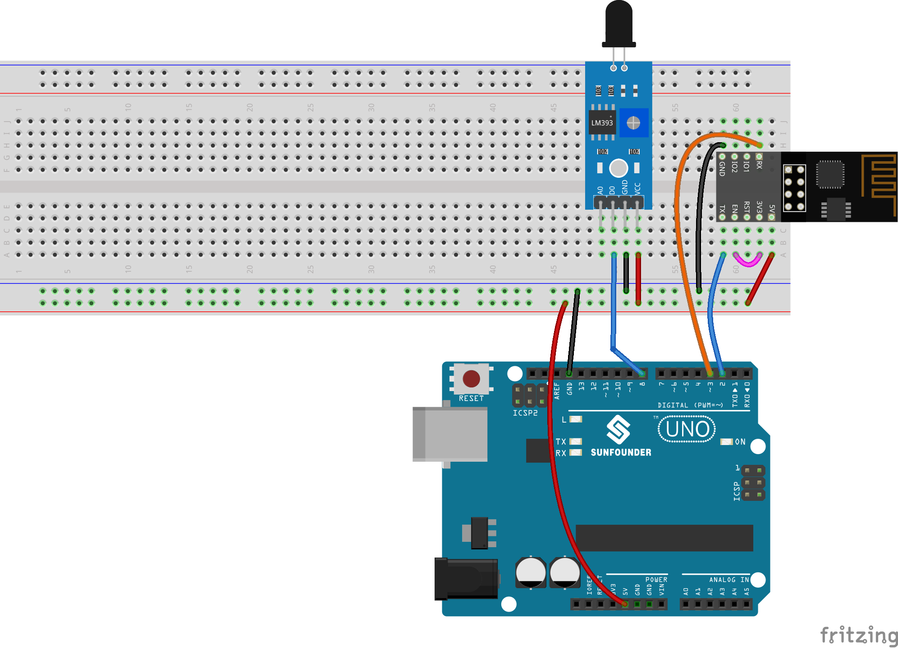

Blynk konfigurieren
-----------------------------

**1 Vorlage erstellen**
^^^^^^^^^^^^^^^^^^^^^^^^^^^^^

Zunächst müssen wir eine Vorlage auf Blynk erstellen. Befolgen Sie die folgenden Schritte, um eine Vorlage für das **"Flammenwarnsystem"** zu erstellen. 

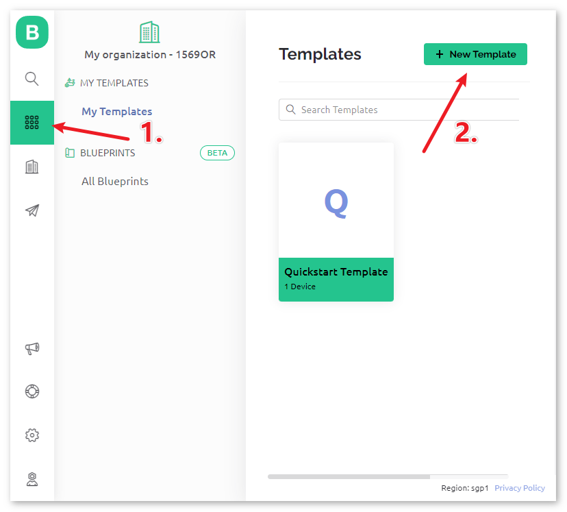

Stellen Sie sicher, dass die **HARDWARE** als **ESP8266** konfiguriert ist und der **VERBINDUNGSTYP** auf **WiFi** eingestellt ist.

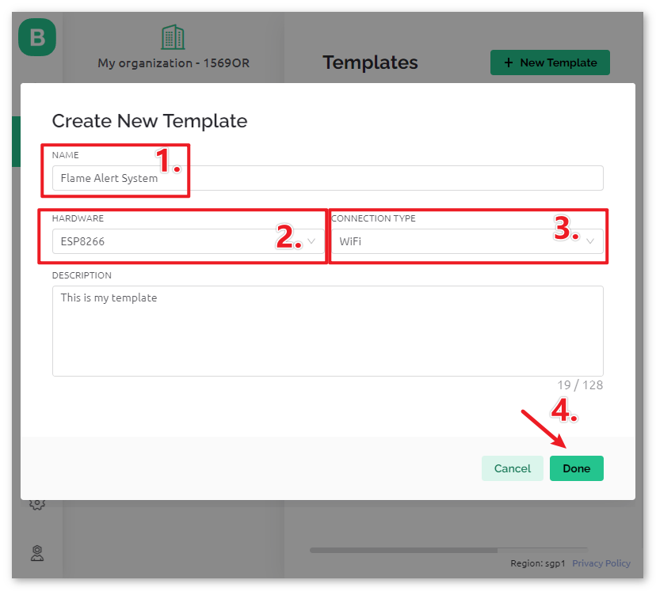

.. raw:: html
    
       

**2 Datenstrom**
^^^^^^^^^^^^^^^^^^^^^^^^^^^^^

Erstellen Sie eine **Datenstrom** vom Typ **Virtueller Pin** auf der Seite **Datenstrom**, um den Wert des Flammensensors zu erhalten. 

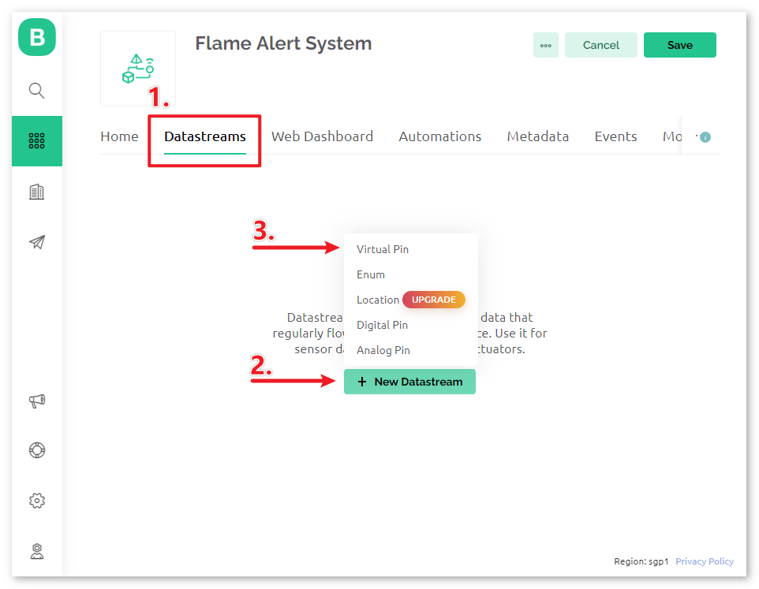

Setzen Sie den Namen des **Virtuellen Pins** auf ``flame_sensor_value``. Setzen Sie den **DATENTYP** auf **Integer** und MIN und MAX auf **0** und **1**.

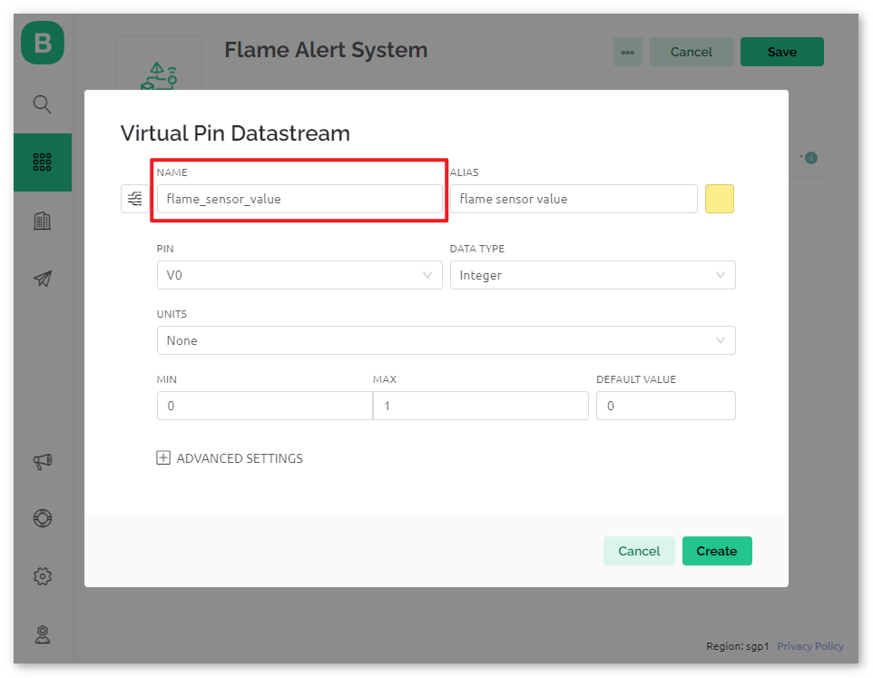

.. raw:: html
    
      

**3 Ereignis**
^^^^^^^^^^^^^^^^^^^^^^^^^^^^^

Als Nächstes erstellen wir ein **Ereignis**, das die Erkennung von Flammen protokolliert und eine E-Mail-Benachrichtigung sendet.

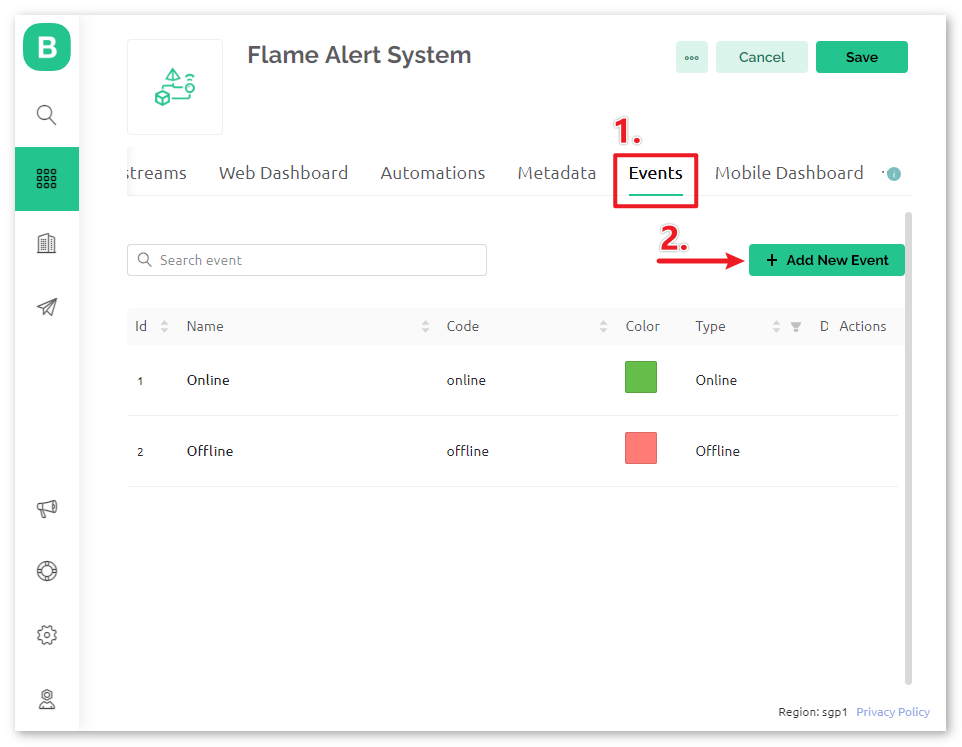

.. note::
    Es wird empfohlen, es konsistent mit meinen Einstellungen zu halten, sonst müssen Sie möglicherweise den Code anpassen, um das Projekt auszuführen.

Setzen Sie **EREIGNISNAME** auf ``flame_detection_alert``. Gleichzeitig können Sie den Inhalt der per E-Mail gesendeten Benachrichtigung durch Einstellen von **BESCHREIBUNG** für die Ereignisauslösung anpassen. Sie können auch Frequenzgrenzen für die Ereignisauslösung unten festlegen.

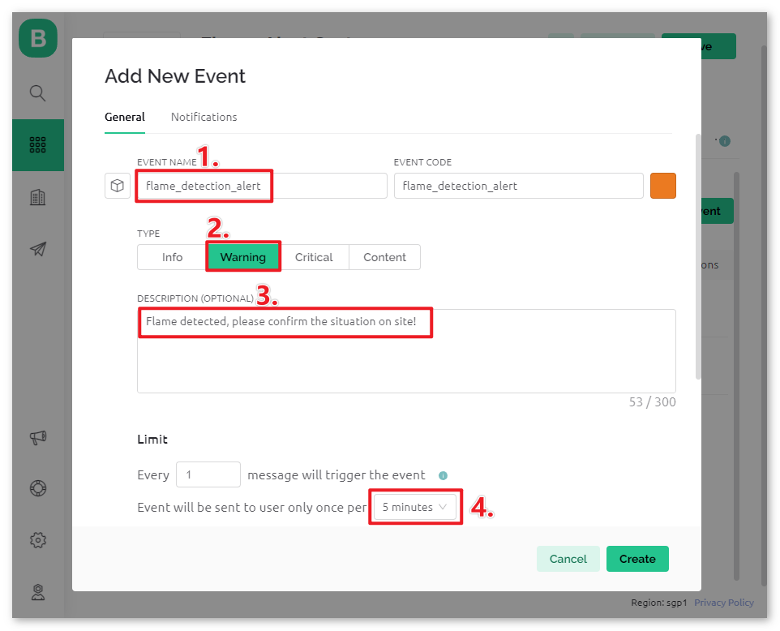

Gehen Sie zur Seite **Benachrichtigungen** und konfigurieren Sie die E-Mail-Einstellungen.

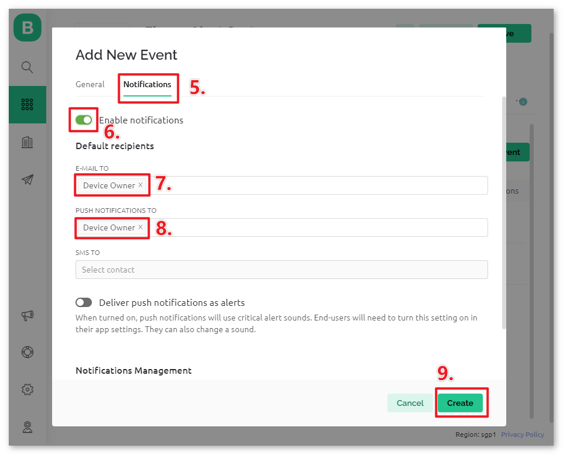

.. raw:: html
    
      

**4 Web-Dashboard**
^^^^^^^^^^^^^^^^^^^^^^^^^^^^^

Es ist auch erforderlich, das **Web-Dashboard** einzurichten, um die vom Uno-Board gesendeten Sensordaten anzuzeigen.

Ziehen Sie ein **Label-Widget** auf die Seite des **Web-Dashboards**.

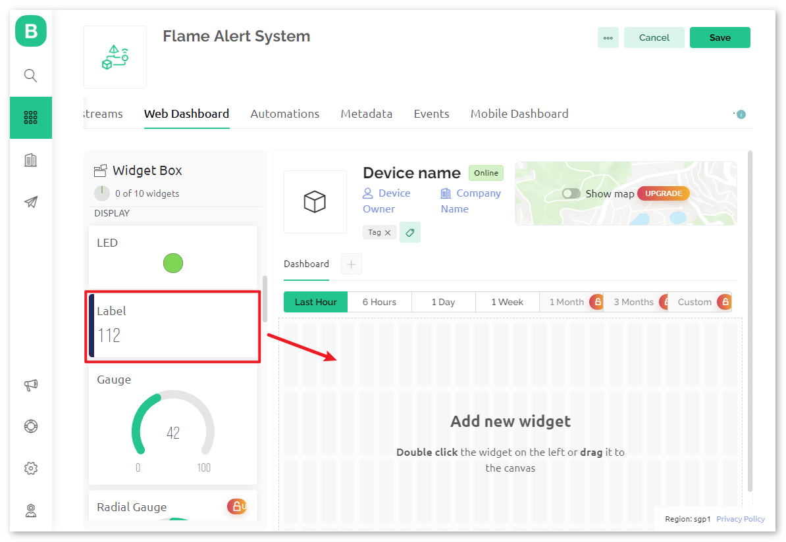

Auf der Einstellungsseite des **Label-Widgets** wählen Sie **Datenstrom** als **flame_sensor_value(V0)** aus. Legen Sie dann die Farbe des **WIDGET-HINTERGRUNDS** fest, um sich mit dem Wert der Daten zu ändern. Wenn der angezeigte Wert 1 beträgt, wird er grün angezeigt. Wenn der Wert 0 beträgt, wird er rot angezeigt.

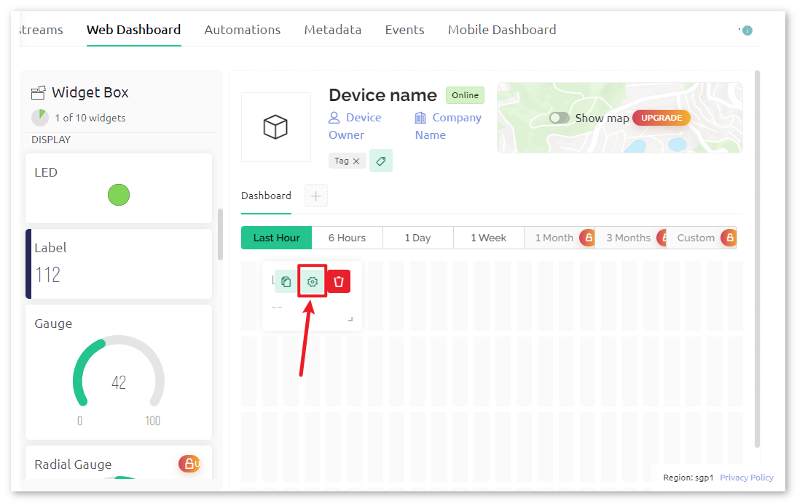

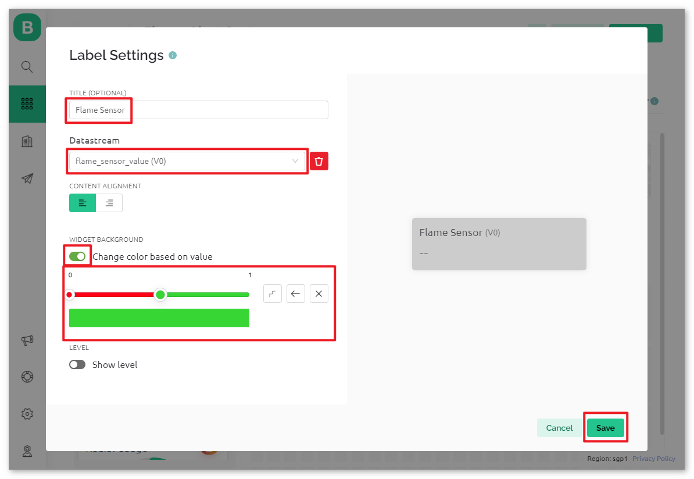

.. raw:: html
    
      

**5 Vorlage speichern**
^^^^^^^^^^^^^^^^^^^^^^^^^^^^^

Vergessen Sie abschließend nicht, die Vorlage zu speichern.

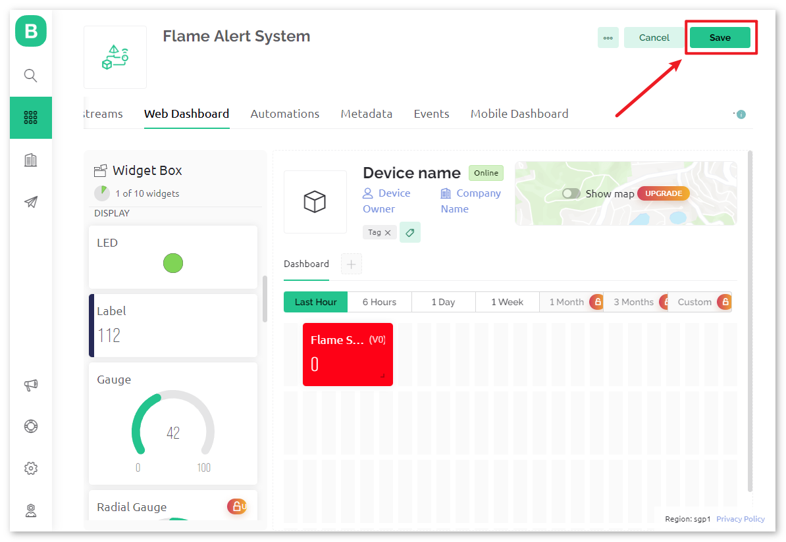

Falls Sie die Vorlage bearbeiten müssen, können Sie auf die Schaltfläche "Bearbeiten" in der oberen rechten Ecke klicken.

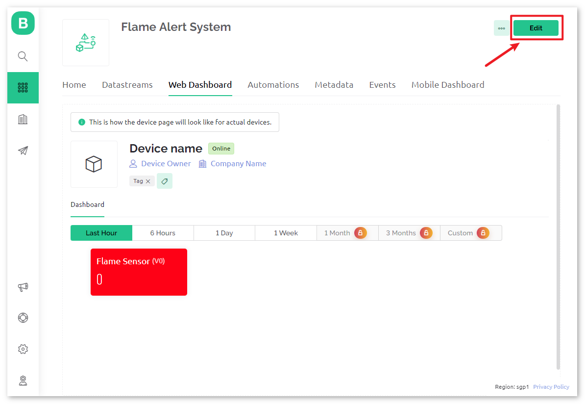

.. raw:: html
    
      

Code
----------------------- 

#. Öffnen Sie die Datei ``Lesson_50_Flame_alert_system.ino`` im Pfad ``universal-maker-sensor-kit\arduino_uno\Lesson_50_Flame_alert_system`` oder kopieren Sie diesen Code in die **Arduino IDE**.

   .. raw:: html
       
       <iframe src=https://create.arduino.cc/editor/sunfounder01/ef829dd7-337d-475d-908b-d118c6a93eef/preview?embed style="height:510px;width:100%;margin:10px 0" frameborder=0></iframe>

#. Erstellen Sie ein Blynk-Gerät mit der Vorlage Flame Detection Alert. Ersetzen Sie dann die Werte für ``BLYNK_TEMPLATE_ID``, ``BLYNK_TEMPLATE_NAME`` und ``BLYNK_AUTH_TOKEN`` durch Ihre eigenen. 

   .. code-block:: arduino
    
      #define BLYNK_TEMPLATE_ID "TMPxxxxxxx"
      #define BLYNK_TEMPLATE_NAME "Flame Alert System"
      #define BLYNK_AUTH_TOKEN "xxxxxxxxxxxxx"
   
   .. image:: img/01-create_device_1_shadow.png
    :width: 80%
    :align: center

   .. image:: img/01-create_device_2_shadow.png
    :width: 80%
    :align: center

   .. image:: img/01-create_device_3_shadow.png
    :width: 80%
    :align: center

   .. image:: img/01-create_device_4_shadow.png
    :width: 80%
    :align: center

#. Geben Sie außerdem das ``ssid`` und das ``password`` des WLANs ein, das Sie verwenden. 

   .. code-block:: arduino

    char ssid[] = "your_ssid";
    char pass[] = "your_password";

#. Nachdem Sie das richtige Board und den richtigen Port ausgewählt haben, klicken Sie auf die **Upload**-Schaltfläche.

#. Öffnen Sie den Seriellen Monitor (stellen Sie die Baudrate auf 115200 ein) und warten Sie darauf, dass eine Meldung wie eine erfolgreiche Verbindung erscheint.

   .. image:: img/01-ready_1_shadow.png
    :width: 80%
    :align: center

   .. note::

       Wenn beim Verbinden die Meldung ``ESP antwortet nicht`` erscheint, befolgen Sie diese Schritte:

       * Make sure the 9V battery is plugged in.
       * Reset the ESP8266 module by connecting the pin RST to GND for 1 second, then unplug it.
       * Press the reset button on the R4 board.

       Manchmal müssen Sie die oben genannte Operation 3-5 Mal wiederholen. Bitte haben Sie Geduld.

#. Nun zeigt Blynk die vom Flammensensor gelesenen Daten an. Im Label-Widget sehen Sie den Wert, der vom Flammensensor gelesen wurde. Wenn der angezeigte Wert 1 ist, wird der Hintergrund des Labels grün angezeigt. Wenn der Wert 0 beträgt, wird der Hintergrund des Labels rot angezeigt und Blynk sendet Ihnen eine Benachrichtigungs-E-Mail.
   
   .. image:: img/01-ready_2_shadow.png
    :width: 80%
    :align: center

#. Wenn Sie Blynk auf mobilen Geräten verwenden möchten, lesen Sie bitte :ref:`blynk_mobile`.

Codeanalyse
---------------------------

1. **Initialisierung der Bibliotheken**

   Bevor wir beginnen, ist es entscheidend, die erforderlichen Bibliotheken und Einstellungen für die Kommunikation zwischen dem Arduino, dem ESP8266-WiFi-Modul und der Blynk-App einzurichten. Dieser Code richtet die erforderlichen Bibliotheken ein und konfiguriert eine Software-Serial-Verbindung zwischen dem Arduino und dem ESP8266-Modul mit der geeigneten Baudrate für die Datenübertragung.
   
   .. code-block:: arduino
   
       //Set debug prints on Serial Monitor
       #define BLYNK_PRINT Serial
   
       #include <ESP8266_Lib.h>               // Library for ESP8266
       #include <BlynkSimpleShieldEsp8266.h>  // Library for Blynk
   
       // Software Serial on Uno
       #include <SoftwareSerial.h>
       SoftwareSerial EspSerial(2, 3);  // RX, TX
       #define ESP8266_BAUD 115200      // Set the ESP8266 baud rate
       ESP8266 wifi(&EspSerial);

2. **Blynk- und WiFi-Konfiguration**

   Damit das Projekt mit der Blynk-App kommunizieren kann, muss es sich mit einem WLAN-Netzwerk verbinden. Die Anmeldeinformationen müssen hier angegeben werden.
   
   .. code-block:: arduino

      // Template ID, Device Name and Auth Token are provided by the Blynk Cloud
      // See the Device Info tab, or Template settings
      #define BLYNK_TEMPLATE_ID "TMPxxxxxx"
      #define BLYNK_TEMPLATE_NAME "Flame Alert System"
      #define BLYNK_AUTH_TOKEN "xxxxxxxxxxxxxxx" 
      
      // Your WiFi credentials.
      // Set password to "" for open networks.
      char ssid[] = "your_ssid";
      char pass[] = "your_password";

3. **Sensor-Pin & Timer-Deklaration**

   Definieren Sie die Pin-Nummer für die Flamme.
   Die Blynk-Bibliothek bietet einen integrierten Timer, und wir erstellen ein Timer-Objekt. Mehr dazu unter |link_blynk_timer_intro| . 

   .. code-block:: arduino

       const int sensorPin = 8;
       BlynkTimer timer;

4. **setup() Funktion**

   Initiale Konfigurationen wie das Einstellen des Pin-Modus für sensorPin, die Initiierung der seriellen Kommunikation, das Einstellen des BlynkTimers und die Verbindung zur Blynk-App werden in dieser Funktion durchgeführt.

   - Wir verwenden ``timer.setInterval(1000L, myTimerEvent)`` , um das Zeitintervall in setup() einzustellen, hier setzen wir die Ausführung der Funktion ``myTimerEvent()`` alle **1000 ms**. Sie können den ersten Parameter von ``timer.setInterval(1000L, myTimerEvent)`` ändern, um das Intervall zwischen den Ausführungen von ``myTimerEvent`` zu ändern.

   .. raw:: html
    
      

   .. code-block:: arduino

       void setup() {
         pinMode(sensorPin, INPUT);
         Serial.begin(115200);
         EspSerial.begin(ESP8266_BAUD);
         delay(1000);
         timer.setInterval(1000L, myTimerEvent);
         Blynk.config(wifi,BLYNK_AUTH_TOKEN);
         Blynk.connectWiFi(ssid, pass);
       }

5. **loop() Funktion**

   Die Hauptfunktion läuft kontinuierlich und führt die Blynk- und Timerdienste aus.

   .. code-block:: arduino

       void loop() {
         Blynk.run();
         timer.run();
       }

6. **myTimerEvent() & sendData() Funktion**

   

   .. code-block:: arduino
 
       void myTimerEvent() {
         // Please don't send more that 10 values per second.
         sendData();  // Call function to send sensor data to Blynk app
       }

   Die Funktion ``sendData()`` liest den Wert vom Flammensensor und sendet ihn an Blynk. Wenn sie eine Flamme erkennt (Wert 0), sendet sie das Ereignis  ``flame_detection_alert`` an die Blynk-App.

   - Verwenden Sie ``Blynk.virtualWrite(vPin, value)``, um Daten an den virtuellen Pin V0 auf Blynk zu senden. Mehr dazu unter |link_blynk_virtualWrite|.

   - Verwenden Sie ``Blynk.logEvent("event_code")``, um ein Ereignis in Blynk zu protokollieren. Mehr dazu unter |link_blynk_logEvent|.

   .. raw:: html
    
      

   .. code-block:: arduino
       
      void sendData() {
        int data = digitalRead(sensorPin);
        Blynk.virtualWrite(V0, data);  // send data to virtual pin V0 on Blynk
        Serial.print("flame:");
        Serial.println(data);  // Print flame status on Serial Monitor
        if (data == 0) {
          Blynk.logEvent("flame_alert");  // log flame alert event if sensor detects flame
        }
      }

**Referenz**

- |link_blynk_doc|
- |link_blynk_quickstart| 
- |link_blynk_virtualWrite|
- |link_blynk_logEvent|
- |link_blynk_timer_intro|