.. note:: 
    Bonjour et bienvenue dans la communauté des passionnés de SunFounder Raspberry Pi, Arduino et ESP32 sur Facebook ! Plongez plus profondément dans l'univers des Raspberry Pi, Arduino et ESP32 avec d'autres enthousiastes.

    **Pourquoi rejoindre ?**

    - **Support d'experts** : Résolvez les problèmes après-vente et les défis techniques avec l'aide de notre communauté et de notre équipe.
    - **Apprendre et partager** : Échangez des astuces et des tutoriels pour améliorer vos compétences.
    - **Aperçus exclusifs** : Accédez en avant-première aux nouvelles annonces de produits et aux aperçus.
    - **Remises spéciales** : Profitez de remises exclusives sur nos nouveaux produits.
    - **Promotions festives et cadeaux** : Participez à des cadeaux et des promotions de fêtes.

    👉 Prêt à explorer et à créer avec nous ? Cliquez sur [|link_sf_facebook|] et rejoignez-nous aujourd'hui !

.. _uno_iot_flame:

Leçon 50 : Système d'alerte incendie avec Blynk
============================================================

Dans ce chapitre, nous vous guiderons à travers le processus de création d'une démonstration de système d'alarme incendie domestique en utilisant Blynk. En utilisant un capteur de flamme, vous pouvez détecter d'éventuels incendies chez vous. L'envoi des valeurs détectées à Blynk permet une surveillance à distance de votre domicile via Internet. En cas d'incendie, Blynk vous notifiera rapidement par e-mail.

Composants requis
--------------------------

Pour ce projet, nous avons besoin des composants suivants.

Il est certainement pratique d'acheter un kit complet, voici le lien :

.. list-table::
    :widths: 20 20 20
    :header-rows: 1

    *   - Nom
        - ARTICLES DE CE KIT
        - LIEN
    *   - Kit de capteurs universels pour créateurs
        - 94
        - |link_umsk|

Vous pouvez également les acheter séparément via les liens ci-dessous.

.. list-table::
    :widths: 30 20
    :header-rows: 1

    *   - Introduction des composants
        - Lien d'achat

    *   - Arduino UNO R3 ou R4
        - |link_Uno_R3_buy|
    *   - :ref:`cpn_breadboard`
        - |link_breadboard_buy|
    *   - :ref:`cpn_esp8266`
        - \-
    *   - :ref:`cpn_flame`
        - \-

Câblage
---------------------------

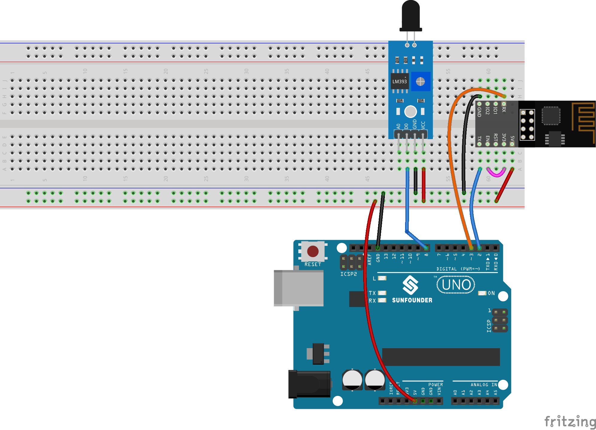

Configurer Blynk
-----------------------------

**1 Créer un modèle**
^^^^^^^^^^^^^^^^^^^^^^^^^^^^^

Tout d'abord, nous devons établir un modèle sur Blynk. Suivez les étapes ci-dessous pour créer un modèle **"Système d'alerte incendie"**.

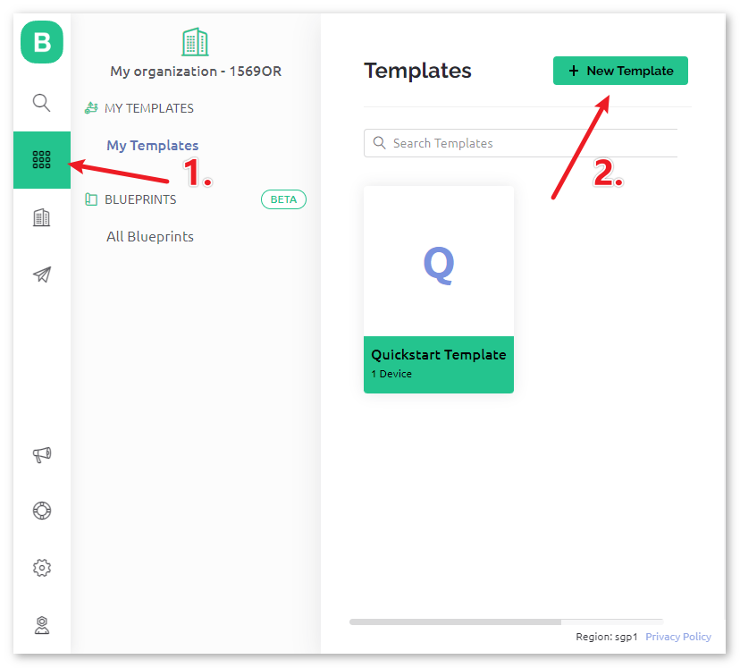

Assurez-vous que le **MATÉRIEL** est configuré comme **ESP8266** et que le **TYPE DE CONNEXION** est réglé sur **WiFi**.

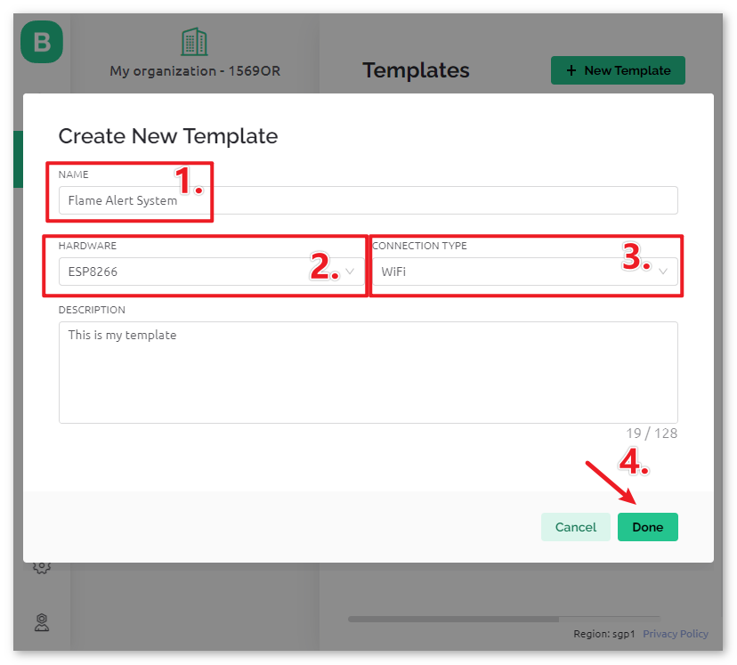

.. raw:: html
    
       

2 Flux de données
^^^^^^^^^^^^^^^^^^^^^^^^^^^^^

Créez un **flux de données** de type **Broche Virtuelle** sur la page **Flux de données** pour obtenir la valeur du module capteur de flamme.

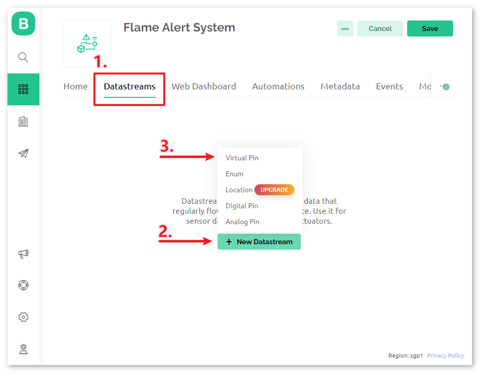

Nommez la **Broche Virtuelle** ``flame_sensor_value``. Réglez le **TYPE DE DONNÉES** sur **Entier** et les valeurs MIN et MAX sur **0** et **1**.

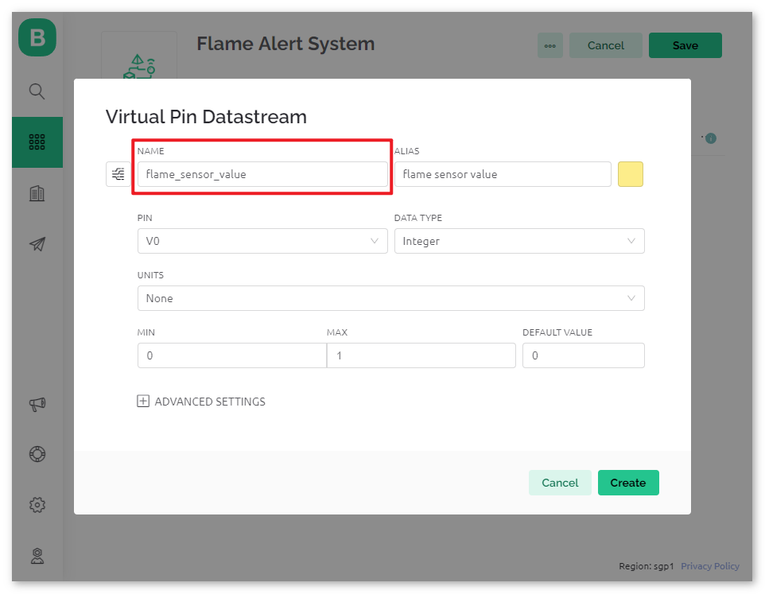

.. raw:: html
    
      

**3 Événement**
^^^^^^^^^^^^^^^^^^^^^^^^^^^^^

Ensuite, nous créerons un **événement** qui enregistre la détection des flammes et envoie une notification par email.

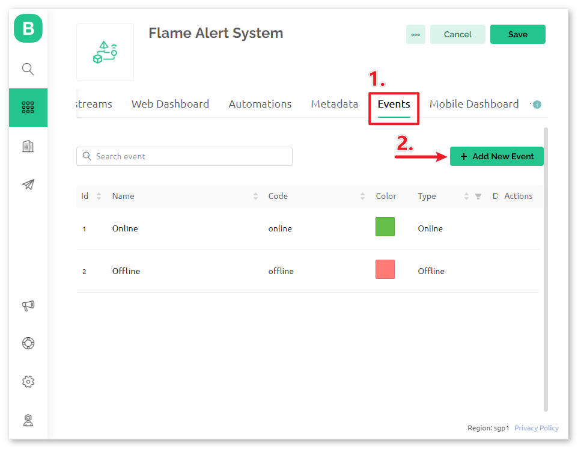

.. note::
    Il est recommandé de garder les réglages cohérents avec les miens, sinon vous pourriez devoir modifier le code pour exécuter le projet.

Définissez le **NOM DE L'ÉVÉNEMENT** sur ``flame_detection_alert``. En même temps, vous pouvez personnaliser le contenu de l'email envoyé en réglant la **DESCRIPTION** pour le déclenchement de l'événement. Vous pouvez également définir des limites de fréquence pour le déclenchement de l'événement ci-dessous.

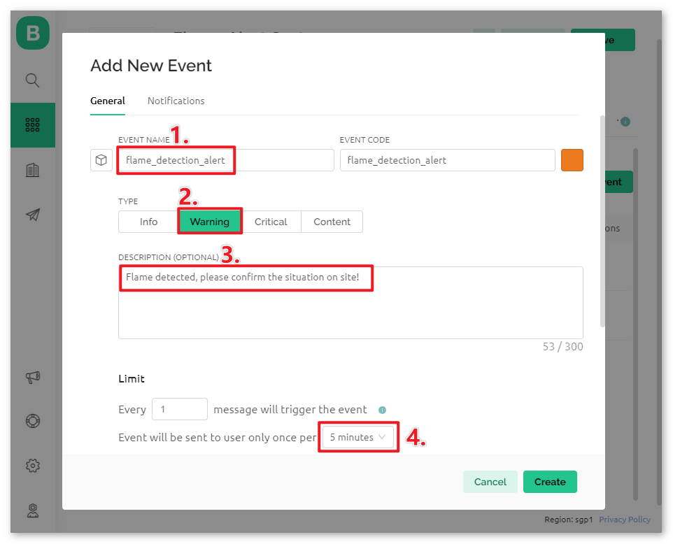

Rendez-vous sur la page **Notifications** et configurez les paramètres de l'email.

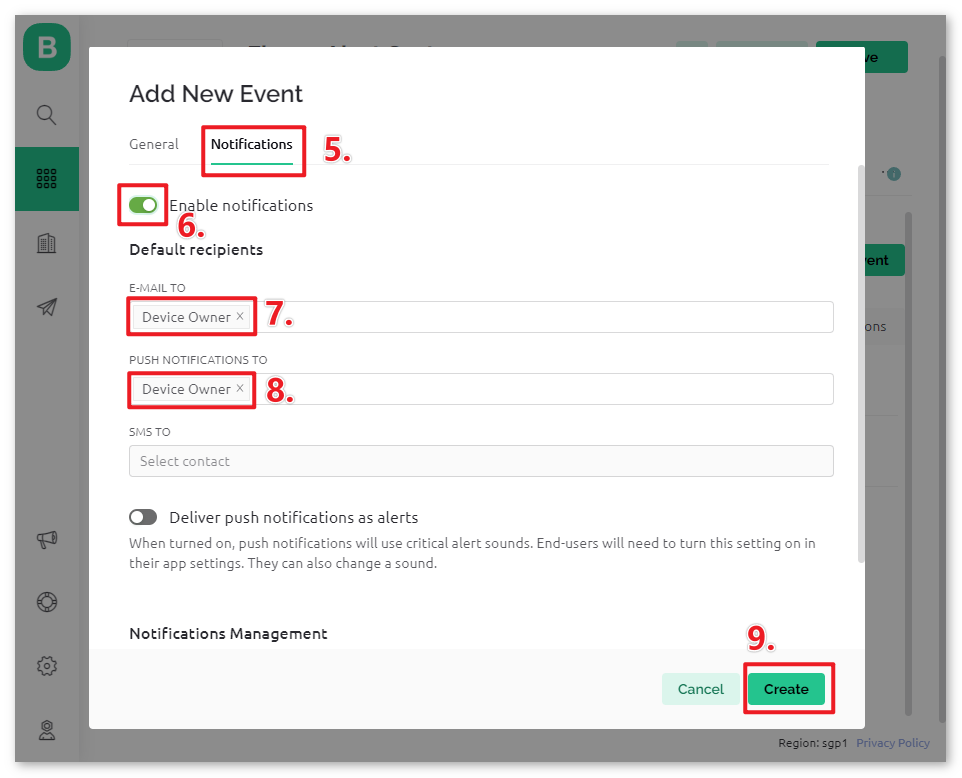

.. raw:: html
    
      

**4 Tableau de bord Web**
^^^^^^^^^^^^^^^^^^^^^^^^^^^^^

Nous devons également configurer le **Tableau de bord Web** pour afficher les données des capteurs envoyées depuis la carte Uno.

Glissez-déposez un **widget Étiquette** sur la page du **Tableau de bord Web**.

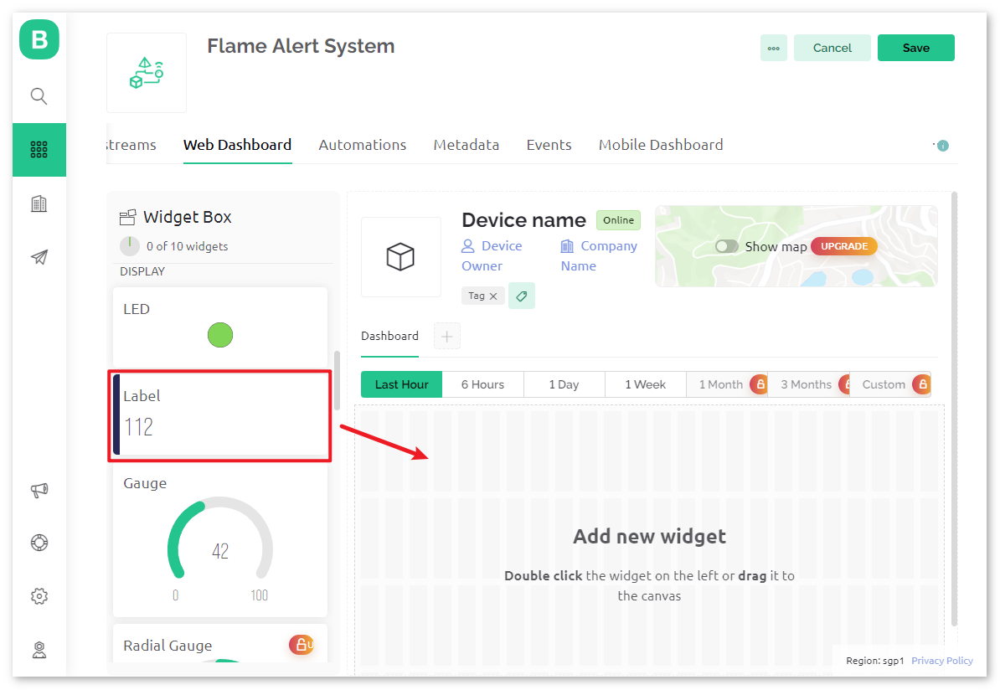

Dans la page de paramètres du **widget Étiquette**, sélectionnez **Flux de données** comme **flame_sensor_value(V0)**. Ensuite, réglez la couleur de **L'ARRIÈRE-PLAN DU WIDGET** pour qu'elle change avec la valeur des données. Lorsque la valeur affichée est 1, elle sera affichée en vert. Lorsque la valeur est 0, elle sera affichée en rouge.

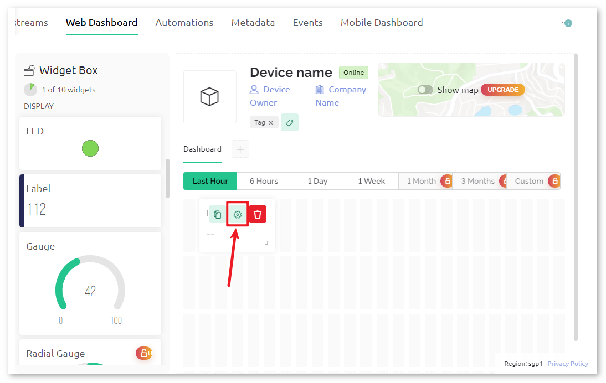

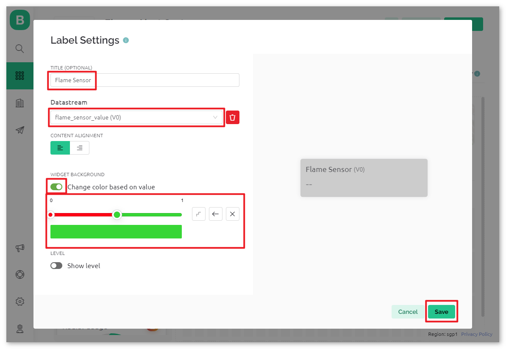

.. raw:: html
    
      

**5 Sauvegarder le modèle**
^^^^^^^^^^^^^^^^^^^^^^^^^^^^^

Enfin, n'oubliez pas de sauvegarder le modèle.

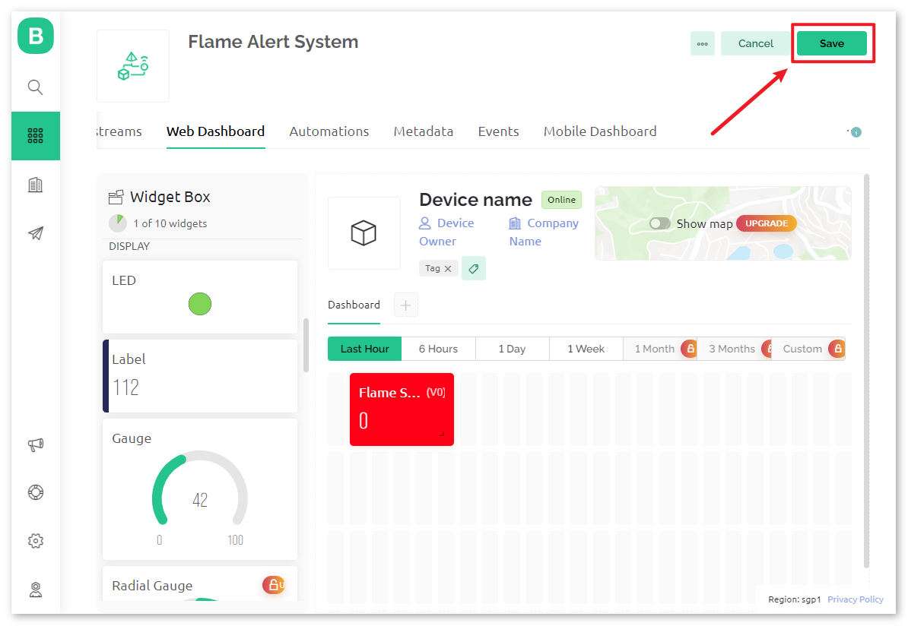

Si vous devez modifier le modèle, vous pouvez cliquer sur le bouton de modification dans le coin supérieur droit.

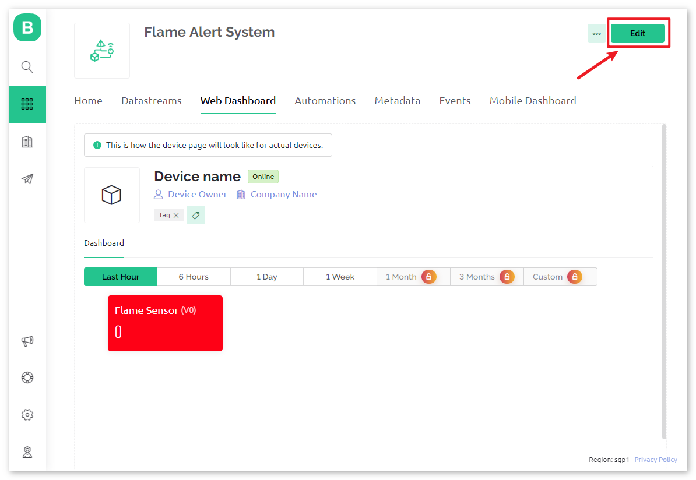

.. raw:: html
    
      

Code
-----------------------

#. Ouvrez le fichier ``Lesson_50_Flame_alert_system.ino`` situé dans le chemin ``universal-maker-sensor-kit\arduino_uno\Lesson_50_Flame_alert_system``, ou copiez ce code dans **Arduino IDE**.

   .. raw:: html
       
       <iframe src=https://create.arduino.cc/editor/sunfounder01/ef829dd7-337d-475d-908b-d118c6a93eef/preview?embed style="height:510px;width:100%;margin:10px 0" frameborder=0></iframe>

#. Créez un appareil Blynk en utilisant le modèle d'alerte de détection de flamme. Remplacez ensuite les valeurs ``BLYNK_TEMPLATE_ID``, ``BLYNK_TEMPLATE_NAME``, et ``BLYNK_AUTH_TOKEN`` par les vôtres.

   .. code-block:: arduino
    
      #define BLYNK_TEMPLATE_ID "TMPxxxxxxx"
      #define BLYNK_TEMPLATE_NAME "Flame Alert System"
      #define BLYNK_AUTH_TOKEN "xxxxxxxxxxxxx"
   
   .. image:: img/01-create_device_1_shadow.png
    :width: 80%
    :align: center

   .. image:: img/01-create_device_2_shadow.png
    :width: 80%
    :align: center

   .. image:: img/01-create_device_3_shadow.png
    :width: 80%
    :align: center

   .. image:: img/01-create_device_4_shadow.png
    :width: 80%
    :align: center

#. Vous devez également entrer le ``ssid`` et le ``mot de passe`` du WiFi que vous utilisez.

   .. code-block:: arduino

    char ssid[] = "your_ssid";
    char pass[] = "your_password";

#. Après avoir sélectionné la carte et le port appropriés, cliquez sur le bouton **Upload**.

#. Ouvrez le moniteur série (réglez le baudrate à 115200) et attendez un message tel qu'une connexion réussie.

   .. image:: img/01-ready_1_shadow.png
    :width: 80%
    :align: center

   .. note::

       Si le message ``ESP ne répond pas`` apparaît lors de la connexion, veuillez suivre ces étapes.

       * Assurez-vous que la batterie 9V est branchée.
       * Réinitialisez le module ESP8266 en connectant la broche RST à GND pendant 1 seconde, puis débranchez-la.
       * Appuyez sur le bouton de réinitialisation de la carte R4.

       Parfois, vous devrez peut-être répéter l'opération ci-dessus 3 à 5 fois, soyez patient.

#. Maintenant, Blynk affichera les données lues par le capteur de flamme. Dans le widget d'étiquette, vous pouvez voir la valeur lue par le capteur de flamme. Lorsque la valeur affichée est 1, l'arrière-plan de l'étiquette sera vert. Lorsque la valeur est 0, l'arrière-plan de l'étiquette sera rouge et Blynk vous enverra un email d'alerte.

   .. image:: img/01-ready_2_shadow.png
    :width: 80%
    :align: center

#. Si vous souhaitez utiliser Blynk sur des appareils mobiles, veuillez vous référer à :ref:`blynk_mobile`.

Analyse du code
---------------------------

1. **Initialisation des bibliothèques**

   Avant de commencer, il est crucial de configurer les bibliothèques nécessaires et les paramètres pour la communication entre l'Arduino, le module WiFi ESP8266 et l'application Blynk. Ce code configure les bibliothèques requises et établit une connexion série logicielle entre l'Arduino et le module ESP8266, avec le débit baud approprié pour la transmission des données.

   .. code-block:: arduino
   
       #define BLYNK_PRINT Serial  // Définit l'affichage de débogage sur le moniteur série
       #include <ESP8266_Lib.h>    // Bibliothèque pour ESP8266
       #include <BlynkSimpleShieldEsp8266.h>  // Bibliothèque pour Blynk
       #include <SoftwareSerial.h> // Bibliothèque pour la communication série logicielle
       SoftwareSerial EspSerial(2, 3);  // RX, TX
       #define ESP8266_BAUD 115200  // Définit le débit baud pour ESP8266
       ESP8266 wifi(&EspSerial);  // Crée une instance ESP8266

2. **Configuration de Blynk et du WiFi**

   Pour que le projet communique avec l'application Blynk, il doit se connecter à un réseau Wi-Fi. Les informations d'identification doivent être spécifiées ici.

   .. code-block:: arduino

      // Template ID, Device Name and Auth Token are provided by the Blynk Cloud
      // See the Device Info tab, or Template settings
      #define BLYNK_TEMPLATE_ID "TMPxxxxxx"
      #define BLYNK_TEMPLATE_NAME "Flame Alert System"
      #define BLYNK_AUTH_TOKEN "xxxxxxxxxxxxxxx" 

      // Your WiFi credentials.
      // Set password to "" for open networks.
      char ssid[] = "your_ssid";
      char pass[] = "your_password";

3. **Déclaration de la broche du capteur et de la minuterie**

   Définissez le numéro de broche pour le capteur de flamme et créez un objet de minuterie Blynk.

   .. code-block:: arduino

       const int sensorPin = 8;  // Broche du capteur de flamme
       BlynkTimer timer;  // Crée une minuterie Blynk

4. **Fonction setup()**

   Cette fonction effectue les configurations initiales telles que la configuration du mode des broches pour le sensorPin, l'initiation de la communication série, la configuration du BlynkTimer, et la connexion à l'application Blynk.

   - Nous utilisons ``timer.setInterval(1000L, myTimerEvent)`` pour régler l'intervalle du minuteur dans setup(), ici nous le réglons pour exécuter la fonction ``myTimerEvent()`` toutes les **1000ms**. Vous pouvez modifier le premier paramètre de ``timer.setInterval(1000L, myTimerEvent)`` pour changer l'intervalle entre les exécutions de ``myTimerEvent``.

   .. code-block:: arduino

       void setup() {
         pinMode(sensorPin, INPUT);  // Définit le capteur comme entrée
         Serial.begin(115200);  // Commence la communication série à 115200 baud
         EspSerial.begin(ESP8266_BAUD);  // Commence la communication série avec ESP8266
         delay(1000);  // Délai pour permettre à l'ESP8266 de démarrer
         timer.setInterval(1000L, myTimerEvent);  // Définit l'intervalle de minuterie
         Blynk.config(wifi, BLYNK_AUTH_TOKEN);  // Configure Blynk
         Blynk.connectWiFi(ssid, pass);  // Connecte au WiFi
       }

5. **Fonction loop()**

   La boucle principale exécute continuellement les services Blynk et Timer.

   .. code-block:: arduino

       void loop() {
         Blynk.run();  // Exécute le service Blynk
         timer.run();  // Exécute le service de minuterie
       }

6. **Fonctions myTimerEvent() et sendData()**

   .. code-block:: arduino

       void myTimerEvent() {
         // Veuillez ne pas envoyer plus de 10 valeurs par seconde.
         sendData();  // Appelle la fonction pour envoyer les données du capteur à l'application Blynk
       }

   La fonction ``sendData()`` lit la valeur du capteur de flamme et l'envoie à Blynk. Si une flamme est détectée (valeur 0), elle envoie l'événement ``flame_detection_alert`` à l'application Blynk.

   - Utilisez ``Blynk.virtualWrite(vPin, value)`` pour envoyer des données au pin virtuel V0 sur Blynk. Pour en savoir plus, voir |link_blynk_virtualWrite|.

   - Utilisez ``Blynk.logEvent("event_code")`` pour enregistrer un événement sur Blynk. Pour en savoir plus, voir |link_blynk_logEvent|.

   .. raw:: html

      

   .. code-block:: arduino

      void sendData() {
        int data = digitalRead(sensorPin);
        Blynk.virtualWrite(V0, data);  // envoie les données au pin virtuel V0 sur Blynk
        Serial.print("flame:");
        Serial.println(data);  // Imprime le statut de la flamme sur le moniteur série
        if (data == 0) {
          Blynk.logEvent("flame_alert");  // enregistre l'événement d'alerte de flamme si le capteur détecte une flamme
        }
      }

**Références**

- |link_blynk_doc|
- |link_blynk_quickstart| 
- |link_blynk_virtualWrite|
- |link_blynk_logEvent|
- |link_blynk_timer_intro|