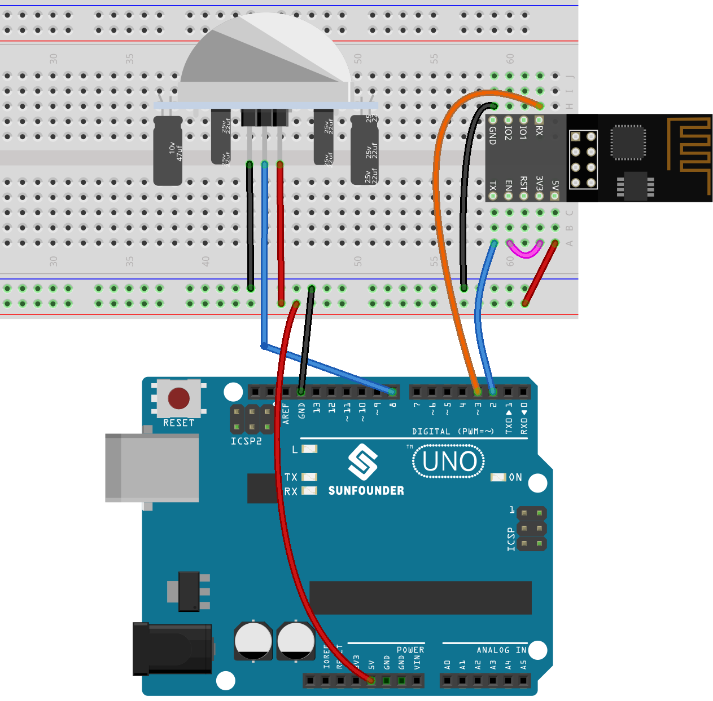
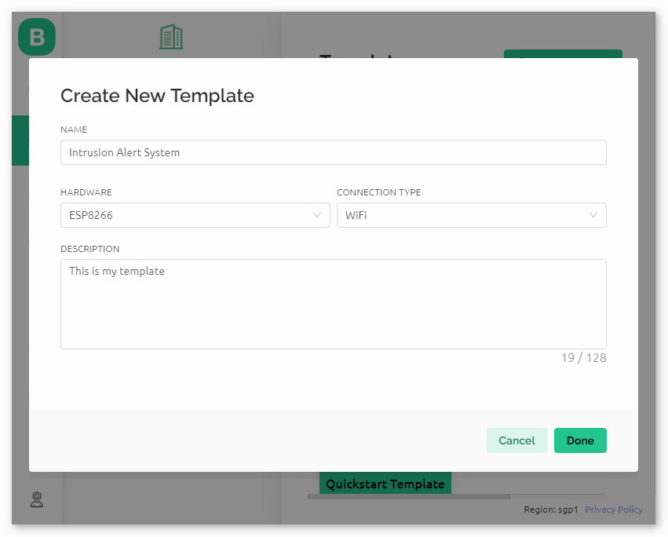
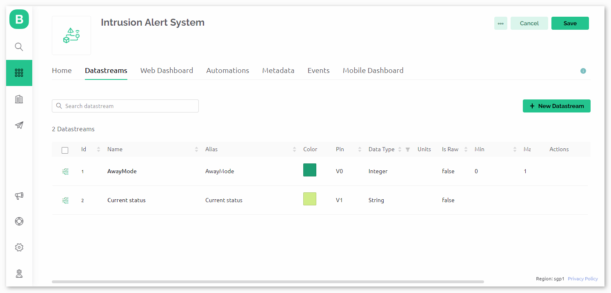
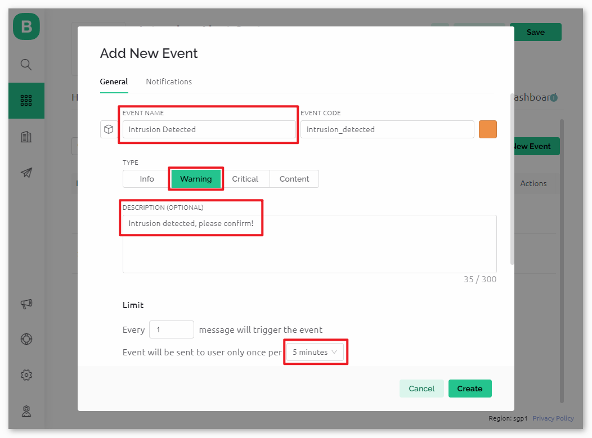
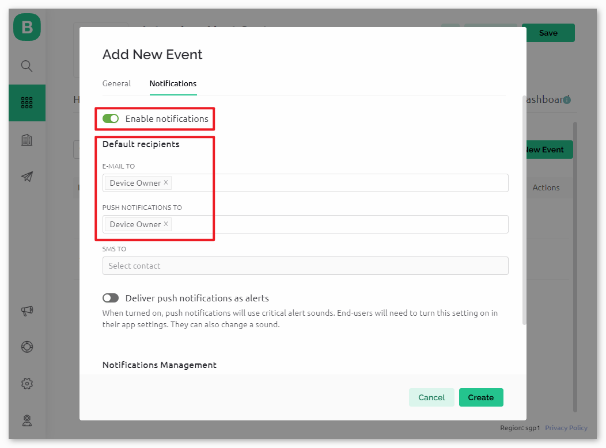
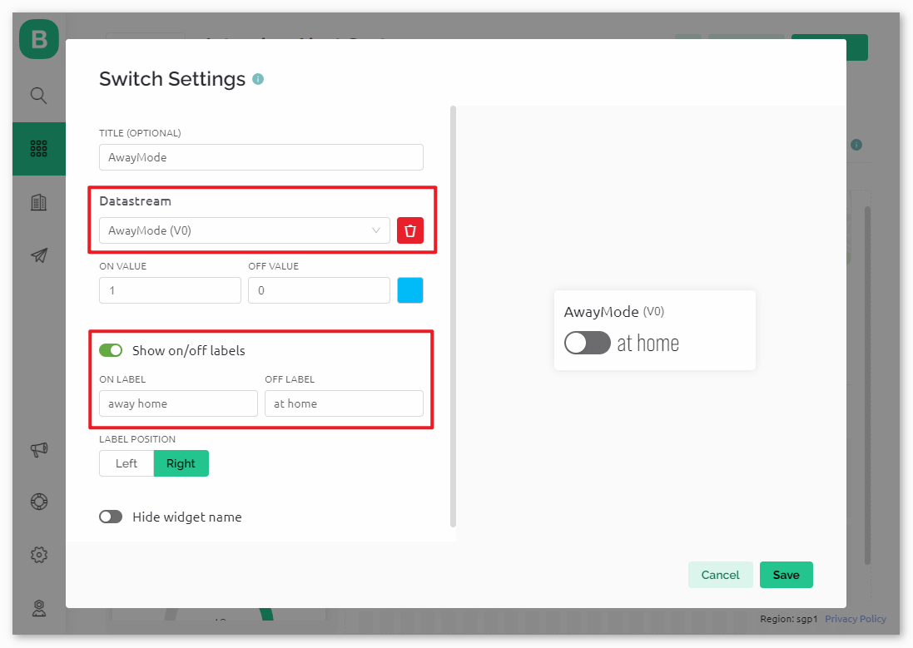
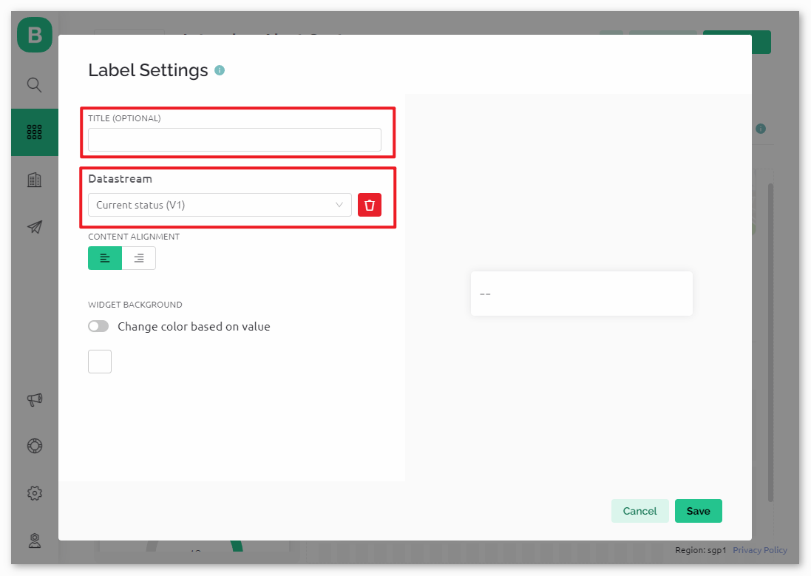
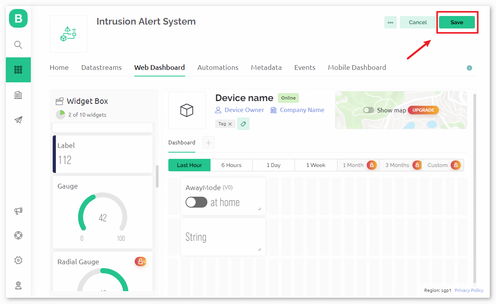

.. https://github.com/sunfounder/ultimate-sensor-kit/blob/docs/docs/source/iot_project/02-iot_Intrusion_alert_system.rst

.. note::

    Hello, welcome to the SunFounder Raspberry Pi & Arduino & ESP32 Enthusiasts Community on Facebook! Dive deeper into Raspberry Pi, Arduino, and ESP32 with fellow enthusiasts.

    **Why Join?**

    - **Expert Support**: Solve post-sale issues and technical challenges with help from our community and team.
    - **Learn & Share**: Exchange tips and tutorials to enhance your skills.
    - **Exclusive Previews**: Get early access to new product announcements and sneak peeks.
    - **Special Discounts**: Enjoy exclusive discounts on our newest products.
    - **Festive Promotions and Giveaways**: Take part in giveaways and holiday promotions.

    👉 Ready to explore and create with us? Click [|link_sf_facebook|] and join today!

.. _uno_iot_intrusion_alert_system:

Lesson 51: Intrusion Alert System with Blynk
===================================================================

This project demonstrate a simple home intrusion detection system using a passive infrared (PIR) sensor (HC-SR501).
When the system is set to 'Away' mode through the Blynk app, the PIR sensor monitors for motion.
Any detected movement triggers a notification on the Blynk app, alerting the user of potential intrusion.

Required Components
--------------------------

In this project, we need the following components. 

It's definitely convenient to buy a whole kit, here's the link: 

.. list-table::
    :widths: 20 20 20
    :header-rows: 1

    *   - Name	
        - ITEMS IN THIS KIT
        - LINK
    *   - Universal Maker Sensor Kit
        - 94
        - |link_umsk|

You can also buy them separately from the links below.

.. list-table::
    :widths: 30 20
    :header-rows: 1

    *   - Component Introduction
        - Purchase Link

    *   - Arduino UNO R3 or R4
        - |link_Uno_R3_buy|
    *   - :ref:`cpn_breadboard`
        - |link_breadboard_buy|
    *   - :ref:`cpn_esp8266`
        - \-
    *   - :ref:`cpn_pir_motion`
        - \-

Wiring
---------------------------

Configure Blynk
-----------------------------

.. note::
    If you are not familiar with Blynk, it is strongly recommended that you read these two tutorials first. :ref:`iot_blynk_start` is a beginner's guide for Blynk, which includes how to configure ESP8266 and register with Blynk. And :ref:`uno_iot_Flame` is a simple example, but the description of the steps will be more detailed.

**1 Create template**
^^^^^^^^^^^^^^^^^^^^^^^^^^^^^

Firstly, we need to establish a template on Blynk. Follow the steps below to create a **"Intrusion Alert System"** template. 

**2 Datastream**
^^^^^^^^^^^^^^^^^^^^^^^^^^^^^

Create **Datastreams** of type **Virtual Pin** in the **Datastream** page receive data from esp8266 and uno r4 board. 

* Create Virtual Pin V0 according to the following diagram: 
   
  Set the name of the **Virtual Pin V0** to **AwayMode**. Set the **DATA TYPE** to **Integer** and MIN and MAX to **0** and **1**.

  .. image:: img/02-datastream_1_shadow.png
      :width: 90%

* Create Virtual Pin V1 according to the following diagram: 

  Set the name of the **Virtual Pin V1** to **Current status**. Set the **DATA TYPE** to **String**.

  .. image:: img/02-datastream_2_shadow.png
      :width: 90%

Make sure that you have set up two Virtual Pins according to the steps above.

.. raw:: html
    
      

**3 Event**
^^^^^^^^^^^^^^^^^^^^^^^^^^^^^

Next, we will create an **event** that logs the detection of intrusion and sends an email notification.

.. note::
    It is recommended to keep it consistent with my settings, otherwise you may need to modify the code to run the project. Make sure that the **EVENT CODE** is set as ``intrusion_detected``.

Go to the **Notifications** page and configure email settings.

.. raw:: html
    
      

**4 Web Dashboard**
^^^^^^^^^^^^^^^^^^^^^^^^^^^^^

We also need to configure the **Web Dashboard** to interact with the Intrusion Alert System.

Drag and drop a **Switch widget** and a **Label widget** to the **Web Dashboard** page.

.. image:: img/02-web_dashboard_1_shadow.png
    :width: 100%
    :align: center

In the settings page of the **Switch widget**, select **Datastream** as **AwayMode(V0)**. Set **ONLABEL** and **OFFLABEL** to display "away home" when the switch is turned on, and "at home" when the switch is turned off.

In the settings page of the **Label widget**, select **Datastream** as **Current status(V1)**. 

**5 Save template**
^^^^^^^^^^^^^^^^^^^^^^^^^^^^^

At last, remember to save the template.

.. raw:: html
    
       

Code
----------------------- 

#. Open the ``Lesson_51_Intrusion_alert_system.ino`` file under the path of ``universal-maker-sensor-kit\arduino_uno\Lesson_51_Intrusion_alert_system``, or copy this code into **Arduino IDE**.

   .. raw:: html
       
       <iframe src=https://create.arduino.cc/editor/sunfounder01/e94c0b5e-1fcd-46aa-bc95-0395efee1d32/preview?embed style="height:510px;width:100%;margin:10px 0" frameborder=0></iframe>

#. Create a Blynk device using the "Intrusion Alert System" template. Then, replace the ``BLYNK_TEMPLATE_ID``, ``BLYNK_TEMPLATE_NAME``, and ``BLYNK_AUTH_TOKEN`` with your own. 

   .. code-block:: arduino
    
      #define BLYNK_TEMPLATE_ID "TMPxxxxxxx"
      #define BLYNK_TEMPLATE_NAME "Intrusion Alert System"
      #define BLYNK_AUTH_TOKEN "xxxxxxxxxxxxx"

#. You also need to enter the ``ssid`` and ``password`` of the WiFi you are using. 

   .. code-block:: arduino

    char ssid[] = "your_ssid";
    char pass[] = "your_password";

#. After selecting the correct board and port, click the **Upload** button.

#. Open the Serial monitor(set baudrate to 115200) and wait for a prompt such as a successful connection to appear.

   .. image:: img/02-ready_1_shadow.png
    :width: 80%
    :align: center

   .. note::

       If the message ``ESP is not responding`` appears when you connect, please follow these steps.

       * Make sure the 9V battery is plugged in.
       * Reset the ESP8266 module by connecting the pin RST to GND for 1 second, then unplug it.
       * Press the reset button on the R4 board.

       Sometimes, you may need to repeat the above operation 3-5 times, please be patient.

Code Analysis
---------------------------

#. **Configuration & Libraries**

   Here, constants and credentials for Blynk are set up. Necessary libraries for the ESP8266 WiFi module and Blynk are included.

   .. code-block:: arduino

      #define BLYNK_TEMPLATE_ID "TMPxxxx"
      #define BLYNK_TEMPLATE_NAME "Intrusion Alert System"
      #define BLYNK_AUTH_TOKEN "xxxxxx-"
      #define BLYNK_PRINT Serial

      #include <ESP8266_Lib.h>
      #include <BlynkSimpleShieldEsp8266.h>

#. **WiFi Setup**

   Configure WiFi credentials and set up software serial communication with the ESP01 module.

   .. code-block:: arduino

      char ssid[] = "your_ssid";
      char pass[] = "your_password";

      SoftwareSerial EspSerial(2, 3);
      #define ESP8266_BAUD 115200
      ESP8266 wifi(&EspSerial);

#. **PIR Sensor Configuration**

   Define the pin where the PIR sensor is connected and initialize state variables.

   .. code-block:: arduino

      const int sensorPin = 8;
      int state = 0;
      int awayHomeMode = 0;
      BlynkTimer timer;

#. **setup() Function**

   This initializes the PIR sensor as an input, sets up serial communication, connects to WiFi, and configures Blynk.

   - We use ``timer.setInterval(1000L, myTimerEvent)`` to set the timer interval in setup(), here we set to execute the ``myTimerEvent()`` function every **1000ms**. You can modify the first parameter of ``timer.setInterval(1000L, myTimerEvent)`` to change the interval between ``myTimerEvent`` executions.

   .. raw:: html
    
      

   .. code-block:: arduino

      void setup() {
         pinMode(sensorPin, INPUT);
         Serial.begin(115200);
         EspSerial.begin(ESP8266_BAUD);
         delay(10);
         Blynk.config(wifi, BLYNK_AUTH_TOKEN);
         Blynk.connectWiFi(ssid, pass);
         timer.setInterval(1000L, myTimerEvent);
      }

#. **loop() Function**

   The loop function repeatedly runs Blynk and the Blynk timer functions.

   .. code-block:: arduino

      void loop() {
         Blynk.run();
         timer.run();
      }

#. **Blynk App Interaction**

   These functions are called when the device connects to Blynk and when there's a change in the state of the virtual pin V0 on the Blynk app.

   - Every time the device connects to the Blynk server, or reconnects due to poor network conditions, the ``BLYNK_CONNECTED()`` function is called. The ``Blynk.syncVirtual()`` command request a single Virtual Pin value. The specified Virtual Pin will perform ``BLYNK_WRITE()`` call. Please refer to |link_blynk_syncing| for more details.

   - Whenever the value of a virtual pin on the BLYNK server changes, it will trigger ``BLYNK_WRITE()``. More details at |link_blynk_write|.

   .. raw:: html
    
      

   .. code-block:: arduino
      
      // This function is called every time the device is connected to the Blynk.Cloud
      BLYNK_CONNECTED() {
         Blynk.syncVirtual(V0);
      }
      
      // This function is called every time the Virtual Pin 0 state changes
      BLYNK_WRITE(V0) {
         awayHomeMode = param.asInt();
         // additional logic
      }

#. **Data Handling**

   Every second, the ``myTimerEvent()`` function calls ``sendData()``. If the away mode is enabled on Blynk, it checks the PIR sensor and sends a notification to Blynk if motion is detected.

   - We use ``Blynk.virtualWrite(V1, "Somebody in your house! Please check!");`` to change the text of a label.

   - Use ``Blynk.logEvent("intrusion_detected");`` to log event to Blynk.

   .. raw:: html
    
      

   .. code-block:: arduino

      void myTimerEvent() {
         sendData();
      }

      void sendData() {
         if (awayHomeMode == 1) {
            state = digitalRead(sensorPin);  // Read the state of the PIR sensor

            Serial.print("state:");
            Serial.println(state);
        
            // If the sensor detects movement, send an alert to the Blynk app
            if (state == HIGH) {
              Serial.println("Somebody here!");
              Blynk.virtualWrite(V1, "Somebody in your house! Please check!");
              Blynk.logEvent("intrusion_detected");
            }
         }
      }

**Reference**

- |link_blynk_doc|
- |link_blynk_quickstart| 
- |link_blynk_virtualWrite|
- |link_blynk_logEvent|
- |link_blynk_timer_intro|
- |link_blynk_syncing| 
- |link_blynk_write|