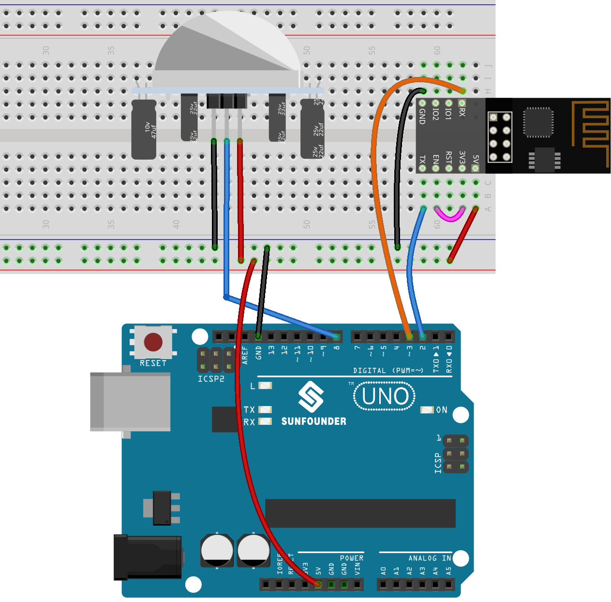
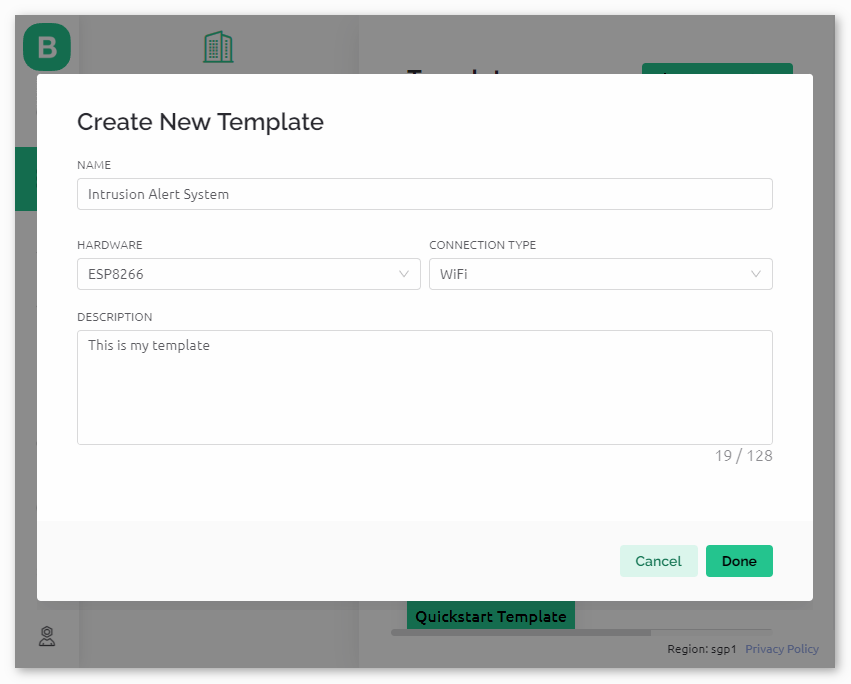
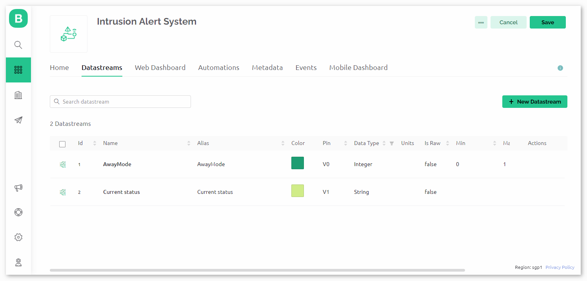
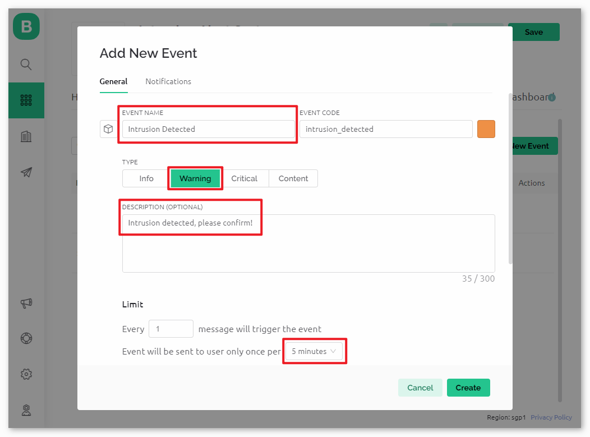
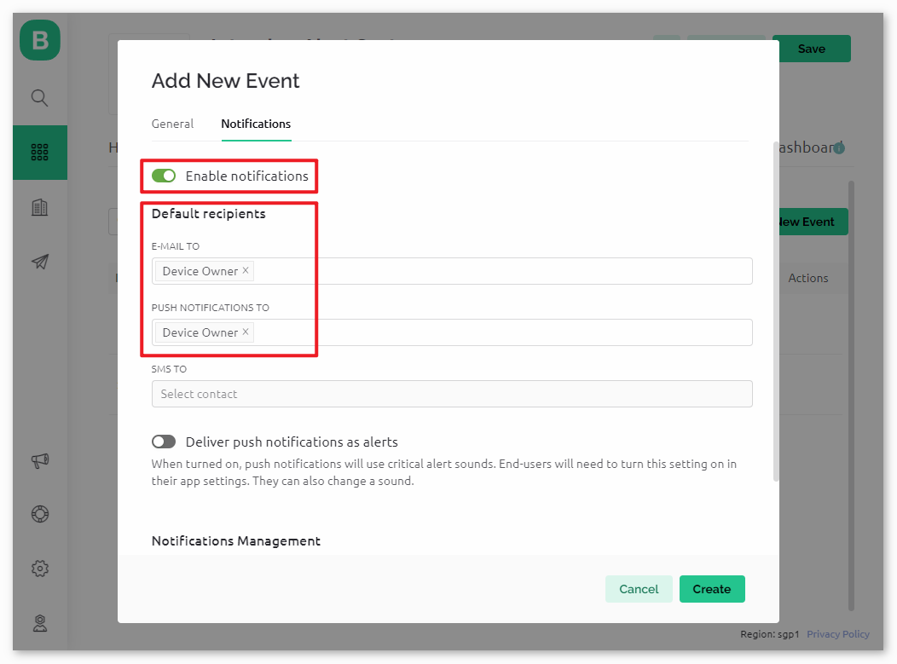
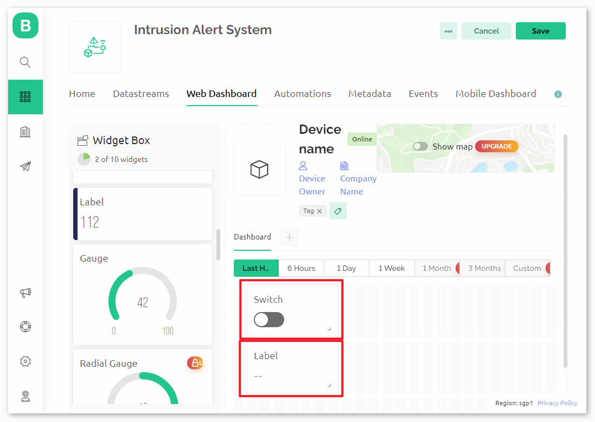
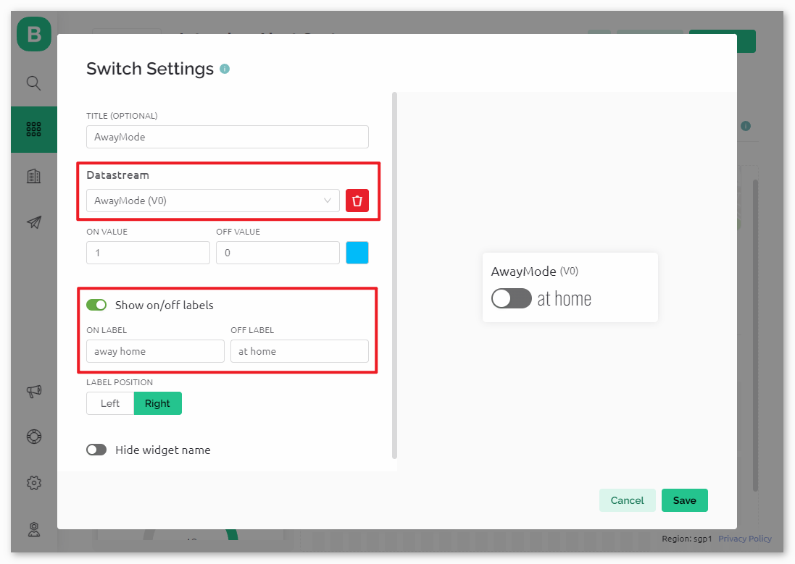
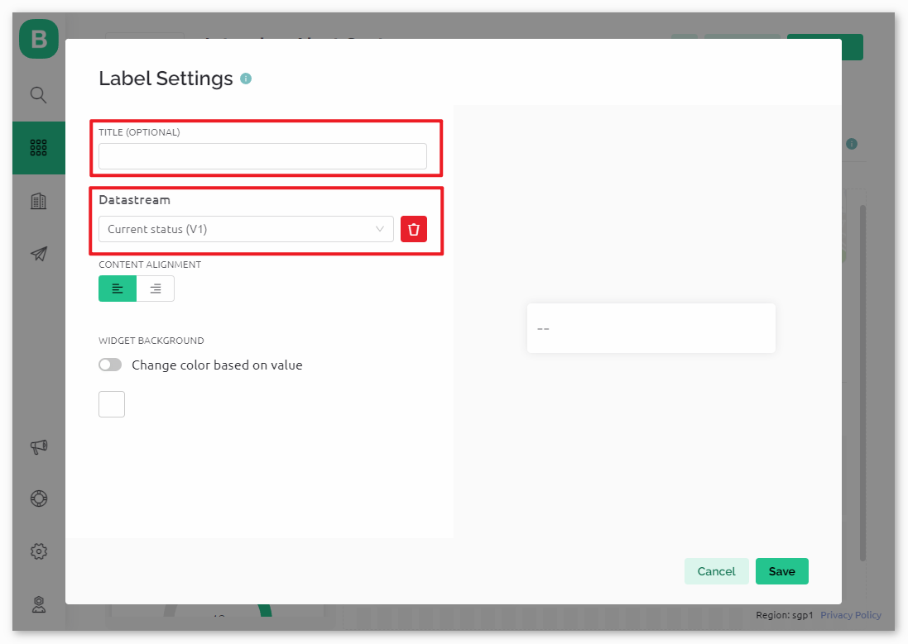
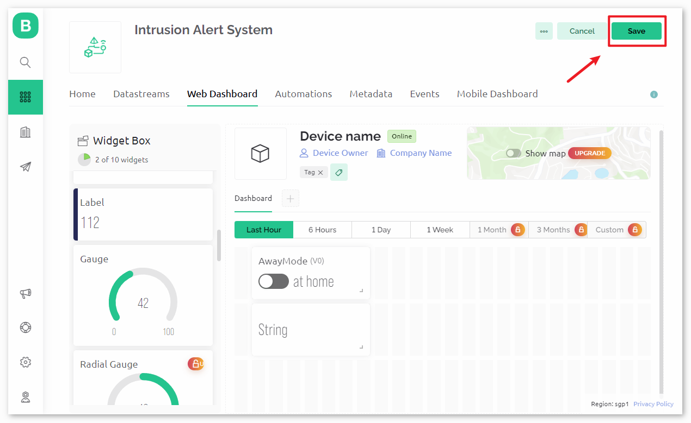

.. note::

    こんにちは、SunFounder Raspberry Pi & Arduino & ESP32 Enthusiasts Communityへようこそ！Facebook上で、仲間と一緒にRaspberry Pi、Arduino、ESP32をさらに深く探求しましょう。

    **なぜ参加するのか？**

    - **専門的なサポート**：購入後の問題や技術的な課題をコミュニティやチームの助けを借りて解決。
    - **学びと共有**：スキルを向上させるためのヒントやチュートリアルを交換。
    - **限定プレビュー**：新製品発表や予告編に早期アクセス。
    - **特別割引**：最新製品の特別割引を楽しむ。
    - **フェスティブプロモーションとプレゼント**：プレゼントやホリデープロモーションに参加。

    👉 私たちと一緒に探索と創造を始める準備はできましたか？[|link_sf_facebook|]をクリックして、今すぐ参加しましょう！
    
.. _uno_iot_intrusion_alert_system:

レッスン51: Blynkによる侵入警報システム
===================================================================

このプロジェクトでは、パッシブ赤外線（PIR）センサー（HC-SR501）を使用した簡単なホーム侵入検知システムを示します。
Blynkアプリでシステムを「不在」モードに設定すると、PIRセンサーが動きを監視します。
動きが検出されると、Blynkアプリに通知が送信され、潜在的な侵入をユーザーに警告します。

必要な部品
--------------------------

このプロジェクトでは、以下の部品が必要です。

すべてが揃ったキットを購入すると便利です。リンクはこちらです：

.. list-table::
    :widths: 20 20 20
    :header-rows: 1

    *   - Name	
        - ITEMS IN THIS KIT
        - LINK
    *   - Universal Maker Sensor Kit
        - 94
        - |link_umsk|

以下のリンクから個別に購入することもできます。

.. list-table::
    :widths: 30 20
    :header-rows: 1

    *   - Component Introduction
        - Purchase Link

    *   - Arduino UNO R3 or R4
        - |link_Uno_R3_buy|
    *   - :ref:`cpn_breadboard`
        - |link_breadboard_buy|
    *   - :ref:`cpn_esp8266`
        - \-
    *   - :ref:`cpn_pir_motion`
        - \-

配線
---------------------------

Blynkの設定
-----------------------------

.. note::
    Blynkに不慣れな方は、まずこれらの2つのチュートリアルを読むことを強くお勧めします。 :ref:`iot_blynk_start` はBlynkの初心者向けガイドで、ESP8266の設定やBlynkへの登録方法が含まれています。 :ref:`uno_iot_Flame` はシンプルな例ですが、手順の説明がより詳細です。

**1 テンプレートの作成**
^^^^^^^^^^^^^^^^^^^^^^^^^^^^^

まず、Blynkにテンプレートを作成する必要があります。以下の手順に従って **"Intrusion Alert System"** テンプレートを作成します。

**2 データストリームの作成**
^^^^^^^^^^^^^^^^^^^^^^^^^^^^^

**Datastream** ページで、esp8266およびuno r4ボードからデータを受信するための **仮想ピン** タイプの **Datastreams** を作成します。

* 次の図に従って仮想ピンV0を作成します：

  **仮想ピンV0** の名前を **AwayMode** に設定します。 **データタイプ** を **整数** に設定し、MINとMAXを **0** および **1** に設定します。

  .. image:: img/02-datastream_1_shadow.png
      :width: 90%

* 次の図に従って仮想ピンV1を作成します：

  **仮想ピンV1** の名前を **Current status**に設定します。 **データタイプ** を **文字列** に設定します。

  .. image:: img/02-datastream_2_shadow.png
      :width: 90%

上記の手順に従って2つの仮想ピンを設定したことを確認してください。

.. raw:: html
    
     

**3 イベントの作成**
^^^^^^^^^^^^^^^^^^^^^^^^^^^^^

次に、侵入検知をログに記録し、メール通知を送信する **イベント** を作成します。

.. note::
    プロジェクトを正しく実行するために、設定を一貫して保つことをお勧めします。 **イベントコード** を ``intrusion_detected`` に設定してください。

**Notifications** ページに移動し、メール設定を構成します。

.. raw:: html
    
     

**4 Web Dashboard**
^^^^^^^^^^^^^^^^^^^^^^^^^^^^^

**Web Dashboard** を構成して、侵入警報システムと連携させる必要があります。

**Web Dashboard** ページに **スイッチウィジェット** と **ラベルウィジェット** をドラッグ＆ドロップします。

**スイッチウィジェット** の設定ページで、 **Datastream** を **AwayMode(V0)** に選択します。スイッチがオンの時に「away home」、オフの時に「at home」と表示されるように **ONLABEL** と **OFFLABEL** を設定します。

**ラベルウィジェット** の設定ページで、 **Datastream** を **Current status(V1)** に選択します。

**5 テンプレートの保存**
^^^^^^^^^^^^^^^^^^^^^^^^^^^^^

最後に、テンプレートを保存することを忘れないでください。

.. raw:: html
    
     

コード
----------------------- 

#. ``universal-maker-sensor-kit\arduino_uno\Lesson_51_Intrusion_alert_system`` のパスにある ``Lesson_51_Intrusion_alert_system.ino`` ファイルを開くか、このコードを **Arduino IDE** にコピーします。

   .. raw:: html
       
       <iframe src=https://create.arduino.cc/editor/sunfounder01/e94c0b5e-1fcd-46aa-bc95-0395efee1d32/preview?embed style="height:510px;width:100%;margin:10px 0" frameborder=0></iframe>

#. "Intrusion Alert System"テンプレートを使用してBlynkデバイスを作成します。次に、 ``BLYNK_TEMPLATE_ID`` 、 ``BLYNK_TEMPLATE_NAME`` 、および ``BLYNK_AUTH_TOKEN`` を自身のものに置き換えます。

   .. code-block:: arduino
    
      #define BLYNK_TEMPLATE_ID "TMPxxxxxxx"
      #define BLYNK_TEMPLATE_NAME "Intrusion Alert System"
      #define BLYNK_AUTH_TOKEN "xxxxxxxxxxxxx"

#. 使用しているWiFiの ``ssid`` と ``password`` を入力する必要があります。

   .. code-block:: arduino

    char ssid[] = "your_ssid";
    char pass[] = "your_password";

#. 正しいボードとポートを選択した後、 **Upload** ボタンをクリックします。

#. シリアルモニターを開き（ボーレートを115200に設定）、接続成功のプロンプトが表示されるのを待ちます。

   .. image:: img/02-ready_1_shadow.png
    :width: 80%
    :align: center

   .. note::

       接続時に ``ESP is not responding`` というメッセージが表示された場合は、次の手順に従ってください。

       * 9Vバッテリーが接続されていることを確認します。
       * RSTピンをGNDに1秒間接続してESP8266モジュールをリセットし、その後ピンを外します。
       * R4ボードのリセットボタンを押します。

       上記の操作を3～5回繰り返す必要がある場合がありますので、忍耐強くお待ちください。

コード分析
---------------------------

#. **設定とライブラリ**

   ここでは、Blynkの定数と認証情報を設定します。ESP8266 WiFiモジュールとBlynkの必要なライブラリを含めます。

   .. code-block:: arduino

      #define BLYNK_TEMPLATE_ID "TMPxxxx"
      #define BLYNK_TEMPLATE_NAME "Intrusion Alert System"
      #define BLYNK_AUTH_TOKEN "xxxxxx-"
      #define BLYNK_PRINT Serial

      #include <ESP8266_Lib.h>
      #include <BlynkSimpleShieldEsp8266.h>

#. **WiFiの設定**

   WiFiの認証情報を設定し、ESP01モジュールとのソフトウェアシリアル通信を設定します。

   .. code-block:: arduino

      char ssid[] = "your_ssid";
      char pass[] = "your_password";

      SoftwareSerial EspSerial(2, 3);
      #define ESP8266_BAUD 115200
      ESP8266 wifi(&EspSerial);

#. **PIRセンサーの設定**

   PIRセンサーが接続されているピンを定義し、状態変数を初期化します。

   .. code-block:: arduino

      const int sensorPin = 8;
      int state = 0;
      int awayHomeMode = 0;
      BlynkTimer timer;

#. **setup()関数**

   PIRセンサーを入力として初期化し、シリアル通信を設定し、WiFiに接続し、Blynkを設定します。

   - ``timer.setInterval(1000L, myTimerEvent)``を使用して、setup()でタイマー間隔を設定します。ここでは、 ``myTimerEvent()`` 関数を **1000ms** ごとに実行するように設定します。 ``timer.setInterval(1000L, myTimerEvent)`` の最初のパラメータを変更して、 ``myTimerEvent`` 実行間隔を変更できます。

   .. raw:: html
    
      

   .. code-block:: arduino

      void setup() {
         pinMode(sensorPin, INPUT);
         Serial.begin(115200);
         EspSerial.begin(ESP8266_BAUD);
         delay(10);
         Blynk.config(wifi, BLYNK_AUTH_TOKEN);
         Blynk.connectWiFi(ssid, pass);
         timer.setInterval(1000L, myTimerEvent);
      }

#. **loop()関数**

   loop関数はBlynkとBlynkタイマー関数を繰り返し実行します。

   .. code-block:: arduino

      void loop() {
         Blynk.run();
         timer.run();
      }

#. **Blynkアプリとの連携**

   これらの関数は、デバイスがBlynkに接続されたとき、またはBlynkアプリの仮想ピンV0の状態が変化したときに呼び出されます。

   - デバイスがBlynkサーバーに接続されるたびに、またはネットワーク条件が悪いために再接続されるたびに、 ``BLYNK_CONNECTED()`` 関数が呼び出されます。 ``Blynk.syncVirtual()`` コマンドは単一の仮想ピン値を要求します。指定された仮想ピンは ``BLYNK_WRITE()`` 呼び出しを実行します。詳細については |link_blynk_syncing| をご参照ください。

   - BLYNKサーバーの仮想ピンの値が変更されるたびに ``BLYNK_WRITE()`` がトリガーされます。詳細は |link_blynk_write| をご参照ください。

   .. raw:: html
    
      

   .. code-block:: arduino
      
      // This function is called every time the device is connected to the Blynk.Cloud
      BLYNK_CONNECTED() {
         Blynk.syncVirtual(V0);
      }
      
      // This function is called every time the Virtual Pin 0 state changes
      BLYNK_WRITE(V0) {
         awayHomeMode = param.asInt();
         // additional logic
      }

#. **データ処理**

   毎秒、 ``myTimerEvent()`` 関数は ``sendData()`` を呼び出します。Blynkでアウェイモードが有効になっている場合、PIRセンサーをチェックし、動きが検出された場合はBlynkに通知を送信します。

   - ``Blynk.virtualWrite(V1, "Somebody in your house! Please check!");`` を使用してラベルのテキストを変更します。

   - ``Blynk.logEvent("intrusion_detected");`` を使用してBlynkにイベントをログします。

   .. raw:: html
    
      

   .. code-block:: arduino

      void myTimerEvent() {
         sendData();
      }

      void sendData() {
         if (awayHomeMode == 1) {
            state = digitalRead(sensorPin);  // Read the state of the PIR sensor

            Serial.print("state:");
            Serial.println(state);
        
            // If the sensor detects movement, send an alert to the Blynk app
            if (state == HIGH) {
              Serial.println("Somebody here!");
              Blynk.virtualWrite(V1, "Somebody in your house! Please check!");
              Blynk.logEvent("intrusion_detected");
            }
         }
      }

**参考資料**

- |link_blynk_doc|
- |link_blynk_quickstart| 
- |link_blynk_virtualWrite|
- |link_blynk_logEvent|
- |link_blynk_timer_intro|
- |link_blynk_syncing| 
- |link_blynk_write|