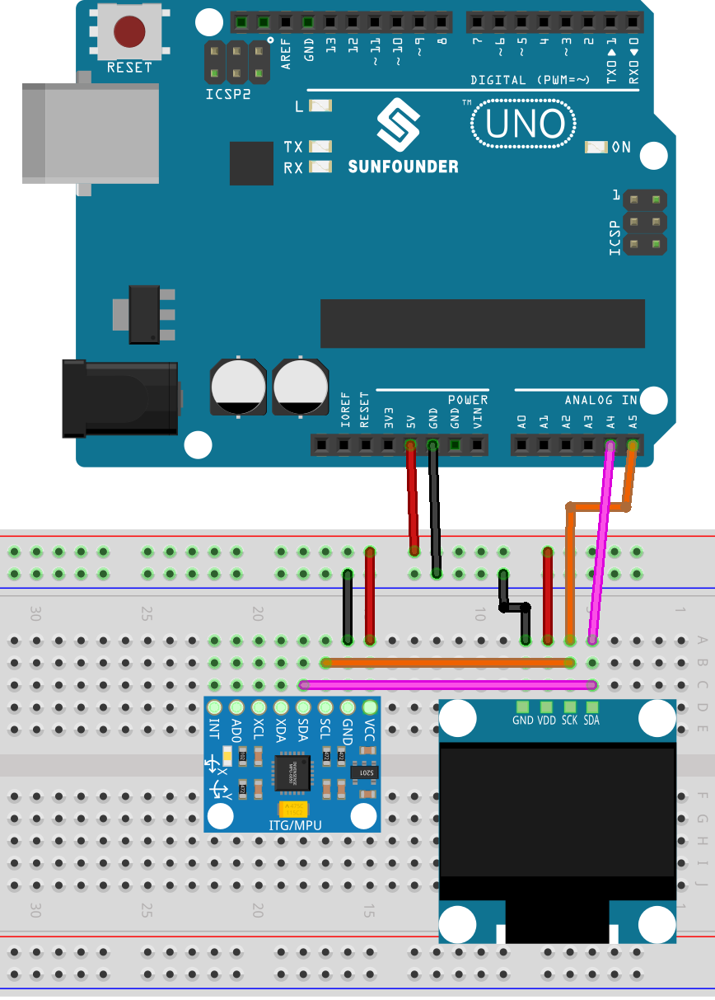

.. note::

    こんにちは、SunFounder Raspberry Pi & Arduino & ESP32 Enthusiasts Communityへようこそ！Facebook上で、仲間と一緒にRaspberry Pi、Arduino、ESP32をさらに深く探求しましょう。

    **なぜ参加するのか？**

    - **専門的なサポート**：購入後の問題や技術的な課題をコミュニティやチームの助けを借りて解決。
    - **学びと共有**：スキルを向上させるためのヒントやチュートリアルを交換。
    - **限定プレビュー**：新製品発表や予告編に早期アクセス。
    - **特別割引**：最新製品の特別割引を楽しむ。
    - **フェスティブプロモーションとプレゼント**：プレゼントやホリデープロモーションに参加。

    👉 私たちと一緒に探索と創造を始める準備はできましたか？[|link_sf_facebook|]をクリックして、今すぐ参加しましょう！

.. _uno_fun_tilt_direction_indicator:

レッスン52: 傾き方向インジケーター
===========================================

このArduinoプロジェクトでは、MPU6050加速度計とジャイロセンサー、およびOLEDディスプレイを使用します。プロジェクトはMPU6050センサーからデータを読み取り、傾き方向を検出して、OLED画面に対応する矢印（上、下、左、右）または円（顕著な傾きがない場合）を表示します。

必要な部品
--------------------------

このプロジェクトでは、以下の部品が必要です。

全キットを購入するのが便利です。リンクはこちら：

.. list-table::
    :widths: 20 20 20
    :header-rows: 1

    *   - 名称
        - キットに含まれるアイテム
        - リンク
    *   - ユニバーサルメーカセンサーキット
        - 94
        - |link_umsk|

以下のリンクから個別に購入することもできます。

.. list-table::
    :widths: 30 20
    :header-rows: 1

    *   - コンポーネント紹介
        - 購入リンク

    *   - Arduino UNO R3またはR4
        - |link_Uno_R3_buy|
    *   - :ref:`cpn_mpu6050`
        - |link_mpu6050_buy|
    *   - :ref:`cpn_oled`
        - \-
    *   - :ref:`cpn_breadboard`
        - |link_breadboard_buy|
        

配線
---------------------------

コード
---------------------------

.. note:: 
   ライブラリをインストールするには、Arduinoライブラリマネージャーを使用し、「Adafruit SSD1306」と「Adafruit GFX」を検索してインストールしてください。

.. raw:: html

    <iframe src="https://app.arduino.cc/sketches/ea5345ae-b849-424d-9b61-9a192695aef8?view-mode=embed" style="height:510px;width:100%;margin:10px 0" frameborder=0 /></iframe>

コード解析
---------------------------

#. ライブラリのインクルードとOLEDディスプレイの設定

   プロジェクトは、MPU6050センサーとOLEDディスプレイをインターフェースするために必要なライブラリをインクルードすることから始まります。OLEDディスプレイの寸法とI2Cアドレスが定義され、ディスプレイオブジェクトが作成されます。

   .. code-block:: arduino

       #include <Adafruit_MPU6050.h>
       #include <Adafruit_Sensor.h>
       #include <Wire.h>
       #include <Adafruit_GFX.h>
       #include <Adafruit_SSD1306.h>

       #define SCREEN_WIDTH 128
       #define SCREEN_HEIGHT 64

       #define OLED_RESET -1
       #define SCREEN_ADDRESS 0x3C
       Adafruit_SSD1306 display(SCREEN_WIDTH, SCREEN_HEIGHT, &Wire, OLED_RESET);

       Adafruit_MPU6050 mpu;

#. セットアップ関数

   セットアップ関数では、シリアル通信が初期化され、MPU6050センサーが特定の加速度計およびジャイロスコープの範囲設定で初期化されます。OLEDディスプレイも初期化され、クリアされます。

   .. code-block:: arduino

       void setup(void) {
         Serial.begin(115200);

         if (!mpu.begin()) {
           Serial.println("Failed to find MPU6050 chip");
           while (1) {
             delay(10);
           }
         }

         mpu.setAccelerometerRange(MPU6050_RANGE_8_G);
         mpu.setGyroRange(MPU6050_RANGE_500_DEG);
         mpu.setFilterBandwidth(MPU6050_BAND_21_HZ);

         if (!display.begin(SSD1306_SWITCHCAPVCC, SCREEN_ADDRESS)) {
           Serial.println(F("SSD1306 allocation failed"));
           for (;;)
             ;  // Don't proceed, loop forever
         }
         display.clearDisplay();

         delay(100);
       }

#. ループ関数

   ループ関数では、センサーデータが連続的に読み取られ、加速度の値に基づいて傾き方向が決定されます。傾き方向に応じて、OLEDディスプレイに異なる矢印や円が描画されます。

   コードはMPU6050センサーからデータを読み取り、傾き方向を検出し、対応する矢印（上、下、左、右）または円（顕著な傾きがない場合）をOLED画面に表示します。

   .. code-block:: arduino

       void loop() {

         display.clearDisplay();

         sensors_event_t a, g, temp;
         mpu.getEvent(&a, &g, &temp);

         Serial.print("acceleration:");
         Serial.print(a.acceleration.x);
         Serial.print(",");
         Serial.print(a.acceleration.y);
         Serial.print(",");
         Serial.println(a.acceleration.z);

         if (a.acceleration.x >= 2) {
           drawUpArrow();
         } else if (a.acceleration.x <= -2) {
           drawDownArrow();
         } else if (a.acceleration.y >= 2) {
           drawLeftArrow();
         } else if (a.acceleration.y <= -2) {
           drawRightArrow();
         } else {
           drawCircle();
         }
         display.display();

         delay(200);
       }

#. 描画関数

   OLEDディスプレイに異なる形状を描画するために、いくつかのヘルパー関数が定義されています。これらの関数は``Adafruit_GFX``ライブラリを使用して、矢印や円を描画します。

   .. code-block:: arduino

       void drawUpArrow() {
         display.fillTriangle(49, 30, 64, 15, 79, 30, WHITE);
         display.fillRect(59, 30, 10, 20, WHITE);
       }

       void drawDownArrow() {
         display.fillTriangle(49, 36, 64, 51, 79, 36, WHITE);
         display.fillRect(59, 16, 10, 20, WHITE);
       }

       void drawRightArrow() {
         display.fillTriangle(70, 15, 85, 30, 70, 45, WHITE);
         display.fillRect(50, 25, 20, 10, WHITE);
       }

       void drawLeftArrow() {
         display.fillTriangle(60, 15, 45, 30, 60, 45, WHITE);
         display.fillRect(60, 25, 20, 10, WHITE);
       }

       void drawCircle() {
         display.fillCircle(64, 32, 10, WHITE);
         display.fillCircle(64, 32, 8, BLACK);
       }

**参考資料**

- |link_adafruit_gfx_graphics_library|
