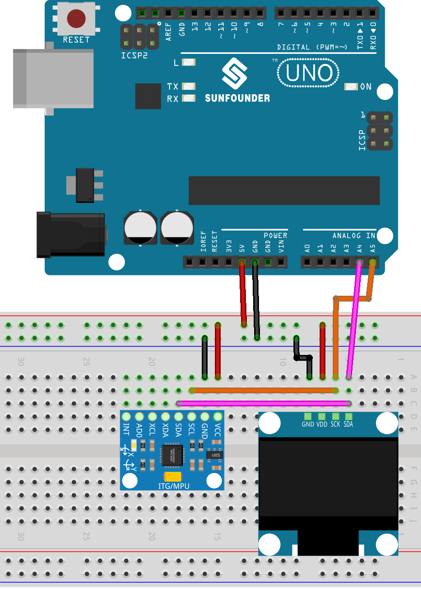

.. note:: 

   Ciao, benvenuti nella Comunità degli Appassionati di SunFounder Raspberry Pi & Arduino & ESP32 su Facebook! Esplorate più a fondo Raspberry Pi, Arduino e ESP32 insieme ad altri appassionati.

   **Perché unirsi?**

   - **Supporto Esperto**: Risolvi problemi post-vendita e sfide tecniche con l'aiuto della nostra comunità e del nostro team.
   - **Impara & Condividi**: Scambia consigli e tutorial per migliorare le tue competenze.
   - **Anteprime Esclusive**: Ottieni accesso anticipato agli annunci di nuovi prodotti e anteprime.
   - **Sconti Speciali**: Goditi sconti esclusivi sui nostri prodotti più recenti.
   - **Promozioni Festive e Regali**: Partecipa a regali e promozioni festive.

   👉 Pronto a esplorare e creare con noi? Clicca [|link_sf_facebook|] e unisciti oggi!

.. _uno_lesson52_tilt_direction_indicator:

Lezione 52: Indicatore di Direzione dell'Inclinazione
================================================================

Questo progetto Arduino utilizza un sensore di accelerazione e giroscopio MPU6050 insieme a un display OLED. Il progetto legge i dati dal sensore MPU6050 per rilevare la direzione di inclinazione e visualizza le frecce corrispondenti (su, giù, sinistra o destra) o un cerchio (se non c'è un'inclinazione significativa) sullo schermo OLED in base alla direzione di inclinazione.

Componenti Necessari
--------------------------

Per questo progetto, abbiamo bisogno dei seguenti componenti.

È decisamente conveniente acquistare un kit completo, ecco il link:

.. list-table::
    :widths: 20 20 20
    :header-rows: 1

    *   - Nome	
        - ELEMENTI IN QUESTO KIT
        - LINK
    *   - Universal Maker Sensor Kit
        - 94
        - |link_umsk|

Puoi anche acquistarli separatamente dai link sottostanti.

.. list-table::
    :widths: 30 20
    :header-rows: 1

    *   - Introduzione ai Componenti
        - Link di Acquisto

    *   - Arduino UNO R3 o R4
        - |link_Uno_R3_buy|
    *   - :ref:`cpn_mpu6050`
        - |link_mpu6050_buy|
    *   - :ref:`cpn_oled`
        - \-
    *   - :ref:`cpn_breadboard`
        - |link_breadboard_buy|
        

Cablaggio
---------------------------

Codice
---------------------------

.. note:: 
   Per installare la libreria, usa il Gestore Librerie Arduino e cerca **"Adafruit SSD1306"** e **"Adafruit GFX"** e installale. 

.. raw:: html

    <iframe src="https://app.arduino.cc/sketches/ea5345ae-b849-424d-9b61-9a192695aef8?view-mode=embed" style="height:510px;width:100%;margin:10px 0" frameborder=0 /></iframe>

Analisi del Codice
---------------------------

#. Inclusione delle librerie e configurazione del display OLED

   Il progetto inizia includendo le librerie necessarie per interfacciarsi con il sensore MPU6050 e il display OLED. Le dimensioni del display OLED e l'indirizzo I2C sono definiti, seguiti dalla creazione dell'oggetto display.

   .. code-block:: arduino

       #include <Adafruit_MPU6050.h>
       #include <Adafruit_Sensor.h>
       #include <Wire.h>
       #include <Adafruit_GFX.h>
       #include <Adafruit_SSD1306.h>

       #define SCREEN_WIDTH 128
       #define SCREEN_HEIGHT 64

       #define OLED_RESET -1
       #define SCREEN_ADDRESS 0x3C
       Adafruit_SSD1306 display(SCREEN_WIDTH, SCREEN_HEIGHT, &Wire, OLED_RESET);

       Adafruit_MPU6050 mpu;

#. Funzione setup

   Nella funzione setup, la comunicazione seriale viene inizializzata e il sensore MPU6050 viene inizializzato con impostazioni specifiche per le gamme di accelerometro e giroscopio. Anche il display OLED viene inizializzato e pulito.

   .. code-block:: arduino

       void setup(void) {
         Serial.begin(115200);

         if (!mpu.begin()) {
           Serial.println("Failed to find MPU6050 chip");
           while (1) {
             delay(10);
           }
         }

         mpu.setAccelerometerRange(MPU6050_RANGE_8_G);
         mpu.setGyroRange(MPU6050_RANGE_500_DEG);
         mpu.setFilterBandwidth(MPU6050_BAND_21_HZ);

         if (!display.begin(SSD1306_SWITCHCAPVCC, SCREEN_ADDRESS)) {
           Serial.println(F("SSD1306 allocation failed"));
           for (;;)
             ;  // Don't proceed, loop forever
         }
         display.clearDisplay();

         delay(100);
       }

#. Funzione loop

   Nella funzione loop, i dati del sensore vengono letti continuamente e la direzione di inclinazione viene determinata in base ai valori di accelerazione. A seconda della direzione di inclinazione, diverse frecce o un cerchio vengono disegnati sul display OLED.

   Il codice legge i dati dal sensore MPU6050 per rilevare la direzione di inclinazione e visualizza le frecce corrispondenti (su, giù, sinistra o destra) o un cerchio (se non c'è un'inclinazione significativa) sullo schermo OLED in base alla direzione di inclinazione.

   .. code-block:: arduino

       void loop() {

         display.clearDisplay();

         sensors_event_t a, g, temp;
         mpu.getEvent(&a, &g, &temp);

         Serial.print("acceleration:");
         Serial.print(a.acceleration.x);
         Serial.print(",");
         Serial.print(a.acceleration.y);
         Serial.print(",");
         Serial.println(a.acceleration.z);

         if (a.acceleration.x >= 2) {
           drawUpArrow();
         } else if (a.acceleration.x <= -2) {
           drawDownArrow();
         } else if (a.acceleration.y >= 2) {
           drawLeftArrow();
         } else if (a.acceleration.y <= -2) {
           drawRightArrow();
         } else {
           drawCircle();
         }
         display.display();

         delay(200);
       }

#. Funzioni di disegno

   Diverse funzioni di aiuto sono definite per disegnare diverse forme sul display OLED. Queste funzioni utilizzano la libreria ``Adafruit_GFX`` per disegnare frecce e cerchi.

   .. code-block:: arduino

       void drawUpArrow() {
         display.fillTriangle(49, 30, 64, 15, 79, 30, WHITE);
         display.fillRect(59, 30, 10, 20, WHITE);
       }

       void drawDownArrow() {
         display.fillTriangle(49, 36, 64, 51, 79, 36, WHITE);
         display.fillRect(59, 16, 10, 20, WHITE);
       }

       void drawRightArrow() {
         display.fillTriangle(70, 15, 85, 30, 70, 45, WHITE);
         display.fillRect(50, 25, 20, 10, WHITE);
       }

       void drawLeftArrow() {
         display.fillTriangle(60, 15, 45, 30, 60, 45, WHITE);
         display.fillRect(60, 25, 20, 10, WHITE);
       }

       void drawCircle() {
         display.fillCircle(64, 32, 10, WHITE);
         display.fillCircle(64, 32, 8, BLACK);
       }

**Riferimento**

- |link_adafruit_gfx_graphics_library|

