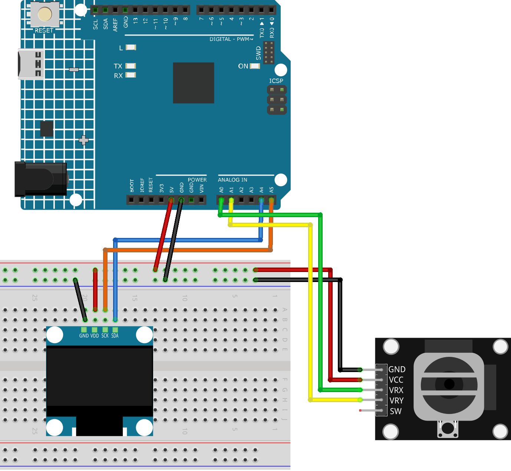

.. note::

    Hello, welcome to the SunFounder Raspberry Pi & Arduino & ESP32 Enthusiasts Community on Facebook! Dive deeper into Raspberry Pi, Arduino, and ESP32 with fellow enthusiasts.

    **Why Join?**

    - **Expert Support**: Solve post-sale issues and technical challenges with help from our community and team.
    - **Learn & Share**: Exchange tips and tutorials to enhance your skills.
    - **Exclusive Previews**: Get early access to new product announcements and sneak peeks.
    - **Special Discounts**: Enjoy exclusive discounts on our newest products.
    - **Festive Promotions and Giveaways**: Take part in giveaways and holiday promotions.

    👉 Ready to explore and create with us? Click [|link_sf_facebook|] and join today!

.. _uno_lesson53_direction_indicator:

Lesson 53: Direction Indicator
===========================================

This Arduino project initializes an OLED display and reads input from a joystick connected to analog pins A0 and A1. It continuously monitors the joystick's position to determine its tilt direction and displays an appropriate arrow (up, down, left, or right) or a circle (if the joystick is centered) on the OLED display.

Required Components
--------------------------

In this project, we need the following components. 

It's definitely convenient to buy a whole kit, here's the link: 

.. list-table::
    :widths: 20 20 20
    :header-rows: 1

    *   - Name	
        - ITEMS IN THIS KIT
        - LINK
    *   - Universal Maker Sensor Kit
        - 94
        - |link_umsk|

You can also buy them separately from the links below.

.. list-table::
    :widths: 30 20
    :header-rows: 1

    *   - Component Introduction
        - Purchase Link

    *   - Arduino UNO R3 or R4
        - |link_Uno_R3_buy|
    *   - :ref:`cpn_joystick`
        - |link_joystick_buy|
    *   - :ref:`cpn_oled`
        - \-
    *   - :ref:`cpn_breadboard`
        - |link_breadboard_buy|
        

Wiring
---------------------------

Code
---------------------------

.. note:: 
   To install the library, use the Arduino Library Manager and search for **"Adafruit SSD1306"** and **"Adafruit GFX"** and install it. 

.. raw:: html

    <iframe src="https://app.arduino.cc/sketches/c926f784-c6ac-4d4d-864c-d55aee9595b4?view-mode=embed" style="height:510px;width:100%;margin:10px 0" frameborder=0></iframe>

Code Analysis
---------------------------

#. Including necessary libraries

   The project uses three libraries: ``Wire.h`` for I2C communication, ``Adafruit_GFX.h`` for graphics primitives, and ``Adafruit_SSD1306.h`` for OLED display control.
 
   .. code-block:: arduino
 
      #include <Wire.h>
      #include <Adafruit_GFX.h>
      #include <Adafruit_SSD1306.h>

#. Defining constants and creating an OLED display object

   Constants for the OLED display dimensions and address are defined. The OLED display object is created with these parameters.
 
   .. code-block:: arduino
     
      #define SCREEN_WIDTH 128  // OLED display width, in pixels
      #define SCREEN_HEIGHT 64  // OLED display height, in pixels
      #define OLED_RESET -1  // Reset pin # (or -1 if sharing Arduino reset pin)
      #define SCREEN_ADDRESS 0x3C
      Adafruit_SSD1306 display(SCREEN_WIDTH, SCREEN_HEIGHT, &Wire, OLED_RESET);

#. Pin definitions and threshold for the joystick

   The analog pins A0 and A1 are used for the joystick, and a threshold is defined to determine if the joystick is centered.
 
   .. code-block:: arduino
 
      const int xPin = A0;  // the VRX attach to
      const int yPin = A1;  // the VRY attach to
      const int threshold = 50;  // threshold to consider joystick in the center
 
#. Setup function: initializing serial communication and the OLED display

   Serial communication is initialized for debugging, and the OLED display is initialized and cleared.
 
   .. code-block:: arduino
 
      void setup() {
        Serial.begin(9600);
        if (!display.begin(SSD1306_SWITCHCAPVCC, SCREEN_ADDRESS)) {
          Serial.println(F("SSD1306 allocation failed"));
          for (;;);
        }
        display.clearDisplay();
      }
 
#. Main loop: reading joystick values, determining direction, and displaying shapes

   The main loop reads the joystick values, determines the direction based on these values, and displays the corresponding shape on the OLED display.

   .. image:: img/Lesson_53_Code_Analysis.png
    :width: 85%

   .. raw:: html
   
         
 
   .. code-block:: arduino
 
      void loop() {
        display.clearDisplay();
        int xValue = analogRead(xPin);
        int yValue = analogRead(yPin) * -1;
        Serial.print("X: ");
        Serial.print(xValue);
        Serial.print("|Y: ");
        Serial.println(-yValue);
  
        float yLine1 = line1(xValue);
        float yLine2 = line2(xValue);
  
        int relX = xValue - 512;
        int relY = -yValue - 512;
  
        if (abs(relX) < threshold && abs(relY) < threshold) {
          drawCircle();
        } else if (yValue > yLine1 && yValue > yLine2) {
          drawUpArrow();
        } else if (yValue < yLine1 && yValue < yLine2) {
          drawDownArrow();
        } else if (yValue < yLine1 && yValue > yLine2) {
          drawRightArrow();
        } else if (yValue > yLine1 && yValue < yLine2) {
          drawLeftArrow();
        }
  
        display.display();
        delay(80);
      }
 
#. Helper functions: calculating lines and drawing shapes

   These functions help in calculating lines used for direction determination and drawing shapes on the OLED display.
 
   .. code-block:: arduino
 
      float line1(float x) {
        return x - 1023;
      }
  
      float line2(float x) {
        return -x;
      }
  
      void drawUpArrow() {
        display.fillTriangle(49, 30, 64, 15, 79, 30, WHITE);
        display.fillRect(59, 30, 10, 20, WHITE);
      }
  
      void drawDownArrow() {
        display.fillTriangle(49, 36, 64, 51, 79, 36, WHITE);
        display.fillRect(59, 16, 10, 20, WHITE);
      }
  
      void drawRightArrow() {
        display.fillTriangle(70, 15, 85, 30, 70, 45, WHITE);
        display.fillRect(50, 25, 20, 10, WHITE);
      }
  
      void drawLeftArrow() {
        display.fillTriangle(60, 15, 45, 30, 60, 45, WHITE);
        display.fillRect(60, 25, 20, 10, WHITE);
      }
  
      void drawCircle() {
        display.fillCircle(64, 32, 10, WHITE);
        display.fillCircle(64, 32, 8, BLACK);
      }
  
**Reference**

- |link_adafruit_gfx_graphics_library|