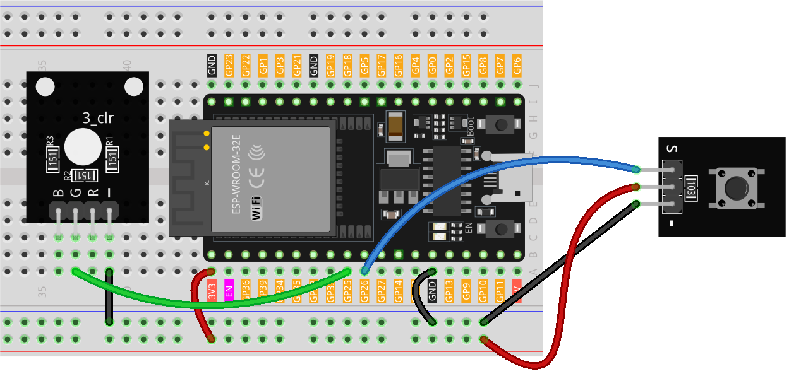

.. note::

    Hello, welcome to the SunFounder Raspberry Pi & Arduino & ESP32 Enthusiasts Community on Facebook! Dive deeper into Raspberry Pi, Arduino, and ESP32 with fellow enthusiasts.

    **Why Join?**

    - **Expert Support**: Solve post-sale issues and technical challenges with help from our community and team.
    - **Learn & Share**: Exchange tips and tutorials to enhance your skills.
    - **Exclusive Previews**: Get early access to new product announcements and sneak peeks.
    - **Special Discounts**: Enjoy exclusive discounts on our newest products.
    - **Festive Promotions and Giveaways**: Take part in giveaways and holiday promotions.

    👉 Ready to explore and create with us? Click [|link_sf_facebook|] and join today!

.. _eps32_lesson01_button:

Lesson 01: Button Module
==================================

In this lesson, you will learn how a button interacts with an LED using ESP32 Development Board. We'll see how pressing the button lights up the LED and releasing it turns off the LED. This project is ideal for beginners as it provides a practical understanding of input and output operations on the ESP32 platform.

Required Components
--------------------------

In this project, we need the following components. 

It's definitely convenient to buy a whole kit, here's the link: 

.. list-table::
    :widths: 20 20 20
    :header-rows: 1

    *   - Name	
        - ITEMS IN THIS KIT
        - LINK
    *   - Universal Maker Sensor Kit
        - 94
        - |link_umsk|

You can also buy them separately from the links below.

.. list-table::
    :widths: 30 20
    :header-rows: 1

    *   - Component Introduction
        - Purchase Link

    *   - ESP32 & Development Board (:ref:`cpn_esp32_wroom_32e`)
        - |link_esp32_camera_pro_kit_buy|
    *   - :ref:`cpn_button`
        - \-
    *   - :ref:`cpn_breadboard`
        - |link_breadboard_buy|

Wiring
---------------------------

Code
---------------------------

.. raw:: html

    <iframe src=https://create.arduino.cc/editor/sunfounder01/7286feaf-3b32-4ce8-959b-eccd6c99c4e1/preview?embed style="height:510px;width:100%;margin:10px 0" frameborder=0></iframe>

Code Analysis
---------------------------

#. Initialization of Pins

   The pins for the button and LED are defined and initialized. The ``buttonPin`` is set as an input to read the button's state, and ``ledPin`` is set as an output to control the LED.
   
   .. code-block:: arduino

      const int buttonPin = 26;  // Pin number for the button
      const int ledPin = 25;     // Pin number for the LED
      int buttonState = 0;  // Variable to hold the current state of the button

#. Setup Function

   This function runs once and sets up the pin modes. ``pinMode(buttonPin, INPUT)`` configures the button pin as an input. ``pinMode(ledPin, OUTPUT)`` sets the LED pin as an output.
   
   .. code-block:: arduino

      void setup() {
        pinMode(buttonPin, INPUT);  // Initialize buttonPin as an input pin
        pinMode(ledPin, OUTPUT);    // Initialize ledPin as an output pin
      }

#. Main Loop Function

   This is the core of the program where the button state is continuously read and the LED state is controlled. ``digitalRead(buttonPin)`` reads the button's state. If the button is pressed (state is LOW), the LED is turned on by ``digitalWrite(ledPin, HIGH)``. If not pressed, the LED is turned off (``digitalWrite(ledPin, LOW)``).

   The :ref:`button module<cpn_button>` used in this project has an internal pull-up resistor (see its :ref:`schematic diagram<cpn_button_sch>`), causing the button to be at a low level when pressed and remain at a high level when released.
   
   .. code-block:: arduino

      void loop() {
        // Read the current state of the button
        buttonState = digitalRead(buttonPin);

        // Check if the button is pressed (LOW)
        if (buttonState == LOW) {
          digitalWrite(ledPin, HIGH);  // Turn the LED on
        } else {
          digitalWrite(ledPin, LOW);  // Turn the LED off
        }
      }
