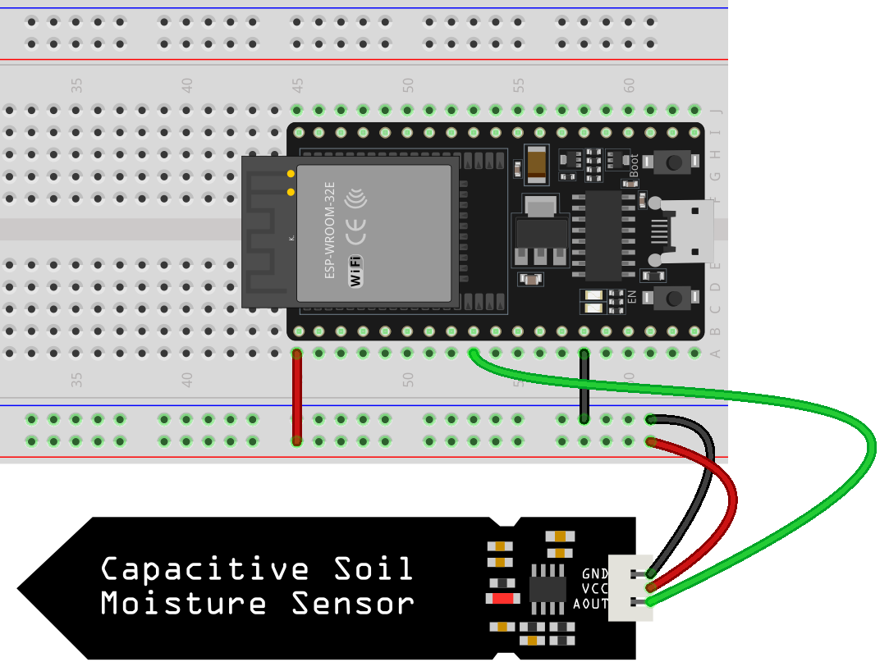

.. note::

    こんにちは、SunFounder Raspberry Pi & Arduino & ESP32 Enthusiasts Communityへようこそ！Facebook上で、仲間と一緒にRaspberry Pi、Arduino、ESP32をさらに深く探求しましょう。

    **なぜ参加するのか？**

    - **専門的なサポート**：購入後の問題や技術的な課題をコミュニティやチームの助けを借りて解決。
    - **学びと共有**：スキルを向上させるためのヒントやチュートリアルを交換。
    - **限定プレビュー**：新製品発表や予告編に早期アクセス。
    - **特別割引**：最新製品の特別割引を楽しむ。
    - **フェスティブプロモーションとプレゼント**：プレゼントやホリデープロモーションに参加。

    👉 私たちと一緒に探索と創造を始める準備はできましたか？[|link_sf_facebook|]をクリックして、今すぐ参加しましょう！
    
.. _esp32_lesson02_soil_moisture:

レッスン02: 容量式土壌湿度モジュール
============================================

このレッスンでは、ESP32開発ボードを使用して容量式土壌湿度センサーで土壌の湿度レベルを読み取る方法を学びます。センサーをピン25に接続し、そのアナログ値を読み取り、これらの読み取り値を解釈して土壌の湿度レベルを判定する方法を紹介します。このプロジェクトは、センサーの操作やESP32プラットフォームでのアナログ入力の理解に関する実践的な経験を提供するため、初心者に最適です。

必要な部品
--------------------------

このプロジェクトでは、以下の部品が必要です。

一式キットを購入すると便利です。リンクはこちら:

.. list-table::
    :widths: 20 20 20
    :header-rows: 1

    *   - Name	
        - ITEMS IN THIS KIT
        - LINK
    *   - Universal Maker Sensor Kit
        - 94
        - |link_umsk|

または、以下のリンクから個別に購入することもできます。

.. list-table::
    :widths: 30 20
    :header-rows: 1

    *   - Component Introduction
        - Purchase Link

    *   - ESP32 & Development Board
        - |link_esp32_camera_pro_kit_buy|
    *   - :ref:`cpn_soil`
        - |link_soil_moisture_buy|
    *   - :ref:`cpn_breadboard`
        - |link_breadboard_buy|

配線
---------------------------

コード
---------------------------

.. raw:: html

    <iframe src=https://create.arduino.cc/editor/sunfounder01/ab3dd759-5698-477c-b837-0c3719a09b8d/preview?embed style="height:510px;width:100%;margin:10px 0" frameborder=0></iframe>

コード解析
---------------------------

#. センサーピンの定義:

   このコード行は、定数整数 ``sensorPin`` を宣言し、センサーが接続されているピン ``25`` の値を割り当てます。

   .. code-block:: arduino

      const int sensorPin = 25;

#. セットアップ関数:

   ``setup()`` 関数はプログラムが開始されたときに一度実行されます。シリアル通信を9600ボーで初期化します。このセットアップはシリアルモニタにデータを送信するために必要です。

   .. code-block:: arduino

      void setup() {
        Serial.begin(9600);
      }

#. ループ関数:

   ``loop()`` 関数は ``setup()`` の後に連続して実行されます。 ``analogRead()`` を使用してピンA0からセンサー値を読み取り、この値をシリアルモニタに出力します。 ``delay(500)``  ステートメントは次の読み取りまでループを500ミリ秒一時停止し、データ取得の速度を制御します。

   .. code-block:: arduino

      void loop() {
        Serial.println(analogRead(sensorPin));
        delay(500);
      }

