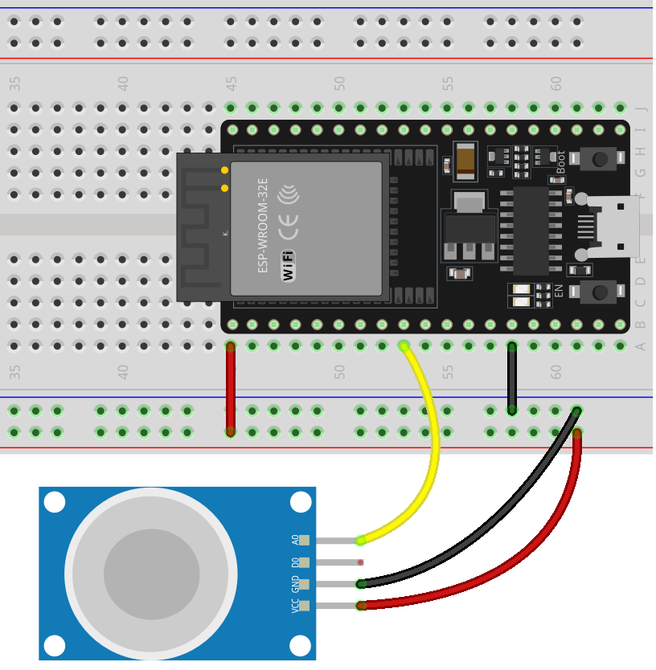

.. _esp32_lesson04_mq2:

Lesson 04: Gas Sensor Module (MQ-2)
============================================

In this lesson, you will learn how to measure gas concentrations using an MQ-2 sensor with an ESP32 Development Board. We'll cover reading the analog output of the gas sensor and displaying it on the serial monitor. This project is ideal for beginners in electronics, providing hands-on experience with sensors and microcontrollers while teaching about analog signal processing and serial communication.

Required Components
---------------------------

.. list-table::
    :widths: 30 10
    :header-rows: 1

    *   - Component Introduction
        - Purchase Link

    *   - ESP32 Development Board
        - \-
    *   - :ref:`cpn_gas`
        - |link_mq2_gas_sensor_module_buy|
    *   - :ref:`cpn_breadboard`
        - |link_breadboard_buy|

Wiring
---------------------------

Code
---------------------------

.. raw:: html

    <iframe src=https://create.arduino.cc/editor/sunfounder01/79ef2209-7e92-4a53-81f2-1ba01214af31/preview?embed style="height:510px;width:100%;margin:10px 0" frameborder=0></iframe>

Code Analysis
---------------------------

1. The first line of code is a constant integer declaration for the gas sensor pin. We use the pin 25 to read the output from the gas sensor.

   .. code-block:: arduino
   
      const int sensorPin = 25;

2. The ``setup()`` function is where we initialize our serial communication at a baud rate of 9600. This is necessary to print the readings from the gas sensor to the serial monitor.

   .. code-block:: arduino
   
      void setup() {
        Serial.begin(9600);  // Start serial communication at 9600 baud rate
      }

3. The ``loop()`` function is where we continuously read the analog value from the gas sensor and print it to the serial monitor. We use the ``analogRead()`` function to read the analog value from the sensor. We then wait for 50 milliseconds before the next reading. This delay gives some breathing space for the serial monitor to process the data.

   .. note:: 
   
     MQ2 is a heating-driven sensor that usually requires preheating before use. During the preheating period, the sensor typically reads high and gradually decreases until it stabilizes.

   .. code-block:: arduino
   
      void loop() {
        Serial.print("Analog output: ");
        Serial.println(analogRead(sensorPin));  // Read the analog value of the gas sensor and print it to the serial monitor
        delay(50);                             // Wait for 50 milliseconds
      }

