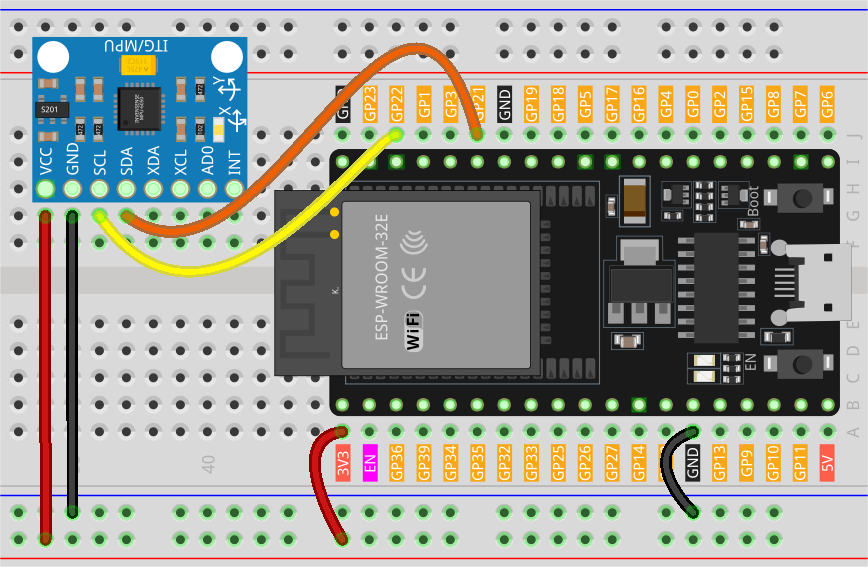

.. note::

    こんにちは、SunFounder Raspberry Pi & Arduino & ESP32 Enthusiasts Communityへようこそ！Facebook上で、仲間と一緒にRaspberry Pi、Arduino、ESP32をさらに深く探求しましょう。

    **なぜ参加するのか？**

    - **専門的なサポート**：購入後の問題や技術的な課題をコミュニティやチームの助けを借りて解決。
    - **学びと共有**：スキルを向上させるためのヒントやチュートリアルを交換。
    - **限定プレビュー**：新製品発表や予告編に早期アクセス。
    - **特別割引**：最新製品の特別割引を楽しむ。
    - **フェスティブプロモーションとプレゼント**：プレゼントやホリデープロモーションに参加。

    👉 私たちと一緒に探索と創造を始める準備はできましたか？[|link_sf_facebook|]をクリックして、今すぐ参加しましょう！
.. _esp32_lesson05_mpu6050:

レッスン 05: ジャイロスコープ & 加速度センサーモジュール (MPU6050)
===================================================================

このレッスンでは、MPU6050加速度計およびジャイロスコープセンサーをESP32開発ボードに接続する方法を学びます。Adafruit_MPU6050ライブラリのセットアップ、センサーの初期化、および加速度計とジャイロの範囲の設定について説明します。また、センサーから加速度、回転、および温度データを読み取り、これらの値をシリアルモニターに表示する方法も学びます。このプロジェクトは、モーショントラッキングや姿勢検出に興味がある方に最適で、Arduino互換のESP32プラットフォームで高度なセンサーを扱う実践的な経験を提供します。

必要な部品
--------------------------

このプロジェクトでは、以下の部品が必要です。

一式キットを購入すると便利です。リンクはこちら:

.. list-table::
    :widths: 20 20 20
    :header-rows: 1

    *   - Name	
        - ITEMS IN THIS KIT
        - LINK
    *   - Universal Maker Sensor Kit
        - 94
        - |link_umsk|

または、以下のリンクから個別に購入することもできます。

.. list-table::
    :widths: 30 10
    :header-rows: 1

    *   - Component Introduction
        - Purchase Link

    *   - ESP32 & Development Board
        - |link_esp32_camera_pro_kit_buy|
    *   - :ref:`cpn_mpu6050`
        - |link_mpu6050_buy|
    *   - :ref:`cpn_breadboard`
        - |link_breadboard_buy|

配線
---------------------------

コード
---------------------------

.. raw:: html

    <iframe src=https://create.arduino.cc/editor/sunfounder01/9464e05b-2cab-4185-bf6d-983e907dd279/preview?embed style="height:510px;width:100%;margin:10px 0" frameborder=0></iframe>

コード解析
---------------------------

1. このコードは、必要なライブラリをインクルードし、MPU6050センサーのオブジェクトを作成することから始まります。このコードでは、Adafruit_MPU6050ライブラリ、Adafruit_Sensorライブラリ、およびWireライブラリを使用します。 ``Adafruit_MPU6050`` ライブラリは、MPU6050センサーと対話して加速度、回転、および温度データを取得します。 ``Adafruit_Sensor``ライブラリは、さまざまなタイプのセンサーのための共通のインターフェースを提供します。 ``Wire`` ライブラリはI2C通信に使用され、MPU6050センサーとの通信に必要です。

   .. note:: 
       ライブラリをインストールするには、Arduino Library Managerを使用し、 **"Adafruit MPU6050"**を検索してインストールしてください。
   
   .. code-block:: arduino
   
      #include <Adafruit_MPU6050.h>
      #include <Adafruit_Sensor.h>
      #include <Wire.h>
      Adafruit_MPU6050 mpu;

  2. ``setup()``関数はシリアル通信を初期化し、センサーが検出されているかどうかを確認します。センサーが見つからない場合、Arduinoは「Failed to find MPU6050 chip」というメッセージとともに無限ループに入ります。見つかった場合、加速度計の範囲、ジャイロの範囲、フィルタ帯域幅が設定され、安定のために遅延が追加されます。

   .. code-block:: arduino
   
      void setup(void) {
        // Initialize the serial communication
        Serial.begin(9600);
   
        // Check if the MPU6050 sensor is detected
        if (!mpu.begin()) {
          Serial.println("Failed to find MPU6050 chip");
          while (1) {
            delay(10);
          }
        }
        Serial.println("MPU6050 Found!");
   
        // set accelerometer range to +-8G
        mpu.setAccelerometerRange(MPU6050_RANGE_8_G);
   
        // set gyro range to +- 500 deg/s
        mpu.setGyroRange(MPU6050_RANGE_500_DEG);
   
        // set filter bandwidth to 21 Hz
        mpu.setFilterBandwidth(MPU6050_BAND_21_HZ);
   
        // Add a delay for stability
        delay(100);
      }

3. ``loop()``関数では、プログラムがセンサーの読み取り値を格納するイベントを作成し、その後読み取り値を取得します。加速度、回転、温度の値がシリアルモニターに出力されます。

   .. code-block:: arduino
   
      void loop() {
        // Get new sensor events with the readings
        sensors_event_t a, g, temp;
        mpu.getEvent(&a, &g, &temp);
   
        // Print out the acceleration, rotation, and temperature readings
        // ...
   
        // Add a delay to avoid flooding the serial monitor
        delay(1000);
      }
