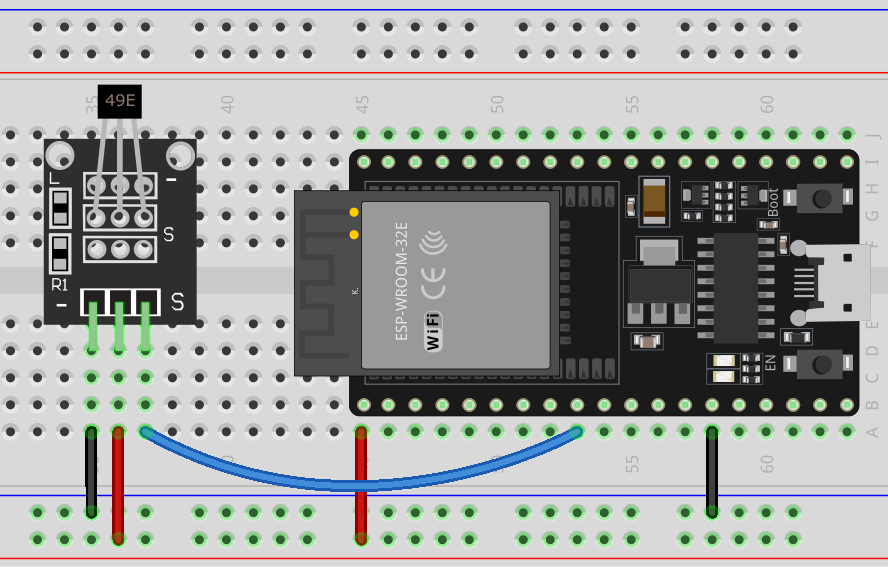

.. _esp32_lesson06_hall_sensor:

Lesson 06: Hall Sensor Module
==================================

In this lesson, you will learn how to use a Hall sensor with an ESP32 Development Board to detect the polarity of a magnetic field. We'll cover reading analog signals from the sensor and interpreting them to differentiate between south and north poles. This project is ideal for beginners in electronics, providing practical experience with sensors and signal processing on the ESP32 platform.

Required Components
---------------------------

* ESP32 Development Board
* :ref:`cpn_hall`
* :ref:`cpn_breadboard`

Wiring
---------------------------

Code
---------------------------

.. raw:: html

    <iframe src=https://create.arduino.cc/editor/sunfounder01/48094da0-b2f8-4af6-ad59-38504a201cbf/preview?embed style="height:510px;width:100%;margin:10px 0" frameborder=0></iframe>

Code Analysis
---------------------------

1. Setting up the Hall Sensor

   .. code-block:: arduino

      const int hallSensorPin = 25;  // Pin connected to the Hall sensor output
      void setup() {
        Serial.begin(9600);             // Initialize serial communication at 9600 bps
        pinMode(hallSensorPin, INPUT);  // Set hall sensor pin as input
      }

   The hall sensor's output is connected to pin 25 on the ESP32 Development Board. The ``setup()`` function is used to initialize serial communication at 9600 bits per second (bps) for displaying data on the serial monitor. The ``pinMode()`` function is used to configure 25 as an input pin.

2. Reading from the Hall Sensor and Determining Polarity

   The Hall sensor module is equipped with a 49E linear Hall effect sensor, which can measure the polarity of the magnetic field's north and south poles as well as the relative strength of the magnetic field. If you place a magnet's south pole near the side marked with 49E (the side with text engraved on it), the value read by the code will increase linearly in proportion to the applied magnetic field strength. Conversely, if you place a north pole near this side, the value read by the code will decrease linearly in proportion to that magnetic field strength. For more details, please refer to :ref:`cpn_hall`.

   .. code-block:: arduino

      void loop() {
        int sensorValue = analogRead(hallSensorPin);  // Read analog value from Hall sensor
        Serial.print(sensorValue);                    // Output raw sensor value to Serial Monitor
        delay(200);                                   // Delay for 200 milliseconds

        // Determine magnetic pole based on sensor value
        if (sensorValue >= 2600) {
          Serial.print(" - South pole detected");  // South pole detected if value >= 2600
        } else if (sensorValue <= 1200) {
          Serial.print(" - North pole detected");  // North pole detected if value <= 1200
        }

        Serial.println();  // New line for next output
      }

