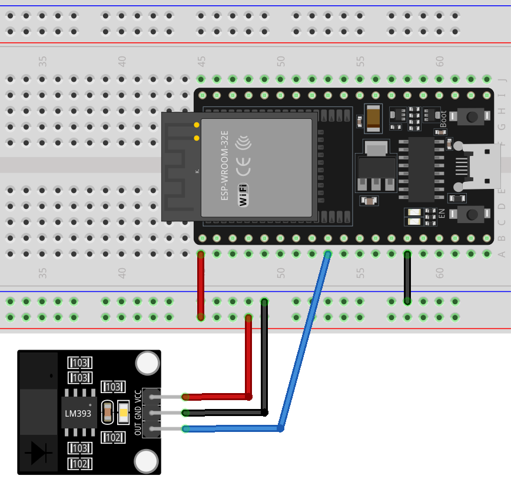

 .. note::

    Hallo und willkommen in der SunFounder Raspberry Pi & Arduino & ESP32 Enthusiasten-Gemeinschaft auf Facebook! Tauchen Sie tiefer ein in die Welt von Raspberry Pi, Arduino und ESP32 mit anderen Enthusiasten.

    **Warum beitreten?**

    - **Expertenunterstützung**: Lösen Sie Nachverkaufsprobleme und technische Herausforderungen mit Hilfe unserer Gemeinschaft und unseres Teams.
    - **Lernen & Teilen**: Tauschen Sie Tipps und Anleitungen aus, um Ihre Fähigkeiten zu verbessern.
    - **Exklusive Vorschauen**: Erhalten Sie frühzeitigen Zugang zu neuen Produktankündigungen und exklusiven Einblicken.
    - **Spezialrabatte**: Genießen Sie exklusive Rabatte auf unsere neuesten Produkte.
    - **Festliche Aktionen und Gewinnspiele**: Nehmen Sie an Gewinnspielen und Feiertagsaktionen teil.

    👉 Sind Sie bereit, mit uns zu erkunden und zu erschaffen? Klicken Sie auf [|link_sf_facebook|] und treten Sie heute bei!

.. _esp32_lesson07_speed:

Lektion 07: Infrarot-Geschwindigkeitssensormodul
==========================================

In dieser Lektion lernen Sie, wie Sie ein ESP32-Entwicklungsboard mit einem Geschwindigkeitssensormodul verwenden, um Hindernisse zu erkennen. Wir werden sehen, wie der Sensor ein hohes Signal sendet, wenn ein Hindernis vorhanden ist, und ein niedriges Signal, wenn der Weg frei ist. Dieses Projekt ist ideal für diejenigen, die das Verständnis der Sensorintegration und grundlegender Ein-/Ausgabeoperationen in einem praktischen Umfeld mit der ESP32-Plattform vertiefen möchten.

Benötigte Komponenten
--------------------------

Für dieses Projekt benötigen wir die folgenden Komponenten.

Es ist definitiv praktisch, ein ganzes Kit zu kaufen, hier ist der Link:

.. list-table::
    :widths: 20 20 20
    :header-rows: 1

    *   - Name	
        - ITEMS IN THIS KIT
        - LINK
    *   - Universal Maker Sensor Kit
        - 94
        - |link_umsk|

Sie können sie auch einzeln über die unten stehenden Links kaufen.

.. list-table::
    :widths: 30 20
    :header-rows: 1

    *   - Component Introduction
        - Purchase Link

    *   - ESP32 & Development Board
        - |link_esp32_camera_pro_kit_buy|
    *   - :ref:`cpn_breadboard`
        - |link_breadboard_buy|
    *   - :ref:`cpn_speed`
        - |link_speed_sensor_module_buy|

Verdrahtung
---------------------------

Code
---------------------------

.. raw:: html

    <iframe src=https://create.arduino.cc/editor/sunfounder01/bdf494c6-c0b1-4dbd-89bc-ce671db41bbb/preview?embed style="height:510px;width:100%;margin:10px 0" frameborder=0></iframe>

Code-Analyse
---------------------------

#. Definition des Sensorpins

   Der Sensorpin wird als konstante Ganzzahl deklariert und auf Pin Nummer 25 des ESP32 gesetzt.

   .. code-block:: arduino

      const int sensorPin = 25;

#. Setup-Funktion

   Diese Funktion initialisiert die serielle Kommunikation mit einer Baudrate von 9600 und setzt den Sensorpin als Eingang.

   .. code-block:: arduino
    
      void setup() {
        Serial.begin(9600);
        pinMode(sensorPin, INPUT);
      }

#. Loop-Funktion

   Die Loop-Funktion prüft kontinuierlich den Status des Sensorpins.
   Wenn der Sensorpin HIGH liest, wird "Obstruktion erkannt" auf dem seriellen Monitor ausgegeben.
   Wenn der Sensorpin LOW ist, wird "Keine Obstruktion" ausgegeben.

   .. code-block:: arduino

      void loop() {
        if (digitalRead(sensorPin) == HIGH) {
          Serial.println("Obstruction detected");
        } else {
          Serial.println("Unobstructed");
        }
      }

#. Zusätzliche Informationen

   Wenn ein Encoder am Motor montiert ist, kann die Drehzahl des Motors berechnet werden, indem die Anzahl der Male gezählt wird, die eine Obstruktion innerhalb eines bestimmten Zeitraums am Sensor vorbeigeht.

   .. image:: img/Lesson_07_Encoder_Disk.png
      :align: center
      :width: 20%